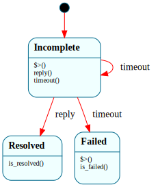

# `ArpResolver`

> The lifecycle of resolving one IPv4 address to a MAC: `$Incomplete → $Resolved`, with a retransmit timer **armed in the enter handler** and `-> $Failed` at the retry cap. The project's first networking Frame system, and the first use of the "timer armed on state entry, fired by a native deadline through the receive loop" pattern — the B5 plan's answer to TCP's timers, rehearsed small here.

| Property | Value |
|---|---|
| Track | Bare-metal |
| Milestone introduced | B5 (Step 2a) |
| Source file | [`../../frame/arp_resolver.frs`](../../frame/arp_resolver.frs) |
| State diagram | [`arp_resolver.svg`](arp_resolver.svg) |
| Instances at runtime | One per in-flight address resolution (Step 2a: the gateway) |
| Status | Implemented and load-bearing — `net::run_demo` resolves the slirp gateway through it. |

## State diagram

## Why a state machine

ARP resolution is a request/response with retransmission: send a who-has, wait for the reply, and if it doesn't come in time, re-send — up to a cap, then give up. That's a lifecycle with a timer and a retry budget, not a single operation. Modeling it as a state machine makes the retransmit policy structural: `$Incomplete`'s **enter handler** is the single place an attempt happens (send + arm the timer), so a retransmit is literally a self-transition back into `$Incomplete` (re-enter → re-send → re-arm), and the cap is one `if` in the `timeout` handler. The resolved/failed terminal states make "may I use this MAC yet?" a state query rather than a flag.

This is the small-scale rehearsal of how B5's TCP timers work (retransmit, `TIME_WAIT`): **Frame owns when a timer is armed/cancelled and what a timeout means in each state; a native timer wheel owns the countdown** and fires the `timeout` event back through the post/drain boundary. ARP needs only one timer, so the "wheel" here is a single deadline checked in the receive loop.

## States

### `$Incomplete` (initial)
A resolution is in flight. The enter handler counts the attempt (`self.attempts`), sends the ARP request (`crate::net::arp_send_request`), and arms the retransmit timer (`crate::net::arp_arm_timer`). `reply()` → `$Resolved`. `timeout()` → re-enter `$Incomplete` (retransmit) while under `max_attempts`, else `-> $Failed`.

### `$Resolved`
The reply arrived; the MAC is known (stored natively). Overrides `is_resolved()` → `true`. `timeout()` is not handled — once resolved, a stray late timer is ignored.

### `$Failed`
Gave up after `max_attempts`. The enter handler records the failure (`crate::net::arp_on_failed`). Overrides `is_failed()` → `true`.

## Interface

| Method | Returns | Purpose |
|---|---|---|
| `reply` | (none) | A matching ARP reply arrived → `$Resolved`. |
| `timeout` | (none) | The retransmit timer fired → re-send, or `$Failed` at the cap. |
| `is_resolved` / `is_failed` | `bool` | State queries. |

Domain: `attempts` / `max_attempts` (the retry policy). The resolved MAC bytes live natively (`net.rs`) — Frame owns "are we resolved?", not the address.

## Composition

**Driven by:** `crate::net` — `run_demo()` brings up virtio-net, constructs an `ArpResolver` (whose initial enter handler sends the first request + arms the timer), then loops: `virtio_net::poll_rx` drains frames and fires `reply()` on a matching gateway ARP reply; when the deadline passes, `timeout()` fires. The Ethernet/ARP encode+decode, the resolved MAC, and the retransmit deadline are native; `ArpResolver` owns the lifecycle + retry budget.

## Testing

**State graph snapshot (Level 2):** `kernel-tests/tests/state_graphs.rs::arp_resolver_state_graph_snapshot`.

**Behavioral (Level 3):** `kernel-tests/tests/arp_resolver_behavior.rs` — 6 tests: construction sends one request + arms one timer; `reply` resolves; `timeout` below the cap retransmits (re-send + re-arm); reply after a retransmit still resolves; **timeouts to the cap → `$Failed` + `arp_on_failed`**; `$Resolved` ignores a late `timeout`. (The `net` native deps are doubled with call counters in `kernel-tests/src/lib.rs`.)

**QEMU (Level 7):** `arp_resolves_gateway_b5` — the kernel resolves the QEMU slirp gateway (10.0.2.2) through `ArpResolver` and prints the resolved MAC, proving NIC TX/RX + post/drain + the Frame-driven resolution lifecycle end to end.

## Related documents
- [Roadmap](../roadmap.md) — B5 Step 2a
- [B5 plan](../plans/b5.md) — how timers map to Frame (enter/exit + state vars + native wheel)
- [`BlockRequest`](block_request.md) — the post/drain pattern this reuses

## Change log
- **2026-05-21** — initial doc; B5 Step 2a. `$Incomplete → $Resolved | $Failed`; retransmit timer armed in the enter handler; first networking Frame system.
