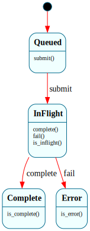

# `BlockRequest`

> The lifecycle of one block-device I/O request: `$Queued → $InFlight → $Complete | $Error`. The reference consumer of B4's **`post`/`drain` deferred-event pattern** — the request goes `$InFlight` on submit, and the *drained* completion (fired from normal context, never the IRQ) moves it to `$Complete` or `$Error`.

| Property | Value |
|---|---|
| Track | Bare-metal |
| Milestone introduced | B4 (Step 1) |
| Source file | [`../../frame/block_request.frs`](../../frame/block_request.frs) |
| State diagram | [`block_request.svg`](block_request.svg) |
| Instances at runtime | One per outstanding I/O request |
| Status | Implemented and load-bearing — the virtio-blk read/write path drives it. |

## State diagram

## Why this is the post/drain showcase

A block device completes I/O **asynchronously**: the driver submits a request and, some time later, the device raises a completion interrupt. That interrupt cannot drive a Frame system directly — Frame dispatch is non-reentrant, and an ISR can fire at any point (including mid-dispatch of another instance). So B4 introduces the **post/drain split**, and `BlockRequest` is its first consumer:

- **post** (interrupt context, native): the virtio-blk IRQ handler (`virtio_blk::on_irq`) only acks the device and sets a flag. No Frame dispatch.
- **drain** (normal context): the kernel reads the device's used ring and *then* drives `BlockRequest` — `complete()` on success, `fail()` on a non-zero status.

This is the same boundary discipline as the timer ISR (which never touches Frame) and the synchronous `#PF` handler (which can, because it can't be re-entered) — but generalized to an *asynchronous* interrupt, which is the new hard case. The pattern becomes the reference for the NIC at B5 and cross-core delivery at B7.

## States

### `$Queued` (initial)
A freshly created request. `submit()` → `$InFlight` (the driver has placed it on the virtqueue and notified the device). `complete`/`fail` are unhandled here — a completion can't arrive before submission.

### `$InFlight`
The request is on the device. The drained completion fires `complete()` → `$Complete` or `fail()` → `$Error`. Overrides `is_inflight()` → `true`.

### `$Complete`
Terminal success. Overrides `is_complete()` → `true`.

### `$Error`
Terminal failure (device returned a non-zero status). Overrides `is_error()` → `true`.

## Interface

| Method | Parameters | Returns | Purpose |
|---|---|---|---|
| `submit` | (none) | (none) | `$Queued` → `$InFlight` (request placed on the queue). |
| `complete` | (none) | (none) | Drained success → `$Complete`. |
| `fail` | (none) | (none) | Drained failure → `$Error`. |
| `is_inflight` / `is_complete` / `is_error` | (none) | `bool` | State queries (default `false`, per-state override). |

No domain, no constructor params, no native actions — pure lifecycle.

## Composition

**Driven by:** `crate::virtio_blk` — `read_sector`/`write_sector` create a `BlockRequest`, `submit()` it, place a 3-descriptor chain (header / data / status) on the single virtqueue, notify the device, then wait for the completion IRQ to *post* and *drain* it, firing `complete()`/`fail()`. The legacy virtio-blk driver (PCI discovery, virtqueue + DMA via `frames`/HHDM, the IRQ on vector 43) is all native; `BlockRequest` owns "where is this request in its life."

## Testing

**State graph snapshot (Level 2):** `kernel-tests/tests/state_graphs.rs::block_request_state_graph_snapshot`.

**Behavioral (Level 3):** `kernel-tests/tests/block_request_behavior.rs` — 6 tests: fresh-is-idle; submit → `$InFlight`; complete-after-submit → `$Complete`; fail-after-submit → `$Error`; complete-before-submit ignored; `$Complete` is terminal.

**QEMU (Level 7):** `blk_roundtrip_b4` — the kernel inits virtio-blk, writes a known pattern to a sector and reads it back; the completion IRQ posts, the kernel drains it and drives a `BlockRequest` to `$Complete`, and the data verifies (`[blk] sector write/read round-trip: ok`).

## Open questions
- **One in-flight request at a time** (Step 1): a single global request + scratch DMA frame. Concurrent/queued requests (multiple `BlockRequest` instances indexed by the descriptor head) arrive with the buffer cache + FS at Step 2.
- **No-alloc:** `BlockRequest` allocates per request (Rc event + context). A `no-alloc` codegen mode (tracked framec gate) matters once I/O is hot.

## Related documents
- [Roadmap](../roadmap.md) — B4 Step 1 (B4-1/B4-2)
- [`PageFaultHandler`](page_fault_handler.md) — the synchronous-trap Frame system (contrast: that one *can* be driven from the trap; this one can't be driven from the async IRQ)
- [B4 plan](../plans/b4.md) — the post/drain pattern in context

## Change log
- **2026-05-21** — initial doc; B4 Step 1. `$Queued → $InFlight → $Complete | $Error`, driven by the virtio-blk completion via post/drain. The first async-interrupt → Frame boundary.
