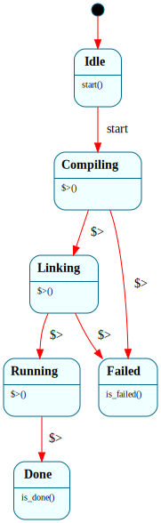

# `BuildDriver`

> The on-device C toolchain pipeline as a state machine: drives `compile → link → run` through the on-device `tcc`, with a `$Failed` sink that records which phase broke. The Frame half of the B11-3 track.

| Property | Value |
|---|---|
| Track | Ring-3 userspace (the `build`/`buildc` program) |
| Milestone introduced | B11-3e |
| Source file | [`../../frame/builddriver.frs`](../../frame/builddriver.frs) |
| State diagram | [`builddriver.svg`](builddriver.svg) |
| Instances at runtime | One per `buildc` invocation — `BuildDriver::__create()` then `start()` |
| Status | Documented (B11-3e) |

## State diagram



Regenerate via `cargo xtask regen-diagrams` after any `.frs` change; `cargo xtask check-diagrams` enforces drift.

## Why this is the Frame half of B11-3

B11-3a–d were native register/loader/libc mechanics — squarely the ~70% Frame has nothing to say about (FPU save/restore, the ELF loader bytes, frame-libc, the C-shim that makes tcc's static link work). The build **lifecycle** — a fixed sequence of phases where any phase can fail and short-circuit to a common cleanup/report sink — is exactly what a state machine is for, so it's modeled in Frame and generated to Rust. The split mirrors the kernel's `ElfLoader`: **Frame owns the phase sequencing + the failure funnel; native owns the mechanism** (here, fork/exec/wait of `/bin/tcc` and the compiled output).

## States

### `$Idle`

Initial state. The driving program constructs the system, then fires `start()` once it's ready to run the pipeline (so construction has no side effects — the work begins on an explicit event, not in a constructor).

**Transitions out:**
- `start()` → `$Compiling`

### `$Compiling`

Enter handler runs `crate::actions::compile()` — forks a child that execs `tcc -c -B/usr/lib/tcc /hello.c -o /hello.o` and waits for its exit status.

**Transitions out (on enter):**
- compile succeeded (tcc exit 0) → `$Linking`
- compile failed → `$Failed`, after `self.failed = "compile"`

### `$Linking`

Enter handler runs `crate::actions::link()` — forks a child that execs `tcc -B/usr/lib/tcc -static /hello.o -o /out.elf` and waits.

**Transitions out (on enter):**
- link succeeded → `$Running`
- link failed → `$Failed`, after `self.failed = "link"`

### `$Running`

Enter handler runs `crate::actions::run()` — forks a child that execs the freshly compiled `/out.elf` and waits, recording its exit code in `self.code`.

**Transitions out (on enter):**
- always → `$Done` (running a *built* program isn't a build failure; its exit code is reported, not judged)

### `$Done`

Terminal. The pipeline completed; `program_exit()` holds the compiled program's exit code.

- `is_done()` → `true`

### `$Failed`

Terminal sink. A `compile` or `link` phase failed; `failed_phase()` names which.

- `is_failed()` → `true`

## Interface

| Method | Parameters | Returns | Purpose |
|---|---|---|---|
| `start` | `()` | `()` | Kick off the pipeline from `$Idle` |
| `is_done` | `()` | `bool` | Whether the pipeline reached `$Done` |
| `is_failed` | `()` | `bool` | Whether it dropped into `$Failed` |
| `failed_phase` | `()` | `String` | Which phase failed (`"compile"`/`"link"`), empty otherwise |
| `program_exit` | `()` | `i32` | The compiled program's exit code (valid once `$Done`) |

Consumer pattern (`user/src/buildc.rs`):

```rust
let mut d = BuildDriver::__create();
d.start();
if d.is_done() {
    // d.program_exit() is /out.elf's exit code
} else {
    // d.failed_phase() names the broken phase
}
```

## Domain

| Field | Type | Initial | Purpose |
|---|---|---|---|
| `failed` | `String` | `String::new()` | Phase that dropped to `$Failed` |
| `code` | `i32` | `0` | Compiled program's exit code (set in `$Running`) |

## Composition

**Calls into:** `crate::actions::{compile, link, run}` — the native mechanism in `user/src/buildc.rs`. Each forks a child, execs `/bin/tcc` (or `/out.elf`), waits, and returns the exit status. The FSM never makes a syscall itself; it only sequences the actions and branches on their results — the same "Frame owns lifecycle, native owns mechanism" split as `ElfLoader` (which calls `crate::elf::*`).

**Called from:** `user/src/buildc.rs` `_start`, which sets up the heap, constructs the system, fires `start()`, and reports `is_done()`/`failed_phase()`/`program_exit()`. The program is staged on disk at `/bin/buildc` and run from the shell.

**Native modules used by actions:** the raw Frame OS syscalls (fork=2, wait=4, exec_argv=11, write_char=0, exit=1) via inline asm in `buildc.rs`.

## Why a state machine

A three-phase pipeline with a shared failure exit is the canonical "lifecycle" shape. As plain Rust it's a short sequence of `if !compile() { report("compile"); return }` blocks — readable, but the legal phase order and the failure funnel are implicit in control flow. As Frame, `builddriver.svg` *is* the pipeline: the phase order, the single `$Failed` sink every fallible phase feeds, and the fact that `$Running` can't fail-the-build are all visible without reading code. Adding a phase (say `$Optimizing` between compile and link, or a `$Verifying` after run) is a localized edit — a state + its transitions — and the generated dispatch can't forget to wire the new phase into the failure path. This is the same property the kernel's `ElfLoader` pipeline (`$ReadingHeader → … → $Done`/`$Failed`) demonstrates, applied to the userspace toolchain.

## Testing

**QEMU smoke / console test (Level 7):** the `console-test` types `/bin/buildc` at the shell. The driver runs compile → link → run; the compiled `/out.elf` prints `hello from a tcc-compiled program on Frame OS!` and exits 7, and the driver prints `[build] pipeline ok; /out.elf exited with code 7` — which the harness asserts. This proves the Frame-owned toolchain lifecycle end to end: the FSM sequenced two real `tcc` invocations + the run, and reached `$Done` with the right exit code.

## Open questions / follow-ups

- **Source path is fixed (`/hello.c`).** A real tool would take the source from argv and derive the object/output names; deferred (Rust user bins need an asm `_start` shim to read argv, as `argtest` does). Tracked in [roadmap.md](../roadmap.md).
- **`$Failed` cleanup.** Currently `$Failed` only records the phase; it could also `unlink` the partial `/hello.o`/`/out.elf` once Frame OS grows a file-delete syscall (roadmap follow-up #2).
- **Compile/link are two `tcc` invocations** (`-c` then link) to make the pipeline genuinely three-phase; tcc can also do both in one pass. The split is the more faithful toolchain model and exercises tcc's object-file output + relink path on-device.

## Related documents

- [`ElfLoader`](elf_loader.md) — the kernel-side pipeline-with-`$Failed` this mirrors
- [Roadmap](../roadmap.md) — B11-3 track and follow-ups
- [Systems index](README.md)

## Change log

- **2026-05-24** — initial doc; B11-3e `BuildDriver` (`$Idle → $Compiling → $Linking → $Running → $Done` / `$Failed`), driving the on-device tcc to compile + link + run `/hello.c`. Validated by the `console-test` `/bin/buildc` step.
