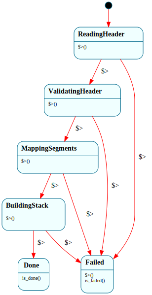

# `ElfLoader`

> Loads a static ELF executable into a process address space as a sequential phase pipeline with one failure sink: `$ReadingHeader → $ValidatingHeader → $MappingSegments → $BuildingStack → $Done`, with any phase dropping to `$Failed` (which rolls back partial work). The B3 showcase of the "`$Failed` funnel" — no `Result<>` ladder threaded through the load sequence.

| Property | Value |
|---|---|
| Track | Bare-metal |
| Milestone introduced | B3 (Step 4) |
| Source file | [`../../frame/elf_loader.frs`](../../frame/elf_loader.frs) |
| State diagram | [`elf_loader.svg`](elf_loader.svg) |
| Instances at runtime | One per load (constructed, drives to completion, read, dropped) |
| Status | Implemented and load-bearing — loads the baked freestanding-Rust user program that the ring-3 demo runs. |

## State diagram

## Why this is a clean Frame fit (and why it's a flat FSM, not an HSM)

Loading an ELF is a fixed sequence of phases, each of which can fail: read the header, validate it's an x86-64 executable, map the PT_LOAD segments, build a user stack, done. The interesting structural fact is the failure handling — a failure in *any* phase must abandon the load and roll back whatever was already mapped. Expressed as plain code that's a `Result<>` ladder with cleanup duplicated (or a `goto fail`); expressed as Frame it's a straight pipeline where every phase routes failure to one `$Failed` state whose enter handler does the cleanup once.

This is a **flat FSM, not an HSM**: there is no shared *handler* to centralize on a parent (each phase's failure *detection* differs), and the shared *work* (cleanup) lives in `$Failed`'s enter handler. The funnel is "many phases → one sink," not `=> $^` forwarding — `Process` and `SyscallDispatcher` already demonstrate parent forwarding, and adding a parent here would be ceremony. The phases cascade from construction, the same way the `Kernel` boot HSM drives its init chain at `__create()`.

## States

### `$ReadingHeader` (initial)
**Enter (`$>`):** `crate::elf::read_header()` — read `e_entry`, `e_phoff`, `e_phentsize`, `e_phnum` from the ELF64 header. On success `-> $ValidatingHeader`; on a too-short image record `"truncated ELF header"` and `-> $Failed`.

### `$ValidatingHeader`
**Enter (`$>`):** `crate::elf::validate_header()` — check the `\x7fELF` magic, ELFCLASS64, little-endian, `ET_EXEC`, `EM_X86_64`, and that the program-header table is in bounds. On success `-> $MappingSegments`; otherwise record `"not a valid x86-64 executable"` and `-> $Failed`.

### `$MappingSegments`
**Enter (`$>`):** `crate::elf::map_segments()` — for each `PT_LOAD`, allocate frames, copy file bytes (zero-filling `.bss`), and map each page at `p_vaddr` with permissions from `p_flags` (USER, +WRITABLE for `PF_W`). On success `-> $BuildingStack`; on allocation failure record the error and `-> $Failed`.

### `$BuildingStack`
**Enter (`$>`):** `crate::elf::build_stack()` — allocate + map a user stack. On success `-> $Done`; on failure `-> $Failed`.

### `$Done`
The load succeeded. Overrides `is_done()` → `true`. The caller reads `entry()` and `user_stack_top()` and enters ring 3.

### `$Failed`
The single failure sink. **Enter (`$>`):** `crate::elf::cleanup()` — unmap and free every page mapped so far (partial segments + a stack if it got that far). Overrides `is_failed()` → `true`; `error()` returns the recorded reason.

## Interface

| Method | Parameters | Returns | Purpose |
|---|---|---|---|
| `entry` | (none) | `u64` | Program entry VA (valid once read). |
| `user_stack_top` | (none) | `u64` | Top of the mapped user stack (valid in `$Done`). |
| `is_done` | (none) | `bool` | The load succeeded. |
| `is_failed` | (none) | `bool` | The load failed (and was rolled back). |
| `error` | (none) | `String` | The failure reason (empty on success). |

No constructor params — the input ELF + target page table are staged via `crate::elf::prepare()` before construction, and the phases run during `__create()`.

## Domain

| Field | Type | Initial | Purpose | Lifetime |
|---|---|---|---|---|
| `err` | `String` | empty | The failure reason recorded by the failing phase. | System lifetime |

(The bytes, parse results, and the list of mapped pages live in `crate::elf`, not the domain — same "Frame owns lifecycle, native owns mechanism" split as `SerialDriver`/`serial` and `PageFaultHandler`/`vm`.)

## Composition

**Driven by (kernel):** `crate::usermode::run` — stages the baked ELF (`crate::elf::prepare(USER_ELF, pml4)`), constructs an `ElfLoader` (which loads), checks `is_failed()`, and on success enters ring 3 at `entry()` with `user_stack_top()`. After the process exits, `crate::elf::cleanup()` frees the mapped pages.

**Calls into (native):** `crate::elf::{read_header, validate_header, map_segments, build_stack, cleanup, entry_va, stack_top}` — the ELF64 byte parser + segment mapper over `frames`/`paging`. Resolved per crate: real in the kernel, a host double in `kernel-tests` (real header parsing, stubbed mapping).

**The baked binary:** `kernel/build.rs` compiles the standalone, workspace-excluded `user/` crate (freestanding Rust, raw syscalls, custom linker script → static `ET_EXEC` at `0x1000_0000`) into an ELF and stages it where `usermode.rs` `include_bytes!`s it.

## Testing

**State graph snapshot (Level 2):** `kernel-tests/tests/state_graphs.rs::elf_loader_state_graph_snapshot`.

**Behavioral (Level 3):** `kernel-tests/tests/elf_loader_behavior.rs` — 6 tests against hand-built header byte arrays: valid ELF → `$Done` with the right entry + a built stack; truncated header → `$Failed` ("truncated"); bad magic → `$Failed` ("not a valid"); wrong machine → `$Failed`; `ET_DYN` (non-exec) → `$Failed`; success path has no error.

**QEMU (Level 7):** `ring3_syscall_b3` — `[elf] loaded user program, entry 0x0000000010000000` proves the *real* baked ELF parses + maps, and the subsequent `hello from ELF` proves it executes in ring 3.

## Open questions
- **One PT_LOAD today.** The baked program links to a single R+X segment; multi-segment programs (separate R+W data) are handled by the per-segment loop but not yet exercised by a real binary.
- **No relocations / dynamic linking.** Only static `ET_EXEC` is accepted (the locked B3 decision: freestanding Rust, no libc/crt0). `ET_DYN`/PIE + a dynamic loader are out of scope.
- **`$MappingSegments`/`$BuildingStack` failure cleanup** is exercised by the `$Failed` enter handler logic and the host validation-failure tests, but the OOM path itself isn't forced in a test yet (would need a frame-exhaustion harness).

## Related documents
- [Roadmap](../roadmap.md) — B3 Step 4 (B3-4)
- [`Process`](process.md) / [`ProcessTable`](process_table.md) — the loaded program is admitted as a `Process`
- [`PageFaultHandler`](page_fault_handler.md) — the other native-mechanism-behind-a-Frame-system, and where user-fault isolation (Step 4b) will route

## Change log
- **2026-05-20** — initial doc; B3 Step 4a. `$ReadingHeader → $ValidatingHeader → $MappingSegments → $BuildingStack → $Done` + `$Failed` cleanup sink; flat phase FSM. Loads the baked freestanding-Rust user program; run in ring 3 by the demo. Isolation (user-fault-kills-process) deferred to Step 4b.
