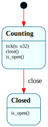

# `EventCounter`

> A tiny Frame system used to demonstrate the **cross-core `post`** (B7): `$Counting → $Closed`. Its `tick(n)` events are *posted from other cores* into a thread-safe MPSC queue, and the core that owns the instance drains the queue and dispatches them. The point isn't the FSM's complexity — it's that a Frame system can be driven safely by events originating on other cores, with the instance pinned to one core and only plain `Send` event data crossing the boundary.

| Property | Value |
|---|---|
| Track | Bare-metal |
| Milestone introduced | B7 (cross-core post) |
| Source file | [`../../frame/event_counter.frs`](../../frame/event_counter.frs) |
| State diagram | [`event_counter.svg`](event_counter.svg) |
| Instances at runtime | One (pinned to the owner core — the BSP) |
| Status | Implemented — driven from all 4 cores via the MPSC post queue; the exact count proves cross-core dispatch with no lost/duplicated events (`cargo xtask qemu-test` `smp_cross_core_post_b7`). |

## State diagram

## Why it exists (the cross-core-post demonstration)

The project's long-standing open question for SMP (B7): *can a Frame system be
driven safely from a different core than the one that owns its instance, given
framec's generated code is neither `Send` nor `Sync`?* `EventCounter` answers it
concretely. The answer is **yes, without any framec change**, because the
post/drain architecture already isolates the instance to one core:

- The instance is a **local** owned by the draining core (the BSP — see
  `kernel/src/crosscore.rs::run_drain_demo`). It is never moved to or touched by
  another core, so its non-`Send`/non-`Sync`-ness is irrelevant.
- Other cores never see the instance. They only enqueue plain `Copy`/`Send` event
  *data* (`PostedEvent::Tick(u32)`) into a `SpinLock`-protected MPSC ring.
- The owning core drains the ring and dispatches each event to its local instance
  — exactly the **"producers only post, the owner drains"** pattern, which is the
  cross-core generalization of B4/B5's "ISRs only post, the kernel drains."

So the long-flagged "framec needs `Send`/`Sync` codegen" concurrency gate is
**sidestepped by the architecture**: only `Send` data crosses cores; the FSM
stays put. And the FSM still runs its real logic on the posted events — `tick`
accumulates while `$Counting`, and is *dropped* after `$Closed` — so cross-core
posts are gated by state exactly like local ones (a late post that races in after
`close()` can't mutate a closed counter).

## States

- **`$Counting`** (initial) — `tick(n)` adds `n` to the domain `total`; `close()`
  → `$Closed`; `is_open()` is true.
- **`$Closed`** — no `tick` handler, so posted ticks are dropped (the count is
  frozen); `is_open()` is false.

## Interface

| Method | Returns | Purpose |
|---|---|---|
| `tick` | (none) | Add `n` to the total (only honored in `$Counting`). |
| `close` | (none) | Stop accepting ticks → `$Closed`. |
| `count` | `u32` | The accumulated total (domain). |
| `is_open` | `bool` | True in `$Counting`. |

Pure — no native dependencies; the domain holds `total: u32`.

## Composition

**Driven by:** `crate::crosscore` — `POST_QUEUE` is a `SpinLock`-protected
fixed-size MPSC ring of `PostedEvent`. Each application processor's
`ap_post_phase()` posts `POSTS_PER_CORE` `Tick(1)` events; the BSP's
`run_drain_demo()` creates the (local) `EventCounter`, contributes its own share,
drains the queue (dispatching `tick`), and verifies the total is exactly
`cores × POSTS_PER_CORE`. The queue lock is released before each dispatch — it's
a leaf lock, never held across the Frame dispatch.

## Testing

**State graph snapshot (Level 2):** `kernel-tests/tests/state_graphs.rs::event_counter_state_graph_snapshot`.

**Behavioral (Level 3):** `kernel-tests/tests/event_counter_behavior.rs` — 4
tests: starts open at zero; ticks accumulate; `close()` freezes the count and
drops further ticks; 200 ticks sum exactly (mirrors a core's contribution).

**QEMU / SMP (Level 7):** `smp_cross_core_post_b7` — all 4 cores post 200 ticks
each into the MPSC queue; the BSP drains them into its `EventCounter`; serial
shows `[smp] cross-core post: counter 800 (expected 800)` →
`cross-core post -> Frame dispatch: ok` → `post-close tick ignored ($Closed gates
it): ok`. The exact total proves every cross-core-posted event was dispatched
exactly once; the dropped post-close tick proves the FSM gates posts by state.

## Related documents
- [Roadmap](../roadmap.md) — B7 (cross-core post)
- [Frame assessment](../frame_assessment.md) — the headline B7 finding: post/drain gives cross-core safety without framec `Send`/`Sync`
- [`BlockRequest`](block_request.md) — the B4 origin of the "ISRs only post, the kernel drains" pattern this generalizes across cores

## Change log
- **2026-05-22** — initial doc; B7 cross-core post. A minimal `$Counting → $Closed` system driven from all cores via a `SpinLock` MPSC queue drained on the owner core; demonstrates that the post/drain architecture gives cross-core safety with the instance pinned and only `Send` event data crossing — no framec `Send`/`Sync` change needed.
