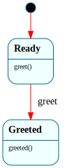

# `Hello`

> The V1.0 capstone Frame system: a deliberately tiny, **language-neutral** state machine that framec transpiles to **both Rust and C**, each wrapped by a per-language harness and run from the shell. Proves the north star — *one Frame source → both backends → both compiled and run on Frame OS* (the C one via the on-device `tcc`).

| Property | Value |
|---|---|
| Track | Ring-3 userspace (the `fhello` bin + `/fhello.c`) |
| Milestone introduced | V1.0 capstone (C1–C5) |
| Source file | [`../../frame/hello.frs`](../../frame/hello.frs) |
| State diagram | [`hello.svg`](hello.svg) |
| Instances at runtime | One per run — `Hello::__create()` / `Hello_new()` then `greet()` |
| Status | Documented (V1.0 capstone) |

## State diagram



Regenerate via `cargo xtask regen-diagrams` after any `.frs` change; `cargo xtask check-diagrams` enforces drift.

## Why this system exists

Frame OS's V1.0 north star is "run framec to compile a hello world in C and Rust and run them from the shell." `Hello` is the single Frame source that satisfies it both ways. The point is not the FSM's complexity (it has one transition) but that the **same** `@@system` block is fed to `framec -l rust` and `framec -l c`, and **both** outputs build and run on the OS — the Rust one as a user bin (`/bin/fhello`), the C one compiled **on-device by tcc** from the framec-generated `/fhello.c` (`buildc /fhello.c`).

To stay language-neutral, the handlers contain **no native code** — only a Frame transition and a literal interface return. All printing lives in the per-language harness (a Rust `main` and a C `main`), so the FSM generates identically clean to both targets.

## States

### `$Ready`

Initial state. `greeted()` returns the interface default `false` here (no handler overrides it), so the harness can assert the FSM hasn't greeted yet.

**Transitions out:**
- `greet()` → `$Greeted`

### `$Greeted`

Terminal. The greeting has happened; `greeted()` is overridden to `true`.

- `greeted()` → `true`

## Interface

| Method | Parameters | Returns | Purpose |
|---|---|---|---|
| `greet` | `()` | `()` | Move `$Ready → $Greeted` |
| `greeted` | `()` | `bool` | `false` in `$Ready`, `true` in `$Greeted` — a real state transition gates it |

Consumer pattern — **Rust** (`user/src/fhello.rs`):

```rust
let mut h = Hello::__create();
assert!(!h.greeted());        // $Ready
h.greet();                    // -> $Greeted
assert!(h.greeted());
// print "hello from a Frame system, transpiled to Rust!"
```

Consumer pattern — **C** (`csrc/fhello_main.c`, appended to the generated `/fhello.c`):

```c
Hello* h = Hello_new();
if (Hello_greeted(h)) return 1;   // $Ready: false
Hello_greet(h);                   // -> $Greeted
if (Hello_greeted(h)) {           // true
    printf("fhello: hello from a Frame system, transpiled to C!\n");
    return 0;
}
```

## Domain

None — the state itself carries all the information (`greeted()` is answered by which state is current).

## Composition

**Rust path:** `user/build.rs` runs `framec -l rust` on `hello.frs` → `OUT_DIR/hello.rs`; `user/src/hello_frame.rs` `include!`s it (re-exporting `String`/`Vec`/`Box` from `alloc`); `user/src/fhello.rs` drives it and prints via frame-libc. Staged at `/bin/fhello`.

**C path:** `xtask::build_fhello_c` runs `framec -l c` on the *same* `hello.frs` → C source, appends `csrc/fhello_main.c`, and stages the result at `/fhello.c`. At the shell, `buildc /fhello.c` invokes the on-device `tcc` (which links the C-shim libc) to compile + link `/fhello.elf`, then runs it.

The generated C carries framec's small runtime (a string-keyed `FrameDict` + a `FrameVec`) using `malloc`/`calloc`/`realloc`/`strdup`/`free`/`memcpy`/`strcmp` and `<stdint.h>`/`<stdbool.h>` — the gaps this exposed in the minimal C-shim (`realloc`, `strdup`, `stdint.h`) were closed for the capstone.

## Why a state machine

`greet()` flipping `greeted()` from `false` to `true` is the smallest possible illustration of Frame's value proposition that still proves the toolchain: the answer to `greeted()` is *not* a stored flag the harness sets — it is a consequence of which state the machine is in, decided by the generated dispatch. The same `.frs` produces that behavior in two languages with zero hand-written FSM code. It's the "one source, many targets" demonstration the `parser.frs`/`frameshell` pair began (one source, Rust on host **and** bare metal), now extended to *different languages* from one source.

## Testing

**QEMU console test (Level 7):** the `console-test` types, at the shell:
- `/bin/fhello` → asserts `fhello: hello from a Frame system, transpiled to Rust!` (the Frame→Rust half).
- `/bin/buildc /fhello.c` → asserts the program's own `fhello: hello from a Frame system, transpiled to C!` *and* `[build] pipeline ok; /fhello.elf exited with code 0` (the Frame→C half: framec-generated C compiled + linked + run by the on-device tcc).

Together these prove one Frame system runs in both languages, from the shell, on the OS.

## Open questions / follow-ups

- **The capstone exposed a real tcc bug.** The framec-generated C is the first on-device program to call its **own** (non-`static`) functions; tcc 0.9.27's broken static-exe PLT crashed it. Fixed with the one-line `tccelf.c` patch (`|| s1->output_type == TCC_OUTPUT_EXE`) — see [`third_party/tcc/README.frame-os.md`](../../third_party/tcc/README.frame-os.md).
- **The C-shim grew** `realloc`/`strdup`/`stdint.h` to meet the generated runtime. Further framec C programs may need more libc surface (demand-driven).

## Related documents

- [`BuildDriver`](builddriver.md) — the on-device toolchain pipeline FSM `buildc` drives to build `/fhello.c`
- [`Parser`](parser.md) — the earlier "one source, two targets" (host + bare metal) demonstration
- [Roadmap](../roadmap.md) — the C1–C5 capstone track
- [Systems index](README.md)

## Change log

- **2026-05-24** — initial doc; the V1.0 capstone `Hello` (`$Ready → $Greeted`), one `hello.frs` transpiled by framec to both Rust (`/bin/fhello`) and C (`/fhello.c`, built on-device by tcc). Validated by the `console-test` `fhello` + `buildc /fhello.c` steps.
