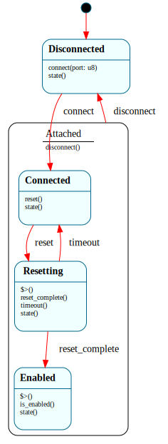

# `HubPort`

> One xHCI root-hub port's connect/reset/enable lifecycle: `$Disconnected → $Connected → $Resetting → $Enabled`, with `disconnect()` funneled back to `$Disconnected` from any attached state through an `$Attached` parent (`=> $^`). The port reset is a **timed transition** — `$Resetting` arms a settle deadline in its enter handler and the driver loop fires `reset_complete()` (on the controller reporting the port enabled) or `timeout()`.

| Property | Value |
|---|---|
| Track | Bare-metal |
| Milestone introduced | B6 (Step 2) |
| Source file | [`../../frame/hub_port.frs`](../../frame/hub_port.frs) |
| State diagram | [`hub_port.svg`](hub_port.svg) |
| Instances at runtime | One (single-flight: the connected port) |
| Status | Implemented and load-bearing — drives the QEMU usb-kbd's port (port 5) from connect to enabled, readying it for enumeration (`cargo xtask qemu-test` `usb_port_reset_b6`). |

## State diagram

## Why a state machine

A USB port has a real, named lifecycle that the spec defines: a device appears
(`$Connected`), software resets the port to put the device in its Default state
(`$Resetting`), and the controller then enables it (`$Enabled`) so enumeration
can begin. A disconnect at *any* point tears it back down. Writing this as a
state machine makes that lifecycle the diagram and makes two things first-class:

- **The reset is a timed transition.** `$Resetting`'s enter handler asserts
  PORTSC.PR and arms a settle deadline (`crate::xhci::begin_port_reset`); the
  driver loop dispatches `reset_complete()` when the controller reports the port
  enabled, or `timeout()` at the cap → `$Connected` (retry). This is the same
  "timer armed on state entry, fired by a native deadline through the driver
  loop" idiom proven by `ArpResolver` and `TcpConnection` in B5 — Frame has no
  `after(ms)`, so the deadline lives natively and the state owns the *arming*.
- **Disconnect is a parent funnel.** `$Connected`/`$Resetting`/`$Enabled` are all
  children of `$Attached`, which holds `disconnect() { -> $Disconnected }`. The
  children forward via `=> $^`, so the teardown disposition is written once — the
  `Process.$Alive` / `TcpConnection.$Open` pattern, applied to hot-plug.

## States

- **`$Disconnected`** (initial) — no device. `connect(port)` stores the port in
  the domain and → `$Connected`.
- **`$Connected`** (child of `$Attached`) — device present, port not yet usable.
  `reset()` → `$Resetting`.
- **`$Resetting`** (child of `$Attached`) — enter handler calls
  `crate::xhci::begin_port_reset(self.port)` (assert PORTSC.PR + arm the settle
  deadline). `reset_complete()` → `$Enabled`; `timeout()` → `$Connected`.
- **`$Enabled`** (child of `$Attached`) — enter handler calls
  `crate::xhci::on_port_enabled(self.port)`; the device is in its Default state,
  ready for enumeration (Step 3). `is_enabled()` is true here.
- **`$Attached`** (parent) — `disconnect() { -> $Disconnected }`, inherited by all
  three attached children via `=> $^`.

## Interface

| Method | Returns | Purpose |
|---|---|---|
| `connect` | (none) | A device appeared on `port` (stored in the domain). |
| `reset` | (none) | Begin the port reset. |
| `reset_complete` | (none) | The controller reported the port enabled. |
| `timeout` | (none) | The reset-settle deadline expired. |
| `disconnect` | (none) | The device was removed (funneled to `$Disconnected`). |
| `state` | `String` | Current state name (tests/observability). |
| `is_enabled` | `bool` | True only in `$Enabled`. |

The 1-based `port` is threaded through the domain (`port: u8`) — set on
`connect`, read by the `$Resetting`/`$Enabled` enter handlers when they call the
native PORTSC actions.

## Composition

**Driven by:** `crate::xhci::run_port_lifecycle()` — after `xhci::init()` detects
a connected port, it creates one `HubPort`, dispatches `connect(port)` →
`reset()`, then pumps (waiting on the timer interrupt) until the controller
reports the port enabled (`reset_complete()` → `$Enabled`, then ack the PORTSC
change bits) or the deadline passes (`timeout()`). Native (`xhci.rs`) owns the
PORTSC register pokes (`begin_reset`, `clear_port_changes`, `port_enabled`) and
the reset deadline; this owns the lifecycle.

## Testing

**State graph snapshot (Level 2):** `kernel-tests/tests/state_graphs.rs::hub_port_state_graph_snapshot`.

**Behavioral (Level 3):** `kernel-tests/tests/hub_port_behavior.rs` — 8 tests:
starts `$Disconnected`; `connect` → `$Connected`; `reset` → `$Resetting` with
`begin_port_reset` called on the threaded port; `reset_complete` → `$Enabled` +
`on_port_enabled`; `timeout` → `$Connected`; and `disconnect` funnels to
`$Disconnected` from each of `$Connected`/`$Resetting`/`$Enabled` (the `=> $^`
parent). The `xhci` actions are doubled to record the port + call counts.

**QEMU (Level 7):** `usb_port_reset_b6` — the kernel drives the real qemu-xhci
port (the usb-kbd lands on port 5): serial shows `[usb] resetting port 5` →
`[usb] port 5 enabled`.

## Related documents
- [Roadmap](../roadmap.md) — B6 Step 2
- [`TcpConnection`](tcp_connection.md) / [`ArpResolver`](arp_resolver.md) — the timed-transition (enter-armed, native-fired) idiom; [`Process`](process.md) — the `=> $^` parent funnel

## Change log
- **2026-05-22** — initial doc; B6 Step 2. Port connect/reset/enable lifecycle as a Frame system with a timed reset transition + a disconnect parent-funnel; drives the qemu-xhci usb-kbd port to enabled.
