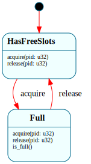

# `IoScheduler`

> The supervisor that **serializes access to the single-flight virtio-blk engine** (S6): `$Idle → $Busy`, with a FIFO waiter queue in the domain. `acquire_disk(pid)` grants the engine (→ owner) or enqueues the caller; `release_disk()` hands off to the next waiter or returns to idle. A *coordinator* FSM, not a per-instance lifecycle — the kernel's analog of an actor owning a mutex + queue.

| Property | Value |
|---|---|
| Track | Bare-metal |
| Milestone introduced | S6 (forced by concurrent `exec` in a pipeline) |
| Source file | [`../../frame/io_scheduler.frs`](../../frame/io_scheduler.frs) |
| State diagram | [`io_scheduler.svg`](io_scheduler.svg) |
| Instances at runtime | One (a shared supervisor, owned by `sched.rs`) |
| Status | Implemented — every disk transaction acquires/releases it. |

## State diagram

## Why this is a Frame system (a new shape for this codebase)

The virtio-blk driver is **single-flight**: one shared scratch buffer + a single completion waiter. That holds when one process does disk I/O at a time (sequential shell commands), but **not** once two run concurrently — a pipeline forks two children that both `exec`, reading their ELFs off disk at once, and overlapping transactions clobber the shared buffer. The first attempt coordinated this with native flags (a `DISK_BUSY` bool + a hand-rolled waiter array), which produced lost-wakeup / clobber bugs — *the* class of bug scattered atomics are bad at.

The fix was to recognize that engine *access* is genuinely **state-shaped**: `acquire` does different things in `$Idle` (grant) vs `$Busy` (enqueue), and `release` does different things with an empty vs non-empty queue. That earns states. Every prior Frame win in this codebase was a per-instance *lifecycle* (`TcpConnection`, `OpenFile`); `IoScheduler` is the first **coordinator** — one shared instance arbitrating a contended resource across processes. The native side owns only the *mechanism*: the DMA, the "block until I'm the owner" wait (`sched::block_current_until`), and the `wake_pid` of the next owner.

> Note the boundary, recorded in [`../frame_assessment.md`](../frame_assessment.md) (2026-05-25): the *coordination* belonged in Frame, but the disk **completion-detection** (poll `used.idx`, the spec-correct "all buffers written" signal) is a hardware-contract fact and stays native — and that completion bug, not the coordination, was the hard one.

## States

### `$Idle` (initial)
The engine is free. `acquire_disk(pid)` sets `owner = pid`, returns `pid` (granted), and transitions to `$Busy`.

### `$Busy`
The engine is held by `owner`. `acquire_disk(pid)` pushes `pid` onto `disk_q` and returns `0` (the caller must block until handed the engine). `release_disk()` hands off via the `hand_off` action: pop the next waiter → new `owner` (returns its pid to wake, stays `$Busy`), or empty → `owner = 0`, return `0`, transition to `$Idle`. Overrides `disk_owner(pid)` from the live `owner`.

## Interface

| Method | Parameters | Returns | Purpose |
|---|---|---|---|
| `acquire_disk` | `pid: u32` | `u32` | Grant now (returns the granted pid == `owner`) or enqueue (returns `0`). |
| `release_disk` | (none) | `u32` | Hand off to the next waiter (returns its pid to wake) or `0` if the engine went idle. |
| `disk_owner` | `pid: u32` | `bool` | Is `pid` the current owner? (the native side blocks until this is true). |

**Domain:** `owner: u32 = 0`, `disk_q: VecDeque<u32>`. **Action:** `hand_off()` pops the queue, sets `owner`.

## Composition

**Driven by:** `crate::sched` — `acquire_disk()` calls `with_io_sched(|s| s.acquire_disk(pid))` then `block_current_until(|| s.disk_owner(pid))`; `release_disk()` calls `s.release_disk()` and `wake_pid(next)`. `virtio_blk::{read_sector,write_sector}` bracket every transaction with these. A boot bypass (`!is_preemption_active() || pid == 0`) skips the supervisor during single-threaded early boot (the instance may not exist yet). The instance lives beside the `Scheduler` FSM in `sched.rs`, guarded by `without_interrupts` (non-reentrant, syscall/drained context only — never an ISR).

## Testing

**QEMU (Level 7):** `console-test` `echo pipe one two | wc` (S6) — the two pipeline children `exec` concurrently; without serialization their disk reads clobber the single-flight buffer (the writer's `exec` fails). With the supervisor, both serialize and the pipe yields `1 3 13`. The on-device `tcc` compile path (heavy concurrent-capable disk I/O) also exercises it.

## Open questions
- **Per-sector, not per-fs-operation.** The lock brackets each sector transaction; a multi-block `fs::create` releases between block ops. Fine for the current single-writer workloads; concurrent *writers* to the FS would want a higher-level fs lock.
- **IRQ wakes stay native.** Disk *completion* (IRQ) and console RX can't drive Frame (non-reentrant in an ISR); they wake a cached pid via native `wake_pid`. The supervisor owns the syscall-context sequencing only.

## Related documents
- [`BlockRequest`](block_request.md) — the per-*request* lifecycle (this serializes *access* to the engine those requests run on).
- [`Pipe`](pipe.md) — the S6 sibling; concurrent pipeline `exec` is what forced this supervisor.
- [`../frame_assessment.md`](../frame_assessment.md) — 2026-05-25 entries: the coordinator shape + why the completion fix was native, not Frame.

## Change log
- **2026-05-25** — initial doc; S6. `$Idle/$Busy` + waiter queue; the first coordinator/supervisor Frame system, replacing an ad-hoc native disk lock.
