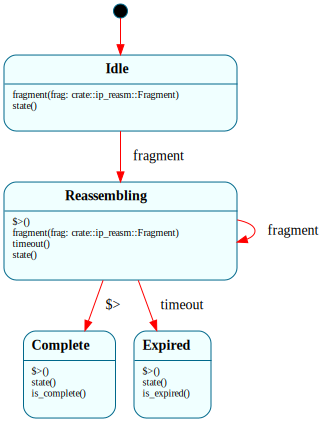

# `IpReassembly`

> Reassemble one fragmented IPv4 datagram: `$Idle → $Reassembling → ($Complete | $Expired)`. The second **data pipeline** (after `RxPipeline`) — each fragment's parsed summary (`Fragment`) rides into `$Reassembling` as an **enter parameter**, and every additional fragment **self-transitions** back into `$Reassembling` with fresh enter-param data, so "store this fragment, am I done?" is the state-entry action and runs once per fragment.

| Property | Value |
|---|---|
| Track | Bare-metal |
| Milestone introduced | B5 (Step 6 / B5-5) |
| Source file | [`../../frame/ip_reassembly.frs`](../../frame/ip_reassembly.frs) |
| State diagram | [`ip_reassembly.svg`](ip_reassembly.svg) |
| Instances at runtime | One (single-flight reassembly) |
| Status | Implemented and load-bearing — a real `ping -s 4000` over TAP is reassembled, answered, and the reply re-fragmented outbound (`cargo xtask qemu-tap`). |

## State diagram

## Why a state machine (and why a *pipeline*)

A datagram larger than the link MTU arrives as several IP fragments that must be stitched back together before the upper layer (here ICMP) sees the whole message. That stitching has a genuine lifecycle: nothing yet → collecting → done, with a *timeout* escape if a fragment is lost. Modelling it as a state machine makes that lifecycle the diagram, and makes the timeout a first-class edge rather than a flag checked in a loop.

The pipeline shape is the interesting part: each fragment's parsed `Fragment` summary (`offset`/`len`/`more`/`ident`) flows into `$Reassembling` **as an enter parameter** (`-> (frag) $Reassembling` → `$>(frag: Fragment)`), and the self-transition `-> (frag) $Reassembling` re-enters the state with each new fragment — so the per-fragment work ("copy these bytes at this offset, check whether the holes are now filled") is the **state-entry action**, visible in the graph rather than buried in a `while`. The completion test is a native guard (`crate::ip_reasm::is_complete()`) around the `→ $Complete` transition.

The fragment **bytes** stay native (`crate::ip_reasm`'s reassembly buffer + a per-byte coverage bitmap); only the small `Fragment` descriptor rides the transitions. Same **"thread the parsed descriptor, keep the payload native"** recipe as `RxPipeline` — here applied to a *collect-until-whole* loop instead of a classify fan-out.

## States

- **`$Idle`** (initial) — `fragment(frag)` → `$Reassembling`, carrying the fragment. (Named `$Idle`, not `$Empty`: see the framec note below.)
- **`$Reassembling`** — enter handler calls `crate::ip_reasm::store(frag)` (copies the payload into the buffer at its offset, marks coverage, latches the total length when the final `MF=0` fragment lands), then transitions to `$Complete` **iff** `is_complete()`. Another `fragment(frag)` self-transitions back here (re-store). `timeout()` → `$Expired`.
- **`$Complete`** — enter handler calls `crate::ip_reasm::on_complete()`: reconstruct the whole datagram (saved header with the fragment fields cleared + total length fixed) and hand it to the IP layer (`net::on_reassembled_ipv4`), which replies to the now-whole ICMP echo request — re-fragmenting the reply outbound if it exceeds the MTU.
- **`$Expired`** — enter handler calls `crate::ip_reasm::on_expired()`: a fragment was lost or too slow, drop the partial buffer.

## Interface

| Method | Returns | Purpose |
|---|---|---|
| `fragment` | (none) | A parsed IPv4 fragment arrived; store it and check for completion. |
| `timeout` | (none) | The reassembly timer expired (lost fragment). |
| `state` | `String` | Current state name (tests/observability). |
| `is_complete` | `bool` | True only in `$Complete`. |
| `is_expired` | `bool` | True only in `$Expired`. |

`Fragment { offset: usize, len: usize, more: bool, ident: u16 }` (`Clone, Copy, Default, Debug`) is the threaded summary; the payload bytes are stored natively.

## Composition

**Driven by:** `crate::net::on_icmp` — when the `RxPipeline` `$Icmp` leaf sees a fragment (`ip_reasm::parse_fragment` returns `Some`), it calls `ip_reasm::on_fragment(frame)`, which parses the fragment, stashes its payload, starts a fresh reassembly when the datagram id changes, and dispatches `fragment(frag)`. The reassembly timeout is fired from the inbound-serve loop via `ip_reasm::drain_timer()` (the same post/drain-style native-timer idiom as ARP/TCP).

**Outbound mirror:** `net::tx_ipv4_fragmented` splits a `>MTU` reply (a reassembled echo reply) into MTU-sized, 8-byte-aligned IP fragments — needed because `virtio_net::MAX_FRAME` is 1514 but the reassembled ping reply is ~4 KiB. `virtio_net::tx_frame` waits for TX completion so the back-to-back fragment sends don't clobber the single TX buffer.

## Scope / honesty

This is **single-flight** reassembly: one datagram at a time (a host `ping` produces exactly one in-flight fragmented datagram), keyed by IP identification; a different id resets the in-progress state. The coverage bitmap makes "are all the bytes present" a *real* check (not a fragment count), and handles out-of-order and overlapping fragments correctly for a single datagram — but it is **not** full RFC-815 hole management across many concurrent datagrams. That generalization is deferred (no current workload needs it).

## framec note

The state was named `$Idle` rather than the originally-intended `$Empty` because framec currently synthesizes a reserved `Empty` variant in the generated per-state context enum (used as the `Default`), which **collides** with a user state literally named `$Empty` (two `Empty` enum variants → a compile error). `$Idle` is the idiomatic name anyway (it matches `RxPipeline`'s "waiting for input" state), so this is a clean choice — but the underlying name collision is a framec codegen bug worth fixing (the synthesized sentinel should be namespaced against user state names). Recorded in [`frame_assessment.md`](../frame_assessment.md).

## Testing

**State graph snapshot (Level 2):** `kernel-tests/tests/state_graphs.rs::ip_reassembly_state_graph_snapshot`.

**Behavioral (Level 3):** `kernel-tests/tests/ip_reassembly_behavior.rs` — 7 tests: starts `$Idle`; first fragment → `$Reassembling` + store; additional fragments re-store and stay `$Reassembling` (the self-transition); a completing fragment → `$Complete` + `on_complete` fired; a single already-whole fragment goes `$Idle → $Complete`; `timeout` in `$Reassembling` → `$Expired` + `on_expired`; `$Idle` ignores `timeout`. (The `ip_reasm` actions are doubled — `store` counts, `is_complete` is a settable guard, terminal actions latch.)

**QEMU / TAP (Level 7):** `cargo xtask qemu-tap` sends a real `ping -s 4000 10.0.2.15` over a host TAP link. The ~4028-byte datagram fragments into 3 IP fragments; the kernel reassembles them (serial: `[ip] reassembled 4008 bytes from 3 fragments`), answers the whole echo request, and re-fragments the >MTU reply outbound so the host's `ping` round-trips. (The reassembly *algorithm* is validated here, end to end; the host behavioral tests pin the FSM transitions.)

## Related documents
- [Roadmap](../roadmap.md) — B5 Step 6 / B5-5
- [`RxPipeline`](rx_pipeline.md) — the `$Icmp` leaf feeds fragments here; the first descriptor-threading pipeline
- [Frame assessment](../frame_assessment.md) — the framec `$Empty` collision note + the standing ~30/70 split observation

## Change log
- **2026-05-22** — initial doc; B5 Step 6 (B5-5). Inbound IPv4 reassembly as a Frame system threading `Fragment` via enter params (self-transition re-store) + native outbound fragmentation; validated by a real `ping -s 4000` round-trip over TAP.
