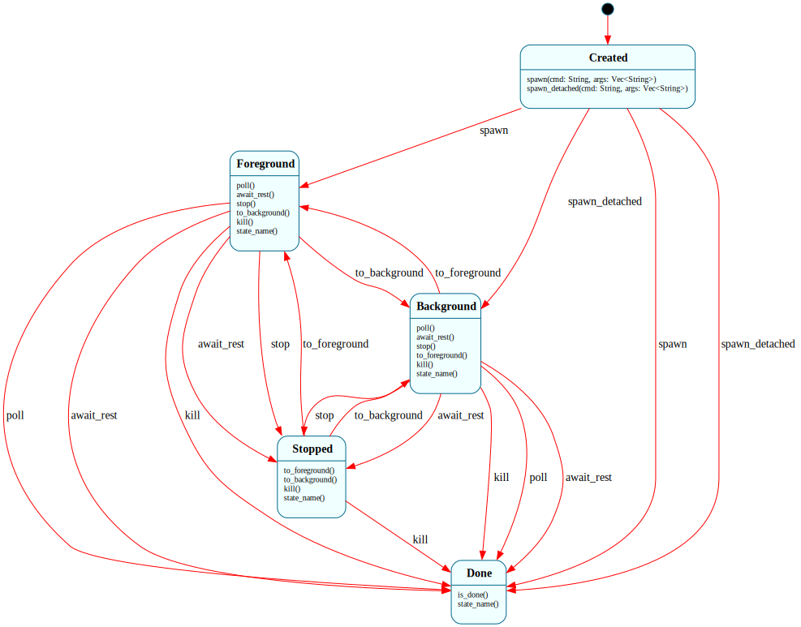

# `Job`

> Per-instance lifecycle for a spawned external process. One `Job` instance per running, stopped, or completed external command. Will be composed inside `JobControl`'s `Vec<Job>` domain at H3 Step 2.

| Property | Value |
|---|---|
| Track | Hosted (Unix-first; Windows compiles but stop/resume are no-ops) |
| Milestone introduced | H3 Step 1 |
| Source file | [`../../frame/job.frs`](../../frame/job.frs) |
| State diagram | [`job.svg`](job.svg) |
| Constructor params | `id: u32` — the job number assigned by `JobControl` |
| Instances at runtime | Many — one per spawned external command |
| Status | In progress (H3 Step 1 — standalone FSM; integration at Step 3) |

## State diagram

## States

### `$Created`

Initial. Job has an `id` but no PID yet. Waiting for `spawn(cmd, args)`.

**Transitions out:**
- `spawn(cmd, args)` → `$Foreground` — when `std::process::Command::spawn` succeeds. PID is stored in domain.
- `spawn(cmd, args)` → `$Done` — when spawn fails (e.g. `ErrorKind::NotFound`). `spawn_error` is set to the OS error string; `state_name()` reports `"Failed (...)"`.

**Events handled (no transition):** `stop`, `to_foreground`, `to_background`, `kill`, `poll` — all no-ops; these aren't valid from `$Created`.

### `$Foreground`

The job is running and currently in the foreground process group (terminal-owned).

**Transitions out:**
- `poll()` → `$Done` — when the child has exited; `try_wait` returns `Some(status)`. The exit code is recorded.
- `stop()` → `$Stopped` — SIGTSTP delivered to the PID.
- `to_background()` → `$Background` — no signal; just a state-tracking change.
- `kill()` → `$Done` — SIGKILL, then reap.

**Events handled (no transition):** `spawn`, `to_foreground` — no-ops (already in target state or invalid).

### `$Background`

Running and detached from the terminal foreground group.

**Transitions out:** same shape as `$Foreground` — `poll()` → `$Done`, `stop()` → `$Stopped`, `to_foreground()` → `$Foreground`, `kill()` → `$Done`.

**Events handled (no transition):** `spawn`, `to_background` — no-ops.

### `$Stopped`

The job has received SIGTSTP and is paused. Cannot resume without explicit `to_foreground()` or `to_background()` (both send SIGCONT before transitioning).

**Transitions out:**
- `to_foreground()` → `$Foreground` — sends SIGCONT then transitions. The Frame argument: same event name as in `$Background`, different mechanism per source state.
- `to_background()` → `$Background` — same shape.
- `kill()` → `$Done` — sends SIGCONT then SIGKILL (the SIGCONT is required to make SIGKILL deliverable to a stopped process on some platforms).

**Events handled (no transition):** `spawn`, `stop`, `poll` — no-ops. (`poll()` from `$Stopped` deliberately doesn't auto-transition; the user must explicitly resume or kill.)

### `$Done`

Terminal. All events are no-ops. Queries return final-state information including the exit code (if natural exit) or the spawn error (if spawn failed).

**Transitions out:** none.

**`state_name()`** disambiguates two arrival paths: `"Done"` after natural exit, `"Failed (<error>)"` after a spawn failure.

## Interface

| Method | Parameters | Returns | Purpose |
|---|---|---|---|
| `spawn` | `cmd: String, args: Vec<String>` | `()` | Fork+exec the command. Only valid from `$Created`; no-op elsewhere. |
| `stop` | `()` | `()` | SIGTSTP. Only valid from `$Foreground`/`$Background`. |
| `to_foreground` | `()` | `()` | Move to foreground; sends SIGCONT if was stopped. |
| `to_background` | `()` | `()` | Move to background; sends SIGCONT if was stopped. |
| `kill` | `()` | `()` | SIGKILL (with SIGCONT first if stopped). Transitions to `$Done` from any non-terminal state. |
| `poll` | `()` | `()` | Non-blocking `try_wait` check. Transitions to `$Done` if exited. |
| `id` | `()` | `u32` | Job number assigned at construction. |
| `pid` | `()` | `u32` | OS PID (0 before spawn, 0 if spawn failed). |
| `cmd_str` | `()` | `String` | Display string: `cmd` + args joined by spaces. For `jobs` builtin. |
| `state_name` | `()` | `String` | One of `"Pending"`, `"Running"`, `"Stopped"`, `"Done"`, `"Failed (...)"`. |
| `exit_code` | `()` | `i32` | Process exit code in `$Done` (0 if natural exit code unknown; -1 on wait error). |
| `is_done` | `()` | `bool` | True iff in `$Done`. |

The Frame argument here lands on `to_foreground()`, `to_background()`, and `kill()` — each does meaningfully different work depending on which state the job is in. From `$Stopped`, the resume events MUST send SIGCONT before transitioning, otherwise the process stays paused. From `$Foreground` / `$Background`, no signal is needed — it's a state-tracking change only. As plain Rust this would be `if self.state == Stopped { kill(SIGCONT); } self.state = Foreground;` repeated at every call site; in Frame the SIGCONT is a per-state handler in `$Stopped` only.

## Domain

| Field | Type | Initial | Purpose |
|---|---|---|---|
| `id` | `u32` | from constructor param | Job number |
| `cmd` | `String` | empty | Command name (binary path) |
| `args` | `Vec<String>` | empty | Args passed at spawn |
| `pid` | `u32` | `0` | OS PID (0 = not spawned or failed) |
| `child` | `Option<std::process::Child>` | `None` | Handle for `try_wait`. Set in `spawn()`, cleared after reap. |
| `exit_code` | `i32` | `0` | Set in `try_reap()` on natural exit |
| `spawn_error` | `String` | empty | Set in `spawn()` failure path; surfaces via `state_name()` |

The mixed PID+Child design: PID is used for signal delivery (`libc::kill(pid, SIG*)`), Child is used for `try_wait` and the natural-exit reap path. Keeping both avoids the dance of either fully going through libc (more `unsafe`) or fully through `std::process::Child` (which doesn't expose signal sending beyond SIGKILL).

## Why a state machine

The per-job lifecycle is the textbook state-machine case. Five lifecycle states; many events; per-state validity rules; per-state side effects (SIGCONT-before-transition from `$Stopped` is the headline). As plain Rust this would be a `JobState` enum with a 5-arm `match` inside every method (`stop`, `to_foreground`, `kill`, `poll`, etc.), with the SIGCONT logic duplicated or factored into a "was-stopped-then-resume" helper. As Frame the per-state handler simply lives in the right state.

The `$Created` → `$Done` shortcut on spawn failure is a small but real win: instead of an `Option<Job>` return from a constructor, Job is always constructable and the failure path is just a state transition. The `Failed (...)` `state_name()` surface is unified with the rest of the lifecycle.

## Composition

**Calls into:** native action helpers in `frame/job.frs`'s `actions:` block (`try_reap`, `send_signal_stop`, `send_signal_continue`, `send_signal_kill`, `format_cmd`). These use `libc` directly for signal delivery (Unix-only) and `std::process::Child::try_wait` for reap. No other Frame systems.

**Called from:** standalone at H3 Step 1 (tests only). At H3 Step 2, `JobControl` will hold `Vec<Job>` in its domain and call Job's interface methods to drive each instance.

**Native modules used by actions:**
- `std::process::{Command, Child}` — spawn + try_wait
- `libc::{kill, SIGTSTP, SIGCONT, SIGKILL}` — signal delivery (Unix only; gated by `#[cfg(unix)]`)

## Testing

See [`../testing.md`](../testing.md) for the project-wide testing approach.

**State graph snapshot (Level 2):**
- Test file: [`../../shell/tests/state_graphs.rs`](../../shell/tests/state_graphs.rs)
- Snapshot file: `shell/tests/snapshots/state_graphs__job_state_graph.snap`
- Test name: `job_state_graph_snapshot`
- Status: present, accepted

**Behavioral tests (Level 3):**
Test file: [`../../shell/tests/job_behavior.rs`](../../shell/tests/job_behavior.rs). All gated `#![cfg(unix)]` since they invoke POSIX-only binaries (`/bin/sleep`, `/usr/bin/true`, `/usr/bin/false`).

16 tests covering every committed state-event pair:

- `job_starts_in_created` — initial state, id propagation, no PID
- `spawn_transitions_to_foreground_with_running_state` — happy-path spawn
- `spawn_failure_jumps_to_done_with_error` — non-existent binary → `$Done`
- `poll_after_immediate_exit_transitions_to_done_with_code_zero` — `/usr/bin/true`
- `poll_after_nonzero_exit_surfaces_code` — `/usr/bin/false`
- `poll_in_foreground_returns_false_for_long_running` — `sleep 10`
- `kill_in_foreground_transitions_to_done` — SIGKILL from `$Foreground`
- `kill_in_done_is_idempotent` — terminal-state robustness
- `stop_in_foreground_transitions_to_stopped` — SIGTSTP
- `to_foreground_from_stopped_resumes_into_foreground` — SIGCONT + transition
- `to_background_from_stopped_resumes_into_background` — SIGCONT + transition
- `to_background_from_foreground_changes_state` — bare state-tracking transition
- `done_state_ignores_all_lifecycle_events` — terminal robustness
- `cmd_str_handles_no_args` — display formatting
- `cmd_str_joins_args_with_spaces` — display formatting
- `id_propagates_through_lifecycle` — id stays stable across transitions

**Integration tests (Level 4):** N/A at H3 Step 1. Composition with `JobControl` (H3 Step 2) and through `Shell.$RunningForeground` (H3 Step 3) will exercise it integrally.

**E2E tests (Level 6):** N/A — Job has no public CLI surface on its own. E2E coverage lands at H3 Step 3 with the `&` background syntax and at Step 4 with the `jobs` / `fg` / `bg` / `wait` builtins.

## Native action implementations

Defined in the `actions:` block in `frame/job.frs`:

- `try_reap(): bool` — calls `self.child.try_wait()`; if `Some(status)`, records exit code and returns true; if `None`, returns false. Cross-platform.
- `send_signal_stop()` / `send_signal_continue()` — Unix-only `libc::kill(pid, SIG*)`. Empty on Windows (gated by `#[cfg(unix)]`).
- `send_signal_kill()` — Unix: `libc::kill(pid, SIGKILL)`. Windows: falls back to `Child::kill()`.
- `format_cmd(): String` — joins `cmd` and `args` with spaces.

The `unsafe` blocks are confined to `libc::kill` calls. Each is one line, the signal number is a known constant, and the PID is a `u32` from a Child handle we control — no UB surface.

## Open questions

- **Stopped → Done auto-transition on poll?** Currently `poll()` from `$Stopped` is a no-op even if `waitpid(WUNTRACED)` would report a stopped status. We could surface "stopped-or-exited" through poll. Deferred — the explicit `to_foreground`/`to_background`/`kill` path is cleaner and matches what JobControl will drive.
- **Windows stop/resume?** Windows doesn't have SIGTSTP/SIGCONT analogs without Job Objects + suspend/resume thread APIs. H3 Step 4 will gate `jobs`/`fg`/`bg`/`wait` builtins on `#[cfg(unix)]`. The Job FSM itself compiles on Windows; the stop/resume actions are no-ops there.
- **Process group / `setpgid`?** Right now spawn() doesn't put the child in its own process group, so Ctrl-C in `$Prompting` could still hit a recently-spawned background job. H3 Step 3 (Shell integration) will add `pre_exec(|| setpgid(0, 0))` via `std::os::unix::process::CommandExt`.

## Related documents

- [Architecture](../architecture.md) — overall project structure
- [Roadmap](../roadmap.md#h3--job-control) — H3 scope and exit criteria
- [Testing](../testing.md) — project-wide testing approach
- `JobControl` per-system doc (H3 Step 2 — not yet written) — manager that composes Job
- [Systems index](README.md)

## Change log

- **2026-05-19** — initial doc, H3 Step 1: standalone `Job` FSM with 5 states ($Created, $Foreground, $Background, $Stopped, $Done) and 14 edges. 16 Level-3 behavioral tests (`shell/tests/job_behavior.rs`, all `#![cfg(unix)]`). Plus snapshot test for the graph. No Shell integration yet — that's Step 3.
