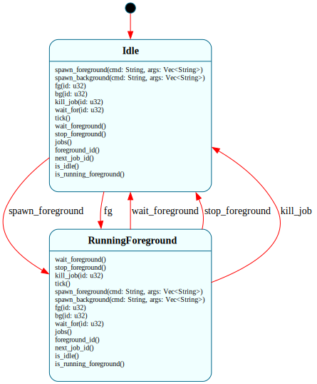

# `JobControl`

> Manager FSM for the hosted shell's job table. Holds `Vec<Job>` in domain and routes per-job operations through its interface. Tracks at most one foreground job at a time; everything else is background or stopped. The "manager + N instances" pattern that will recur at B4 with `ProcessTable` + `Process`.

| Property | Value |
|---|---|
| Track | Hosted (Unix-first; Windows compiles but stop/resume features no-op via Job's per-action `#[cfg(unix)]` gates) |
| Milestone introduced | H3 Step 2 |
| Source file | [`../../frame/job_control.frs`](../../frame/job_control.frs) |
| State diagram | [`job_control.svg`](job_control.svg) |
| Instances at runtime | Exactly one per Shell |
| Status | In progress (H3 Step 2 — standalone FSM landed; Shell integration at Step 3) |

## State diagram

## States

### `$Idle` (initial)

No foreground job is running. The Shell can prompt for input. Background and stopped jobs may exist in the `jobs` vector but they aren't being waited on right now.

**Transitions out:**
- `spawn_foreground(cmd, args)` → `$RunningForeground` — creates a new `Job`, calls `Job.spawn`. If `spawn` succeeds, sets `foreground_id` and transitions. If `spawn` fails (e.g. NotFound), the failed Job is added to the list but state stays in `$Idle` (so `jobs` can show it).
- `fg(id)` → `$RunningForeground` — brings the matching Job to foreground via `Job.to_foreground()` (which sends SIGCONT if it was stopped). No transition if `id` doesn't exist or the job is already `$Done`.

**Events handled (no transition):**
- `spawn_background(cmd, args)` — creates Job, calls `spawn` then `to_background`. Adds to list.
- `bg(id)` — calls `Job.to_background()` on the matching job (typically a stopped one being resumed).
- `kill_job(id)` — calls `Job.kill()`.
- `wait_for(id)` — drives `Job.poll()` in a loop until the matching job is `$Done`.
- `tick()` — reaps any non-`$Done` job (single non-blocking poll cycle per job).
- `wait_foreground()`, `stop_foreground()` — no-op in `$Idle`.

### `$RunningForeground`

A foreground job exists (`foreground_id == Some(N)`). Shell's `$RunningForeground.$>` (at H3 Step 3) calls `wait_foreground()` here, which drives the polling loop until the job exits or is stopped.

**Transitions out:**
- `wait_foreground()` → `$Idle` — calls `drive_foreground_to_idle()` action which polls the foreground Job in a small loop (sleep 20ms between polls) until it reaches `$Done` or `$Stopped`. Clears `foreground_id` and transitions.
- `stop_foreground()` → `$Idle` — sends SIGTSTP to the foreground Job (transitioning it to `$Stopped`), clears `foreground_id`, transitions. Called from a SIGTSTP signal handler at H3 Step 3.
- `kill_job(id)` → `$Idle` — only transitions if the killed job *is* the foreground; otherwise just kills the background job and stays.

**Events handled (no transition):**
- `tick()` — reaps all non-done jobs (same as `$Idle.tick()`).
- `wait_for(id)` — same as `$Idle`.
- `spawn_foreground`, `spawn_background`, `fg`, `bg` — no-ops; you can't launch a new foreground when one is already active (H3 doesn't support job-stacking; real shells do).

## Interface

| Method | Parameters | Returns | Purpose |
|---|---|---|---|
| `spawn_foreground` | `cmd: String, args: Vec<String>` | `()` | Spawn as foreground; transition to `$RunningForeground` |
| `spawn_background` | `cmd: String, args: Vec<String>` | `()` | Spawn as background; stay `$Idle` |
| `wait_foreground` | `()` | `()` | Drive the polling loop until foreground completes or stops |
| `stop_foreground` | `()` | `()` | SIGTSTP the foreground job; transition `$Idle` |
| `fg` | `id: u32` | `()` | Bring job `id` to foreground (no-op if missing/done) |
| `bg` | `id: u32` | `()` | Resume job `id` in background (sends SIGCONT if was stopped) |
| `kill_job` | `id: u32` | `()` | SIGKILL job `id` (with SIGCONT first if stopped) |
| `wait_for` | `id: u32` | `()` | Block until job `id` is `$Done` |
| `tick` | `()` | `()` | Single non-blocking poll cycle across all non-done jobs |
| `jobs` | `()` | `Vec<JobSummary>` | Snapshot list for the `jobs` builtin |
| `foreground_id` | `()` | `u32` | Currently-foreground job id (0 if none) |
| `next_job_id` | `()` | `u32` | Next id that will be assigned by spawn |
| `is_idle` | `()` | `bool` | True iff in `$Idle` |
| `is_running_foreground` | `()` | `bool` | True iff in `$RunningForeground` |

`wait_foreground()` is the blocking driver Shell will call from `$RunningForeground.$>` at Step 3. The polling sleep (20ms) is small enough that Ctrl-Z latency is imperceptible and large enough that idle CPU usage is negligible.

`tick()` is the non-blocking driver Shell will call once per prompt cycle (Step 3) to reap done background jobs before showing the next prompt.

The Frame argument lands on `kill_job(id)`: in `$Idle` it's just a kill; in `$RunningForeground` it additionally checks whether the killed job *is* the foreground and transitions back to `$Idle` if so. Same event, state-dependent dispatch — the consumer doesn't have to know whether the kill target is the foreground; JobControl routes correctly.

## Domain

| Field | Type | Initial | Purpose |
|---|---|---|---|
| `jobs` | `Vec<Job>` | `Vec::new()` | The job table. Grows monotonically — no slot reuse. |
| `next_id` | `u32` | `1` | Next id to assign at spawn. Job ids start at 1 (bash convention). |
| `foreground_id` | `Option<u32>` | `None` | Which Job is currently foreground (`None` ↔ `$Idle`). |

The PID + Child design lives inside each `Job` (see [`job.md`](job.md)). JobControl just holds them and looks them up by id.

## Why a state machine

Borderline Frame fit — two states, mostly the operations work the same way in both. What earns the FSM:

1. **`kill_job(id)`** has materially different state-tracking behavior per state. In `$Idle`: just kill. In `$RunningForeground`: if the killed job IS the foreground, transition to `$Idle`. As plain Rust this is a conditional check at one site; as Frame, the conditional becomes a per-state handler split. Modest win.

2. **`spawn_foreground` is only legal from `$Idle`** at H3 (you can't launch a new foreground when one's already running — real shells handle this with job stacking; we don't). Frame makes that illegality structural rather than a runtime check.

3. **The pattern repeats at B4 with `ProcessTable` + `Process`.** Locking in the manager-FSM-plus-Vec-of-instances shape at H3 sets the precedent. ProcessTable will track slot allocation states (`$Free → $Reserved → $Active → $ZombieAwaitingReap`) and the same Frame argument carries.

The honest accounting: at H3 alone, JobControl could be plain Rust with a `Vec<Job>` field and the conditional in `kill_job`. It's the precedent-setting + the small-but-real `kill_job` dispatch that earns the Frame system designation.

## Composition

**Calls into:**
- `@@Job(self.next_id)` — Frame system instantiation (RFC-0024). Each new job is a separate Frame system instance.
- Per-Job interface methods: `Job.spawn`, `Job.poll`, `Job.stop`, `Job.kill`, `Job.to_foreground`, `Job.to_background`, `Job.id`, `Job.is_done`, `Job.state_name`, `Job.cmd_str`.
- `std::thread::sleep` for the 20ms inter-poll sleep in `drive_foreground_to_idle()`.

**Called from:** standalone at H3 Step 2 (tests only). At H3 Step 3, `Shell` will hold a `JobControl` in its domain and call:
- `spawn_foreground` / `spawn_background` from the renamed `$RunningExternal` (or new `$RunningForeground` / background-launch path) state.
- `wait_foreground` from `$RunningForeground.$>`.
- `tick` once per `$Prompting` entry to reap completed background jobs.
- `stop_foreground` from the SIGTSTP signal handler (Ctrl-Z).
- `fg` / `bg` / `kill_job` / `jobs` / `wait_for` from the new H3 Step 4 builtins.

**Native modules used by actions:** `std::thread`, `std::time::Duration`. Plus the JobSummary type from [`shell/src/job_summary.rs`](../../shell/src/job_summary.rs).

## Testing

See [`../testing.md`](../testing.md) for the project-wide testing approach.

**State graph snapshot (Level 2):**
- Test file: [`../../shell/tests/state_graphs.rs`](../../shell/tests/state_graphs.rs)
- Snapshot file: `shell/tests/snapshots/state_graphs__job_control_state_graph.snap`
- Test name: `job_control_state_graph_snapshot`
- Status: present, accepted

**Behavioral tests (Level 3):**
Test file: [`../../shell/tests/job_control_behavior.rs`](../../shell/tests/job_control_behavior.rs). All `#![cfg(unix)]` because they invoke POSIX binaries through Job.

19 tests covering the committed surface:

*Initial state:*
- `fresh_job_control_is_idle_with_empty_job_list`

*spawn_foreground:*
- `spawn_foreground_transitions_to_running_foreground`
- `spawn_foreground_failure_stays_idle`
- `spawn_foreground_zero_exit_completes_via_wait_foreground`

*spawn_background:*
- `spawn_background_stays_idle_and_adds_to_job_list`
- `multiple_background_jobs_get_distinct_ids`

*fg / bg:*
- `fg_brings_background_job_to_foreground`
- `fg_with_nonexistent_id_stays_idle`
- `fg_with_done_job_does_not_transition`
- `bg_resumes_stopped_job_in_background`

*stop_foreground:*
- `stop_foreground_transitions_to_idle_with_job_stopped`
- `stop_foreground_in_idle_is_noop`

*kill_job:*
- `kill_job_in_idle_kills_background_job`
- `kill_job_of_foreground_transitions_to_idle`

*wait_for:*
- `wait_for_blocks_until_specified_background_job_done`
- `wait_for_nonexistent_id_returns_immediately`

*tick:*
- `tick_reaps_completed_background_jobs`

*jobs():*
- `jobs_summary_includes_id_state_and_cmd`
- `jobs_summary_reflects_mixed_states`

**Integration tests (Level 4):** N/A at H3 Step 2. JobControl + Shell composition lands at Step 3.

**E2E tests (Level 6):** N/A — JobControl has no public CLI surface yet. E2E coverage arrives at Step 3 (`&` background launch) and Step 4 (`jobs` / `fg` / `bg` / `wait` builtins).

## Native action implementations

Three action bodies in the `actions:` block:

- `drive_foreground_to_idle()` — the polling loop. Finds the foreground job by id, polls it, breaks out when `is_done()` or `state_name() == "Stopped"`. Sleeps 20ms between polls.
- `poll_until_done(id)` — same shape but for any job id, used by `wait_for`. Breaks only on `$Done`.
- `job_summaries()` — builds the `Vec<JobSummary>` returned by `jobs()`. Iterates `self.jobs.iter_mut()` (because `Job`'s query methods take `&mut self` per framec convention).

The action bodies use field-access (`j.id`, the public domain field) rather than method-call (`j.id()`) for the lookup loops, because the iterator yields `&Job` and the methods need `&mut`. Lookup-by-id is the small but real reason JobControl's actions touch the `pub` domain field surface directly.

## Open questions

- **`drive_foreground_to_idle`'s 20ms poll interval** — could be smaller for snappier Ctrl-Z feel, or larger for lower idle CPU. 20ms is a defensible default but worth measuring later.
- **Job-stacking when foreground exists** — `spawn_foreground` from `$RunningForeground` is currently a no-op. Real shells support starting nested foregrounds (the prior foreground gets suspended). Deferred — Frame OS doesn't try to be a full bash.
- **PID reuse / id cycling** — `next_id` only grows. After 4 billion jobs we wrap. Acceptable; real shells don't worry about it either.
- **Slot reclamation** — finished jobs stay in `self.jobs` indefinitely (the `jobs` builtin still shows "Done"). Real shells prune after a "done" notice. Deferred to H3 polish.

## Related documents

- [Architecture](../architecture.md) — where JobControl fits
- [Roadmap](../roadmap.md#h3--job-control) — H3 scope and exit criteria
- [Job](job.md) — per-instance FSM that JobControl orchestrates
- [Testing](../testing.md) — project-wide testing approach
- [Systems index](README.md)

## Change log

- **2026-05-19** — initial doc, H3 Step 2: standalone `JobControl` FSM. 2 states ($Idle, $RunningForeground), 6 edges. 19 Level-3 behavioral tests. No Shell integration yet — that's Step 3.
