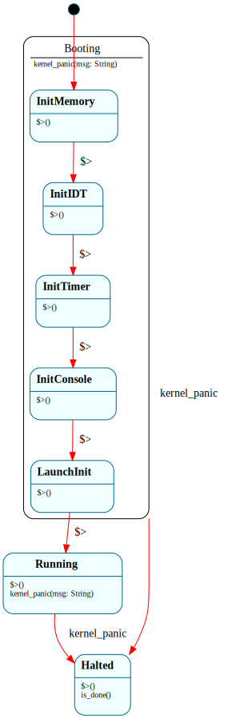

# `Kernel`

> Top-level bare-metal kernel lifecycle: drives the boot phase chain, sits in `$Running` while the system is live, and falls into `$Halted` on shutdown or panic. First hierarchical state machine (HSM) in the project — `$Booting` is a parent state with five init-phase children, all of which forward `kernel_panic()` to the parent via `=> $^`.

| Property | Value |
|---|---|
| Track | Bare-metal |
| Milestone introduced | B0 Step 2 |
| Source file | [`../../frame/kernel.frs`](../../frame/kernel.frs) |
| State diagram | [`kernel.svg`](kernel.svg) |
| Instances at runtime | Exactly one per kernel image |
| Status | Implemented. Boots in QEMU; the HSM drives the full init chain to `$Running`. Validated by the `boot_hsm_runs_init_chain_b0` QEMU smoke test. |

## Status note

This system was briefly blocked: framec 4.2.0's Rust target originally hardcoded `std::rc::Rc`, `std::collections::HashMap`, and `std::any::Any`, which don't compile in the `no_std` kernel (framec issue #31). That's now fixed — framec emits `alloc::rc::Rc`, `alloc::collections::BTreeMap`, and `core::any::Any`. The kernel crate's `build.rs` invokes framec on `frame/kernel.frs` and `src/frame_systems.rs` `include!`s the generated module, re-exporting `String`/`Vec`/`Box`/`ToString` from `alloc` so the generated code's unqualified references resolve in the `no_std` environment. Behavioral / snapshot tests still await a host-target test crate (the kernel bin can't host `cargo test`); see Testing below.

## State diagram

Regenerate via `cargo xtask regen-diagrams` after any `.frs` change. The SVG is committed and `cargo xtask check-diagrams` enforces drift in CI.

## States

### `$InitMemory`

First child of `$Booting`. Currently a stub that prints `[boot] init memory` and transitions to `$InitIDT`. At B1 this is where the page-table setup and the heap allocator initialization will live (today the kernel's heap is set up by `kernel/src/allocator.rs` before `Kernel::__create()` is called; that ordering moves into the state's `$>` handler once the HSM owns the boot chain).

**Transitions out:**
- `$>` (enter) — prints phase banner; transitions to `$InitIDT`

**Forwarding:**
- `=> $^` — any non-`$>` event (in practice only `kernel_panic()`) forwards to `$Booting`'s handler.

### `$InitIDT`

Second child. Stub: prints `[boot] init IDT` and transitions to `$InitTimer`. At B1 this is where the IDT (Interrupt Descriptor Table) is constructed and `lidt` is executed — without an IDT the CPU triple-faults on the first interrupt.

**Transitions out:**
- `$>` (enter) — prints phase banner; transitions to `$InitTimer`

**Forwarding:**
- `=> $^` — forwards `kernel_panic()` to `$Booting`.

### `$InitTimer`

Third child. Stub: prints `[boot] init timer` and transitions to `$InitConsole`. At B1 this programs the APIC timer (or PIT as a fallback on machines without an APIC) and registers the tick handler that `Scheduler.tick()` will hook into.

**Transitions out:**
- `$>` (enter) — prints phase banner; transitions to `$InitConsole`

**Forwarding:**
- `=> $^` — forwards `kernel_panic()` to `$Booting`.

### `$InitConsole`

Fourth child. Stub: prints `[boot] init console` and transitions to `$LaunchInit`. At B0 Step 3 this is where the `SerialDriver` FSM is constructed and made the destination for `serial::*` writes (replacing the current direct port-IO).

**Transitions out:**
- `$>` (enter) — prints phase banner; transitions to `$LaunchInit`

**Forwarding:**
- `=> $^` — forwards `kernel_panic()` to `$Booting`.

### `$LaunchInit`

Fifth and final child. Stub: prints `[boot] launching init` and transitions to `$Running`. At B1+ this constructs the initial task set (`BlinkerTask`, `ConsoleTask`, `WatchdogTask`) and hands control to `Scheduler` for the first dispatch.

**Transitions out:**
- `$>` (enter) — prints phase banner; transitions to `$Running`

**Forwarding:**
- `=> $^` — forwards `kernel_panic()` to `$Booting`.

### `$Booting` (parent)

The HSM parent over the five init phases. Does no work itself; exists to host the shared `kernel_panic()` handler that all init children forward to via `=> $^`. Without the HSM this handler would be duplicated five times.

**Events handled (no transition out of the parent):**
- `kernel_panic(msg)` — prints `KERNEL PANIC during boot: <msg>` and transitions to `$Halted`.

### `$Running`

The kernel is live. Reached from `$LaunchInit.$>`. At B0 the kernel has no scheduler, so `$Running` is a terminal sink that `kmain` polls for `is_done()` (returning `false`) and then halts the CPU. At B1, `$Running` gains a `tick()` event that drives `Scheduler.tick()`, and the kernel becomes interrupt-driven.

**Transitions out:**
- `kernel_panic(msg)` → `$Halted` — runtime panic path. Distinct from `$Booting`'s handler: prints `KERNEL PANIC during runtime: <msg>` instead.
- `$>` (enter) — prints `[run] kernel running`.

### `$Halted`

Terminal sink. Reached from any panic. `is_done()` returns `true`; `kmain` notices and calls `halt_forever()` which sits in `hlt`. The halt is kept in `kmain` rather than in the state's `$>` handler so the kernel can be host-side unit-tested without the test process actually executing the `hlt` instruction.

**Transitions out:** None (terminal).

**Events handled (no transition):**
- `$>` (enter) — prints `[halted]`.
- `is_done()` — returns `true`.

## Interface

| Method | Parameters | Returns | Purpose |
|---|---|---|---|
| `kernel_panic` | `msg: String` | (none) | Trigger the panic chain from any state. Routed to the parent in `$Booting` (boot-phase panic) or handled directly in `$Running` (runtime panic). |
| `is_done` | (none) | `bool` | Polled by `kmain`. Returns `false` everywhere except `$Halted`. Lets `kmain` decide when to call `halt_forever()`. |

Both interface methods use Frame's default-value syntax in the interface declaration (`is_done(): bool = false`) so states only override `is_done` where the default isn't right — currently just `$Halted`.

## Domain

No domain block. At B0 the kernel has no per-instance persistent data — all state is implicit in which state is active. B1 adds a domain field for the scheduler reference; B2 adds one for the console driver reference.

## Why a state machine

**What would this look like as plain Rust?** An `enum KernelState { Booting(BootPhase), Running, Halted }` plus a top-level `match` per event handler. The boot chain itself would be a series of function calls — `init_memory(); init_idt(); init_timer(); ...` — each of which might fail and need to be threaded through `Result` to a global panic handler. The "same `kernel_panic` event behaves differently in `$Booting` vs `$Running`" property would be a manual `if matches!(state, KernelState::Booting(_))` branch in every place a panic could fire.

**What does Frame buy?**

- **HSM forwarding eliminates handler duplication.** Five init phases all need identical panic handling. The Frame source has one handler in `$Booting` and five `=> $^` lines (each one character of intent: "delegate to parent"). The plain-Rust equivalent is either five copies of the panic body or a helper function that all five phases call — the second is less duplicative but it's invisible from the call sites whether the helper got called, so subtle bugs (forgetting to call it in a sixth phase added later) don't surface until panic time.
- **Same-event-different-state is structural.** `kernel_panic()` in `$Booting`'s children prints `"PANIC during boot"`; in `$Running` it prints `"PANIC during runtime"`. The plain-Rust equivalent is a match on the current state inside the panic handler — fine for two cases, untenable for ten.
- **The boot sequence is the state machine.** The init order — memory, IDT, timer, console, init — is encoded in the `-> $NextPhase` transitions of each child. Adding `$InitGDT` between `$InitMemory` and `$InitIDT` is a two-line change: rename `$InitMemory`'s transition target, add the new state. The plain-Rust equivalent requires editing both `init_memory()`'s "what to call next" and the supervising `boot()` function — two places that must agree.
- **The state graph is the documentation.** [`kernel.svg`](kernel.svg) shows the boot chain at a glance, with the parent-child HSM nesting visible. A reader doesn't need to trace function calls to understand the order.

**What would be lost by not using Frame here?** Specifically: the panic-forwarding pattern. Five hand-written init phases that each must remember to call a shared panic helper, with no compiler enforcement, is the kind of code that ships a bug eight months later when phase six is added and the helper call is forgotten. With Frame the `=> $^` is the only way to express the forwarding, so the omission would have to be deliberate.

The Frame argument here is real but compact — the kernel HSM is small (5 init children + 2 peers) and won't grow much. The argument scales further at B1 (where `Scheduler`'s state machine is more complex) and especially at B3 (where the bytecode interpreter's fetch-decode-execute cycle is literally a state machine). The kernel HSM at B0 is mostly a vehicle for proving HSM forwarding works end-to-end before later systems depend on it.

## Composition

**Calls into:**
- `serial::writeln(&str)` / `serial::write_str(&str)` — every state's `$>` handler prints a phase banner. (At B0 Step 3 this becomes calls into a `SerialDriver` FSM instead of direct port-IO.)

**Called from:**
- `kmain` in `kernel/src/main.rs` — calls `Kernel::__create()` once at boot. The `__create` synchronously drives the boot chain (each phase's `$>` runs the next phase's enter) and returns once the kernel has reached `$Running` or `$Halted`. `kmain` then polls `is_done()` and calls `halt_forever()` when true.
- Future: `panic_handler` in `kernel/src/main.rs` will fire `kernel_panic()` on the global Kernel reference. At B0 this isn't wired up yet (Rust's `#[panic_handler]` is global and routing it to a Frame instance needs a `static Mutex<Option<Kernel>>` or similar; that lands when the panic handler can usefully access kernel state).

**Native modules used by actions:**
- `crate::serial` — the byte-level UART writer at port 0x3F8

## Testing

**State graph snapshot (Level 2):**
- Not yet present. Lands with B0 Step 2 codegen.
- Will be: `kernel/tests/state_graphs.rs` snapshot file once the kernel crate can host tests.

**Behavioral tests (Level 3):**
- Not yet present. The kernel crate at B0 Step 1 is `[[bin]]` + `#![no_std]` + `#![no_main]` for `x86_64-unknown-none` and can't host normal `cargo test` integration tests against the host. Once framec #31 lands and the Frame system generates `no_std`-compatible code, a separate host-target test crate (likely `kernel-tests/`) will exercise behavioral tests against the generated state machine independent of the bare-metal target.
- Planned tests, one per committed state-event pair:
  - `panic_in_init_memory_forwards_to_booting_parent`
  - `panic_in_init_idt_forwards_to_booting_parent`
  - `panic_in_init_timer_forwards_to_booting_parent`
  - `panic_in_init_console_forwards_to_booting_parent`
  - `panic_in_launch_init_forwards_to_booting_parent`
  - `panic_in_running_uses_runtime_handler`
  - `boot_chain_progresses_through_all_init_phases`
  - `is_done_is_false_in_booting`, `is_done_is_false_in_running`, `is_done_is_true_in_halted`

**Integration tests (Level 4):**
- Not yet applicable; Kernel doesn't compose with other Frame systems until B0 Step 3 introduces `SerialDriver`. Then `kernel_console_init_drives_serial_driver_to_idle` will assert the composition.

**QEMU smoke tests (Level 7):**
- `cargo xtask qemu-test` runs the smoke test suite (in the `SMOKE_TESTS` table in [`../../xtask/src/main.rs`](../../xtask/src/main.rs)). Two tests cover this system:
  - `boot_prints_banner_b0` — asserts the Step 2 banner (`Frame OS kernel — B0 Step 2`) and `entering boot HSM...` appear, and no panic markers are present. Catches Limine misconfiguration, UEFI firmware path bugs, kernel ELF layout regressions, and serial-port changes.
  - `boot_hsm_runs_init_chain_b0` — asserts each init phase prints its banner **in order** (`[boot] init memory` → `IDT` → `timer` → `console` → `launching init`) followed by `[run] kernel running`. This is the bare-metal proof that the whole HSM boot chain executes: each `[boot] <phase>` is one init child's `$>` enter handler firing on its transition, and `[run] kernel running` is `$Running`'s enter handler. No panic/triple-fault markers permitted.
- These run in CI on Linux (the `qemu-test` job). They don't exercise the panic-forwarding paths (`=> $^`) — that needs the host-target behavioral tests above, which can fire `kernel_panic()` directly.

**Hardware tests (Level 8):**
- Not applicable at B0. The kernel doesn't run on real hardware until a later track (the project's bare-metal target is QEMU x86_64 first; Pi 4/Pico are stretch goals).

## Native action implementations

At B0 the Frame source's action bodies are all inline `serial::*` calls — no separate `actions:` block, no delegation to a Rust module. Each `$>` handler is a one-liner that prints a phase banner and then transitions. This is deliberate for the boot HSM: the work each phase does (memory init, IDT init, etc.) lands incrementally over B0 Step 3 and B1+ as separate refactors of individual states. Today the body is a stub.

When real init work lands, the pattern will be: `actions:` block delegates each phase's work to a function in a Rust module (e.g. `crate::memory::init_paging()`), and the Frame source's action stays a one-liner that calls the action. This keeps the state machine readable as a control-flow document while letting the action implementations be tested and extended independently.

## Open questions

- **Where should the panic-handler-to-Kernel routing live?** Rust's `#[panic_handler]` is a global function — it has no `&mut Kernel` to dispatch on. Options: a `static Mutex<Option<&'static Kernel>>` set during `kmain`, a global event queue the panic handler pushes to and the kernel drains, or keeping the panic path entirely in the native panic handler (printing to serial and halting) without going through the Frame state machine. The third is what B0 Step 1 already does; B0 Step 2 likely keeps it that way until there's a compelling reason to thread panics through the Frame layer. Decision deferred to the first time a panic needs to do anything more than print-and-halt.
- **Should `$Running` actually be one state or split into `$Idle` (no work pending) and `$Processing` (handling an interrupt)?** Today's `$Running` is a sink; B1's needs are unclear. Will be revisited when `Scheduler.tick()` lands.
- **Should the boot chain be reorderable?** Currently each child's `$>` hardcodes its next phase via `-> $NextPhase`. An alternative is a domain-level "next phase" pointer that the parent advances. The hardcoded chain is simpler and the order is genuinely fixed (memory before IDT, IDT before timer, etc.); the indirection would only pay off if phases became optional, which they aren't.

## Related documents

- [Architecture](../architecture.md) — overall project structure; the B-track section
- [Roadmap](../roadmap.md) — B0 milestone exit criteria
- [Shell](shell.md) — example HSM at a smaller scale (`$RunningExternal` is non-hierarchical, but the doc covers state-dependent dispatch in detail)
- framec issue #31 (no_std incompatibility) — filed in framec's `_scratch/FRAMEC_BUGS.md`; **fixed**, which unblocked this system's Rust codegen

## Change log

- **2026-05-19** — initial doc; HSM designed and SVG committed; Rust codegen pending framec #31.
- **2026-05-20** — framec #31 fixed; B0 Step 2 landed. Kernel HSM now compiles into the `no_std` kernel and boots in QEMU; `boot_hsm_runs_init_chain_b0` smoke test validates the full boot chain.
