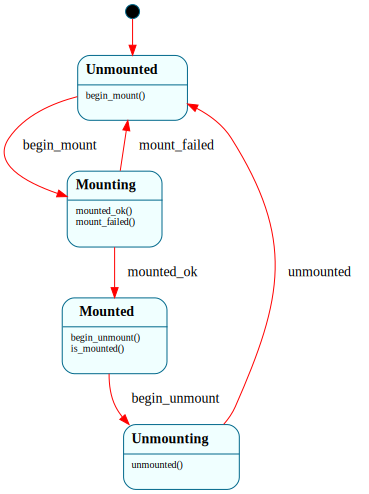

# `Mount`

> A filesystem's mount/unmount lifecycle: `$Unmounted → $Mounting → $Mounted → $Unmounting → $Unmounted`, with a mount-failed path back to `$Unmounted`. Makes the legal sequence structural — the FS can only be read while `$Mounted`.

| Property | Value |
|---|---|
| Track | Bare-metal |
| Milestone introduced | B4 (Step 2) |
| Source file | [`../../frame/mount.frs`](../../frame/mount.frs) |
| State diagram | [`mount.svg`](mount.svg) |
| Instances at runtime | One per mounted filesystem |
| Status | Implemented and load-bearing — `fs::run_demo` drives it around the mount. |

## State diagram

## States

### `$Unmounted` (initial)
No filesystem mounted. `begin_mount()` → `$Mounting`.

### `$Mounting`
Mount in progress (the kernel is validating the superblock). `mounted_ok()` → `$Mounted`; `mount_failed()` → `$Unmounted` (and a retry can follow).

### `$Mounted`
The FS is usable. `begin_unmount()` → `$Unmounting`. Overrides `is_mounted()` → `true` — the gate reads/writes check.

### `$Unmounting`
Unmount in progress. `unmounted()` → `$Unmounted`.

## Interface

| Method | Returns | Purpose |
|---|---|---|
| `begin_mount` | (none) | Start a mount (`$Unmounted` → `$Mounting`). |
| `mounted_ok` / `mount_failed` | (none) | Resolve the mount → `$Mounted` / back to `$Unmounted`. |
| `begin_unmount` | (none) | Start an unmount (`$Mounted` → `$Unmounting`). |
| `unmounted` | (none) | Finish the unmount → `$Unmounted`. |
| `is_mounted` | `bool` | True only in `$Mounted`. |

Pure lifecycle — no domain, no native actions.

## Composition

**Driven by:** `crate::fs::run_demo` (and the FS layer generally) — `begin_mount()`, validate the superblock (`fs::check_superblock`), then `mounted_ok()` / `mount_failed()`; file reads/writes happen only while `is_mounted()`. The block/inode/dirent mechanics are native (`fs.rs` over the buffer cache + virtio-blk); `Mount` owns the lifecycle.

## Testing

**State graph snapshot (Level 2):** `kernel-tests/tests/state_graphs.rs::mount_state_graph_snapshot`.

**Behavioral (Level 3):** `kernel-tests/tests/mount_behavior.rs` — 5 tests: fresh-not-mounted; successful mount → `$Mounted`; failed mount returns to `$Unmounted` (+ retry succeeds); unmount round-trips; `mounted_ok` before `begin_mount` ignored.

**QEMU (Level 7):** `fs_file_roundtrip_b4` + `fs_persists_across_reboot_b4` — the kernel mounts the disk (`[fs] mounted`), reads/writes files, and (on the reboot test) verifies a write survived a reboot.

## Related documents
- [Roadmap](../roadmap.md) — B4 Step 2 (B4-1/B4-2/B4-3/B4-4)
- [`BlockRequest`](block_request.md) — the layer below (block I/O the FS reads/writes through)

## Change log
- **2026-05-21** — initial doc; B4 Step 2. `$Unmounted → $Mounting → $Mounted → $Unmounting`, driving the FS mount lifecycle over the on-disk inode FS + buffer cache.
