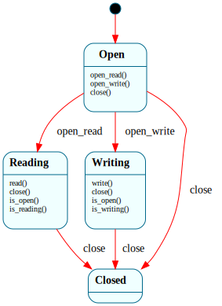

# `OpenFile`

> The lifecycle of one open file descriptor, with the **access mode as the state**: `$Open → $Reading | $Writing → $Closed`. State-dependent dispatch makes "can't write a read-only fd" / "can't touch a closed fd" structural — the wrong operation is gated out, not silently applied.

| Property | Value |
|---|---|
| Track | Bare-metal |
| Milestone introduced | B4 (Step 3) |
| Source file | [`../../frame/open_file.frs`](../../frame/open_file.frs) |
| State diagram | [`open_file.svg`](open_file.svg) |
| Instances at runtime | One per open file descriptor (the VFS fd table) |
| Status | Implemented and load-bearing — the VFS drives one per fd. |

## State diagram

## Why the mode is the state

A file descriptor has a persistent access mode chosen at `open` (read vs write), and that mode determines which operations are legal for the descriptor's whole life. Modeling the mode *as the state* — rather than a flag checked in each op — makes the rule structural: `read()` is only handled in `$Reading` and `write()` only in `$Writing`, so a stray write to a read-only fd (or any op on a closed fd) is dropped by Frame's explicit-only dispatch rather than reaching the disk. (This is the same "the invariant is the state" call as `Mount.is_mounted` and `Process`'s lifecycle.)

## States

### `$Open` (initial)
Just created, mode not yet chosen. `open_read()` → `$Reading`; `open_write()` → `$Writing`; `close()` → `$Closed`.

### `$Reading`
Opened for reading. `read()` is handled (a no-op marker — the VFS does the byte transfer); `write()` is **not** handled (gated out). `close()` → `$Closed`. Overrides `is_open()`/`is_reading()` → `true`.

### `$Writing`
Opened for writing. `write()` handled; `read()` gated out. `close()` → `$Closed`. Overrides `is_open()`/`is_writing()` → `true`.

### `$Closed`
Terminal sink. All operations are ignored.

## Interface

| Method | Returns | Purpose |
|---|---|---|
| `open_read` / `open_write` | (none) | Establish the access mode (`$Open` → `$Reading` / `$Writing`). |
| `read` / `write` | (none) | Mark an I/O of the matching mode (gated by state). |
| `close` | (none) | Close the fd → `$Closed`. |
| `is_open` / `is_reading` / `is_writing` | `bool` | State queries. |

Pure lifecycle — no domain, no native actions.

## Composition

**Driven by:** `crate::vfs` — the open-file table holds one `OpenFile` per fd alongside the resolved inode + byte offset. `open_read(path)` resolves the path (`fs::namei`), creates an `OpenFile`, and fires `open_read()`; `read(fd, buf)` checks `is_reading()` before transferring bytes via `fs::read_at`; `close(fd)` fires `close()` and frees the slot. The on-disk mechanics + path walking are native (`fs.rs`); `OpenFile` owns the per-fd mode + open/closed state.

## Testing

**State graph snapshot (Level 2):** `kernel-tests/tests/state_graphs.rs::open_file_state_graph_snapshot`.

**Behavioral (Level 3):** `kernel-tests/tests/open_file_behavior.rs` — 6 tests: fresh-not-open; open-for-reading; open-for-writing; close from `$Reading`; **a stray write on a read-fd is gated out**; `$Closed` is terminal.

**QEMU (Level 7):** `vfs_path_lookup_b4` — the kernel opens `/motd` and the nested `/bin/info` by path through the fd table (each an `OpenFile` in `$Reading`), reads them, and confirms a closed fd reads nothing.

## Related documents
- [Roadmap](../roadmap.md) — B4 Step 3 (B4-1/B4-2)
- [`Mount`](mount.md) — the FS must be `$Mounted` before files open
- [`BlockRequest`](block_request.md) — the block layer reads ultimately go through

## Change log
- **2026-05-21** — initial doc; B4 Step 3. `$Open → $Reading | $Writing → $Closed`, one per VFS fd; access mode as state, wrong-mode ops gated out.
