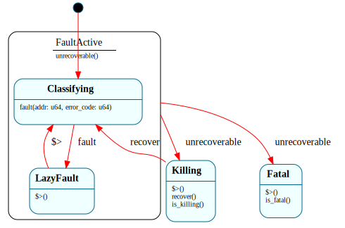

# `PageFaultHandler`

> Classifies a CPU page fault and dispatches to the response, **running inside the `#PF` exception handler**: `$Classifying → $LazyFault` for recovery, with both children funneling unrecoverable faults through `$FaultActive`'s `=> $^` handler to `$Killing` (ring-3 fault → kill the process) or `$Fatal` (kernel fault → halt). B2's Frame showcase — a state machine driving fault recovery from a hardware trap — extended at B3 Step 4b into hardware isolation.

| Property | Value |
|---|---|
| Track | Bare-metal |
| Milestone introduced | B2 (isolation added B3 Step 4b) |
| Source file | [`../../frame/page_fault_handler.frs`](../../frame/page_fault_handler.frs) |
| State diagram | [`page_fault_handler.svg`](page_fault_handler.svg) |
| Instances at runtime | One global instance |
| Status | Implemented and load-bearing — the `#PF` handler drives it on every page fault. |

## State diagram

## Why this is a clean Frame-in-kernel fit

Unlike the timer IRQ (asynchronous → needs the native ready-queue, no Frame from the ISR), a page fault is a **synchronous exception**: the `#PF` interrupt gate clears IF, so while handling a fault there is no preemption and no concurrent fault (a fault *during* fault handling is a double-fault, caught by the safety net). So the `#PF` stub can drive one global `PageFaultHandler` **synchronously — no lock, no queue, no reentrancy hazard**. This is where a Frame HSM fits the kernel directly, and it's a genuinely nice demonstration: the classification + dispatch logic of a fault handler *is* a state machine.

## States

### `$Classifying` (initial, child of `$FaultActive`)
Each `fault(addr, error_code)` lands here. The handler stashes `addr` and the U/S bit (`is_user = error_code & 4`), then classifies via the native `crate::vm::is_lazy_region(addr)`:
- in a registered demand-paged region → `-> $LazyFault`;
- otherwise → `self.unrecoverable()` (unhandled here → `=> $^` to the parent).
**Forwarding:** `=> $^` (see parent).

### `$LazyFault` (child of `$FaultActive`)
**Enter (`$>`):** call `crate::vm::lazy_map(addr)` (allocate a frame + map the page). On success `-> $Classifying` (recovered; the faulting instruction will retry and succeed). On failure (out of frames) `self.unrecoverable()` (forwarded `=> $^`).
**Forwarding:** `=> $^`.

### `$FaultActive` (HSM parent)
The single "give up on recovery" handler the children forward to — **load-bearing since B3 Step 4b** (it was declared-but-not-traversed at B2). **`unrecoverable()`:** decide the disposition once — `is_user ? -> $Killing : -> $Fatal`. The children reach it by self-sending `unrecoverable()`, which is unhandled in the child and so forwards `=> $^` to here — the same self-send + forward shape as `SyscallDispatcher.$Active.reject`. (At B4 the deep children `$StackGrow`/`$CopyOnWrite` join the same funnel.)

### `$Fatal`
A **kernel** fault — a kernel bug. **Enter (`$>`):** report the faulting address on serial. `is_fatal()` overrides to `true`; the native `#PF` handler reads it and halts — a clean fatal, not a silent triple-fault. Peer of `$FaultActive` (recovery abandoned).

### `$Killing`
A **ring-3** fault — the offending process is killed, the kernel survives. **Enter (`$>`):** report the user fault on serial. `is_killing()` overrides to `true`; the native `#PF` handler reads it and tears the process down (`ProcessTable.kill_pid` → `$Zombie`) then longjmps back to the kernel rather than halting. **`recover()`:** `-> $Classifying` — after the kernel has torn down the process, this readies the handler for the next fault (the kill path longjmps away without resetting, so the next fault calls `recover()` first). Peer of `$FaultActive`.

## Interface

| Method | Parameters | Returns | Purpose |
|---|---|---|---|
| `fault` | `addr: u64, error_code: u64` | (none) | Classify + dispatch one page fault. |
| `unrecoverable` | (none) | (none) | The "give up" funnel event children self-send → forwarded `=> $^` to `$FaultActive`. |
| `recover` | (none) | (none) | Reset `$Killing` → `$Classifying` for the next fault. |
| `is_fatal` | (none) | `bool` | `true` in `$Fatal` (kernel fault); the `#PF` handler halts on it. |
| `is_killing` | (none) | `bool` | `true` in `$Killing` (ring-3 fault); the `#PF` handler kills the process. |
| `fault_addr` | (none) | `u64` | The most recent faulting address (domain read). |

## Domain

| Field | Type | Initial | Purpose | Lifetime |
|---|---|---|---|---|
| `fault_addr` | `u64` | `0` | The address of the fault being handled. | System lifetime |
| `is_user` | `bool` | `false` | Whether the current fault came from ring 3 (error-code U/S bit). | System lifetime |

## Composition

**Driven by:** `crate::vm::page_fault_handler(addr, ec)` — the Rust half of the `#PF` stub (`interrupts.rs::isr_page_fault`, vector 14). It reads CR2 + the error code, resets the handler if it's parked in `$Killing` (`recover()`), calls `fault()`, then: on `is_killing()` tears down the process via `crate::usermode::kill_current_user_process()` (longjmp back to the kernel, never returns); on `is_fatal()` halts; otherwise returns so the stub `iretq`s and retries.

**Calls into (native):** `crate::vm::is_lazy_region` / `crate::vm::lazy_map` (the demand-paging policy + alloc/map mechanics, over `frames`/`paging`), and `serial::*`. The `crate::vm` paths resolve per crate — real in the kernel, a controllable test-double in `kernel-tests` (the "shared `.frs`, different native actions per target" pattern).

## Testing

**State graph snapshot (Level 2):** `kernel-tests/tests/state_graphs.rs::page_fault_handler_state_graph_snapshot`.

**Behavioral (Level 3):** `kernel-tests/tests/page_fault_handler_behavior.rs` — 9 tests against the `vm` double: fresh-not-fatal; non-lazy kernel fault → `$Fatal`; lazy fault that maps → recovered; lazy OOM → fatal; independent classification; **user fault (U/S set) → `$Killing` not `$Fatal`**; **user lazy-OOM → `$Killing`**; kernel fault halts-not-kills; `recover()` after a kill readies the next fault.

**QEMU (Level 7):**
- `page_fault_demand_b2` — touching a registered lazy region faults in (`$LazyFault` maps, the access then succeeds): `[#PF] demand fault recovered: ok`. No `KERNEL EXCEPTION` (the `#PF` goes to `isr_page_fault`, not the generic safety net).
- `page_fault_fatal_b2` — an unmapped, non-lazy **kernel** access is `$Fatal`, reported (`[#PF] FATAL unhandled kernel fault at 0x0000600000000000`) and halted cleanly — no `triple fault`.
- `user_fault_does_not_crash_kernel_b3` — a ring-3 program reads kernel memory → `$Killing`: the process is killed (`[#PF] user fault ... -> killing process (kernel survives)`, reaped with exit -1) and the kernel keeps running (reaches the later deliberate kernel-fault demo). Isolation proven.

## Open questions
- **`$StackGrow` / `$CopyOnWrite`** are part of the committed design but not implemented yet (no stack-growth VMAs / COW `fork` yet). They land at B4, joining the same `$FaultActive` `=> $^` funnel that the kill path made load-bearing here.
- **Allocation in exception context:** `fault()` dispatch allocates (Rc event + context), which is fine here (the heap is fully mapped). A `no-alloc` codegen mode (tracked framec gate) would remove even that.

## Related documents
- [Roadmap](../roadmap.md) — B2 (B2-1/B2-2/B2-5); isolation at B3 Step 4b (B3-6)
- [Scheduler](scheduler.md) — the *async* counterpart (why the timer ISR can't drive Frame but `#PF` can)
- [`Process`](process.md) / [`ProcessTable`](process_table.md) — the kill path tears down the faulting `Process`
- [`SyscallDispatcher`](syscall_dispatcher.md) — the other load-bearing self-send + `=> $^` funnel
- [Architecture](../architecture.md) — `PageFaultHandler` HSM note

## Change log
- **2026-05-20** — initial doc; B2 Step 3. `$Classifying → $LazyFault | $Fatal` driven from the `#PF` handler; `$StackGrow`/`$CopyOnWrite` + `=> $^` kill-forwarding deferred.
- **2026-05-20** — B3 Step 4b: hardware isolation. Added `$Killing` (ring-3 fault → kill the process) + `recover()`; the `$FaultActive` `=> $^` funnel is now **load-bearing** (`unrecoverable()` decides user-kill vs kernel-halt once). The `#PF` handler kills the process + longjmps instead of halting on a user fault.
