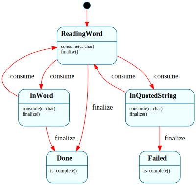

# `Parser`

> Command-line tokenizer for the Frame OS shell: per-character event-driven scanner that turns a typed line into a vector of tokens, handling whitespace separation and quoted substrings.

| Property | Value |
|---|---|
| Track | Hosted **and** ring-3 userspace — the *same* `.frs` compiles for both (the userspace build landed at B4 Step 4b) |
| Milestone introduced | H1 (hosted); reused in ring 3 at B4 Step 4b |
| Source file | [`../../frame/parser.frs`](../../frame/parser.frs) |
| State diagram | [`parser.svg`](parser.svg) |
| Instances at runtime | One per Shell `$Parsing` activation — `Parser::__create()` per line |
| Status | Documented (H1; reused in ring 3 at B4 Step 4b) |

## State diagram



Regenerate via `cargo xtask regen-diagrams` after any `.frs` change. The SVG is committed to the repo and `cargo xtask check-diagrams` enforces drift.

## States

### `$ReadingWord`

Initial state. Between tokens, skipping whitespace.

**Transitions out:**
- `consume(c)` with `c` ∈ {`"`, `'`} → `$InQuotedString`, after recording which quote opened the string
- `consume(c)` with `c` non-whitespace, non-quote → `$InWord`, after appending `c` to the in-progress token
- `finalize()` → `$Done` — no in-progress token to push

**Events handled (no transition):**
- `consume(c)` with `c` whitespace — skip; stays in `$Prompting`-equivalent waiting position

**Queries:**
- `tokens()` → currently-accumulated tokens (empty until at least one full token completes)
- `error()` → empty string
- `is_complete()` → `false`

### `$InWord`

Building an unquoted token character by character.

**Transitions out:**
- `consume(c)` with `c` whitespace → push current token, clear current, → `$ReadingWord`
- `finalize()` → push current token, → `$Done`

**Events handled (no transition):**
- `consume(c)` with `c` any non-whitespace char (including `"` and `'`) — appended to current token

**Note on mid-word quotes:** quotes are only special at token boundaries (`$ReadingWord`). Inside `$InWord` they're ordinary characters. This is a simplification vs. bash, where `hello"world there"` becomes `helloworld there` as one mid-word-concatenated token. Frame OS H1 does not implement mid-word concatenation; defer if/when needed.

**Queries:** same as `$ReadingWord` — incomplete state, error empty, is_complete false.

### `$InQuotedString`

Inside a quoted string. The opening quote character is recorded in `open_quote`; the matching close terminates the token.

**Transitions out:**
- `consume(c)` with `c == open_quote` → push current token, clear current, clear `open_quote`, → `$ReadingWord`
- `finalize()` → `$Failed` with `error_msg` set ("unterminated quoted string: missing closing ...")

**Events handled (no transition):**
- `consume(c)` with `c != open_quote` (including whitespace and the *other* quote character) — appended to current token

**Queries:** same as `$ReadingWord` — incomplete state, error empty, is_complete false. (The error message is set on the transition into `$Failed`; until then it's empty.)

### `$Done`

Terminal state. Tokenization completed successfully. All further events are no-ops.

**Transitions out:** none.

**Events handled:**
- `consume(c)` — ignored (silent no-op so callers can be sloppy without consequences)
- `finalize()` — idempotent (silent no-op)
- `tokens()` → the accumulated tokens
- `error()` → empty string
- `is_complete()` → `true`

### `$Failed`

Terminal state. Tokenization failed due to an unterminated quoted string. All further events are no-ops.

**Transitions out:** none.

**Events handled:**
- `consume(c)` — ignored
- `finalize()` — idempotent
- `tokens()` → the tokens that *did* complete before the failure (partial result; callers should check `error()` first)
- `error()` → the failure message (non-empty)
- `is_complete()` → `true`

## Interface

| Method | Parameters | Returns | Purpose |
|---|---|---|---|
| `consume` | `c: char` | `()` | Feed one character to the scanner |
| `finalize` | `()` | `()` | Tell the scanner there are no more characters |
| `tokens` | `()` | `Vec<String>` | Accumulated tokens as flat literal strings (legacy view; clones) |
| `typed_tokens` | `()` | `Vec<Token>` | Accumulated tokens as operator-aware `Token`s (M1; clones) |
| `error` | `()` | `String` | Failure description, empty string if no failure |
| `is_complete` | `()` | `bool` | Whether the scanner has reached a terminal state (`$Done` or `$Failed`) |

### Typed tokens (M1, H↔B parity)

The scanner tags shell operators. A completed **unquoted** token equal to an
operator string becomes that operator; a quoted token, or any other text, is a
`Word`. Operator recognition lives in the Parser precisely *because* it is a
scanner-mode decision — only the scanner knows whether a `|` came from inside
quotes (a literal `Word`) or not (the `Pipe` operator).

```rust
pub enum Token { Word(String), Pipe, RedirIn, RedirOut, RedirAppend, Amp }
//                              |        <         >          >>         &
```

Two query surfaces over the same `Vec<Token>` domain:

- **`typed_tokens()`** — the structured view, consumed by the `Pipeline` FSM,
  which folds the token stream into a command pipeline + redirection.
- **`tokens()`** — the legacy flat view. Reconstructs each token's literal text,
  so existing consumers (the bare-metal `ish`, which still reads `tokens()`) are
  byte-identical and unaffected until they migrate to the `Pipeline` FSM (M3/M4).

Operators must be their own whitespace-separated token (`a|b` is one `Word`,
matching `ish`'s parser). `Token` is declared in the `.frs` native prolog, so it
is emitted once at the top level of the generated file and shared by every crate
that compiles `parser.frs` (hosted `shell` + bare-metal `user`).

`consume(c)` always succeeds at the type level. State-dependent dispatch decides what the char means.

`finalize()` is required to drive the scanner from any non-terminal state to either `$Done` (success path) or `$Failed` (unterminated quote). Calling `tokens()` or `error()` before `is_complete()` returns `true` produces a snapshot of partial progress, which may be useful for debugging but is not the intended consumer pattern.

Consumer pattern:

```rust
let mut p = Parser::__create();
for c in input.chars() {
    p.consume(c);
}
p.finalize();
if !p.error().is_empty() {
    // handle parse error
}
let tokens = p.tokens();
```

## Domain

| Field | Type | Initial value | Purpose | Lifetime |
|---|---|---|---|---|
| `tokens` | `Vec<Token>` | `Vec::new()` | Accumulated tokens (operator-aware; exposed flat via `tokens()`, structured via `typed_tokens()`) | System lifetime — grows as tokens complete |
| `current` | `String` | `String::new()` | Token under construction | Cleared on each token boundary |
| `open_quote` | `char` | `'\0'` | Which quote character opened `$InQuotedString` | Set in `$ReadingWord` on `"`/`'`; cleared on matching close |
| `error_msg` | `String` | `String::new()` | Failure description | Set on transition to `$Failed`; empty otherwise |

## Why a state machine

Tokenization is the textbook case for explicit state-machine implementation. Each character's effect depends on which mode the scanner is in: a space is a token separator in `$InWord`, a no-op in `$ReadingWord`, and part of the token in `$InQuotedString`. As plain Rust this would be a single `for` loop with a top-level `match` on a `Mode` enum nested inside another `match` on the character — readable, but the mode transitions are buried in branches and the legal moves are implicit.

As Frame, the diagram (`parser.svg`) is directly readable as the scanner's mode graph: which state goes to which on which input is visible without reading the source. Adding a new scanning mode — say, `$InEscape` to handle backslash-escapes — is a localized change: a new state declaration, two new transitions, and the framepiler regenerates the dispatch. The bug class "I added an escape mode but forgot to handle it from `$InQuotedString`" disappears at compile time.

What's lost by not using Frame here is modest in absolute terms: shell command tokenization has four meaningful states, and a competent Rust programmer can write the equivalent `match` ladder in 50 lines. What's gained is the diagram-as-documentation property: a reader can see the scanner's state graph without reading any Rust. That property is what scales as the project adds the more complex protocol/lifecycle machines (the TCP state machine at B5, the deepest Frame system in the project).

This system is also a good test case for using Frame in places where per-event dispatch *is* the work — the same shape framec itself uses internally for its own scanners (the `attribute_scanner`, `output_block_lexer`, and similar FSMs in framec's codebase). Frame OS's Parser is the consumer-side proof of the same pattern.

## Composition

**Calls into:** none. `Parser` is a pure tokenizer — no Frame system or native module is invoked from its handlers other than the `String`/`Vec` operations on its own domain fields.

**Called from:** `Shell.$Parsing.$>()` at H1 — drives Parser to completion for each typed line. The Shell holds a `Parser` instance in its `domain:` block (decision documented in [shell.md](shell.md)).

**Userspace action implementations (B4 Step 4b):** `Parser` is pure — no native actions — so there's *nothing to re-implement* for ring 3; the only environmental difference is that the freestanding `user/` crate supplies a heap (a 64 KiB `linked_list_allocator` static, `user/src/mem.rs`) for the `String`/`Vec`/`Rc`/`BTreeMap` the generated code allocates. The generated `mod _parser_framec` is `no_std`-clean (only `alloc::` + the prelude names re-exported by `user/src/frame_systems.rs`), so the *same* `frame/parser.frs` compiles unchanged for `x86_64-unknown-none`. The ring-3 program `user/src/frameshell.rs` drives it exactly as the hosted shell does — `consume(c)` per char, then `finalize()` + `tokens()` — to tokenize baked command lines and dispatch on the first token (`cat <path>` / exec a program by path).

**Native modules used by actions:** none. The Parser has no `actions:` block at H1 — all behavior is in the per-state handlers, which use only `String`/`Vec` operations on domain fields.

## Testing

See [`../testing.md`](../testing.md) for the project-wide testing approach.

**State graph snapshot (Level 2):**
- Test file: [`../../shell/tests/state_graphs.rs`](../../shell/tests/state_graphs.rs)
- Snapshot file: `shell/tests/snapshots/state_graphs__parser_state_graph.snap`
- Test name: `parser_state_graph_snapshot`
- Status: present; snapshot accepted

**Behavioral tests (Level 3):**
Test file: [`../../shell/tests/parser_behavior.rs`](../../shell/tests/parser_behavior.rs).

30 tests covering every committed state-event pair:

*$ReadingWord behavior:*
- `parses_empty_input` — empty input → empty tokens, `$Done`
- `parses_whitespace_only_input` — `"   \t   "` → empty tokens, `$Done`
- `parses_leading_whitespace` — `"   hello"` → `["hello"]`
- `parses_trailing_whitespace` — `"hello   "` → `["hello"]`

*$InWord behavior:*
- `parses_single_word` — `"hello"` → `["hello"]`
- `parses_multiple_words` — `"cd /tmp foo"` → three tokens
- `parses_tab_separated_words` — `"a\tb\tc"` → three tokens
- `collapses_runs_of_whitespace` — `"foo     bar"` → two tokens, no empties
- `parses_word_with_punctuation` — non-whitespace, non-quote chars stay together

*$InQuotedString behavior:*
- `parses_double_quoted_string_with_spaces` — `"\"hello world\""` → single token with embedded space
- `parses_single_quoted_string_with_spaces` — same for `'...'`
- `parses_double_quoted_empty_string` — `"\"\""` → `[""]`
- `parses_single_quoted_empty_string` — `"''"` → `[""]`
- `parses_single_quote_inside_double_quoted` — `"\"it's me\""` → `["it's me"]`
- `parses_double_quote_inside_single_quoted` — `"'say \"hi\"'"` → `["say \"hi\""]`
- `parses_consecutive_quoted_tokens` — `"\"foo\" \"bar baz\""` → two tokens
- `parses_mixed_quoted_and_unquoted` — `"cat \"my file.txt\" /tmp"` → three tokens
- `parses_quoted_token_at_start` — quote opens token-zero correctly

*$Failed behavior:*
- `unterminated_double_quote_fails` — `is_complete()` true, `error()` non-empty
- `unterminated_single_quote_fails` — same for `'`
- `failed_state_preserves_partial_tokens` — tokens completed before the failure survive

*Terminal-state behavior:*
- `is_complete_starts_false` — fresh `Parser` is in `$ReadingWord`
- `is_complete_false_during_scanning` — mid-scan returns false
- `is_complete_true_after_finalize` — confirmed
- `done_state_ignores_further_consume` — `consume()` after `$Done` is no-op
- `done_state_finalize_is_idempotent` — second `finalize()` is no-op
- `failed_state_ignores_further_consume` — `consume()` after `$Failed` is no-op

*Realistic-input sanity checks:*
- `parses_shell_command_with_args` — `"echo hello world from frame"` → five tokens
- `parses_realistic_cat_invocation` — quoted path with embedded space
- `parses_many_short_tokens` — 10 single-char tokens

**Integration tests (Level 4):** N/A at the moment `Parser` lands alone. Integration with `Shell` is in the next H1 increment (Shell extension with `$Parsing` and `$RunningBuiltin`).

**E2E tests (Level 6):** N/A on its own — `Parser` isn't directly invoked by the binary. E2E tests for builtins exercise the Shell+Parser composition transitively.

**QEMU smoke tests (Level 7):** `userspace_frame_parser_reuse_b4` — boots the kernel and runs a ring-3 program (`frameshell`) that tokenizes command lines with this *same* generated `Parser`. It cats a **quoted** path (`cat "/motd"`), which only resolves if the `$InQuotedString` state ran in userspace to strip the quotes, then execs `/bin/hello` by the parsed token — proving the reused tokenizer (including quote handling) works end to end in ring 3.

**Hardware tests (Level 8):** N/A — same reason.

## Native action implementations

No `actions:` block. The Parser's behavior is entirely in its per-state handlers, which use only standard `Vec` and `String` operations on the domain fields.

## Open questions

- **Mid-word quote concatenation?** Bash treats `hello"world there"` as `helloworld there` (one token). H1 treats it as `hello"world` and then the rest of input gets misparsed (quotes mid-word are literal chars). Deferred — add a state for "saw quote mid-word, capture as continuation" when it becomes necessary.
- **Escape character (`\`) handling?** Deferred per H1's scope decision in [roadmap.md](../roadmap.md#h1--builtins). Natural shape when added: two new states `$EscapeInWord` and `$EscapeInString` (the next char is appended literally, then return to the prior scanning state).
- **Variable substitution (`$VAR`, `$(cmd)`)?** Not in scope for Frame OS — Frame OS isn't a Unix shell, it's a Frame demonstration. Tokenization is the extent of input processing.
- **Should the Parser interface signal "no tokens" differently from "ok, empty input"?** Currently both produce `$Done` with empty `tokens()`. Caller has to check `tokens().is_empty()`. Could add a state like `$DoneEmpty`, but the distinction is borderline — every empty-input case has the same downstream behavior in Shell (no command to run).

## Related documents

- [Architecture](../architecture.md) — where Parser fits in the hosted track
- [Roadmap](../roadmap.md#h1--builtins) — H1 scope and exit criteria including Parser
- [`Shell`](shell.md) — composition partner; the Shell drives Parser from its `$Parsing` state
- [Testing](../testing.md) — project-wide testing approach this doc's Testing section follows
- [Systems index](README.md)

## Change log

- **2026-05-19** — initial doc; H1 Parser implementation with `$ReadingWord → $InWord → $InQuotedString → $Done / $Failed`. 30 behavioral tests cover every committed state-event pair.
