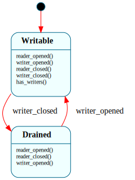

# `Pipe`

> The lifecycle of one anonymous pipe (S6): `$Writable → $Drained`, where **writer presence is the state**. While a writer is open a read on an empty pipe must block (more bytes may come); once every writer has closed, the pipe is drained — a read past the buffered bytes is end-of-file. Reader/writer reference counts live in the domain; the kernel (`pipe.rs`) owns the ring buffer.

| Property | Value |
|---|---|
| Track | Bare-metal |
| Milestone introduced | S6 (shell pipes `\|`) |
| Source file | [`../../frame/pipe.frs`](../../frame/pipe.frs) |
| State diagram | [`pipe.svg`](pipe.svg) |
| Instances at runtime | One per open anonymous pipe (pool in `kernel/src/pipe.rs`) |
| Status | Implemented — backs the shell's `cmd1 \| cmd2`. |

## State diagram

## Why this is a Frame system

A pipe end has a genuine **mode** that changes what an operation means: the *same* "read an empty pipe" event is "block, more is coming" while a writer is open, and "return EOF" once all writers have closed. That state-dependent dispatch is exactly the shape `OpenFile` has for read/write mode — so the pipe earns states rather than a bool. The kernel owns the *mechanism* (the 64 KiB ring buffer + the byte copies, in `pipe.rs`), exactly as the VFS owns the inode/offset while `OpenFile` owns the mode. The FSM owns only "are there still writers, and is the pipe fully closed."

## States

### `$Writable` (initial)
At least one writer is open. `reader_opened`/`writer_opened` bump the domain counts; `reader_closed` decrements readers; `writer_closed` decrements writers and, when the last writer closes, transitions to `$Drained`. Overrides `has_writers()` → `true` (so a reader that finds the buffer empty blocks).

### `$Drained`
Every writer has closed. Reads drain the remaining buffered bytes, then take end-of-file (`has_writers()` keeps its default `false`). A `writer_opened` here (a new write end on a not-yet-freed pipe) returns to `$Writable`.

## Interface

| Method | Parameters | Returns | Purpose |
|---|---|---|---|
| `reader_opened` / `writer_opened` | (none) | (none) | A new descriptor onto this end (fork/dup2) — bump the count. |
| `reader_closed` / `writer_closed` | (none) | (none) | A descriptor closed — drop the count; last writer → `$Drained`. |
| `has_writers` | (none) | `bool` | True iff a writer remains (read-on-empty blocks vs EOF). |
| `is_free` | (none) | `bool` | Both ends fully closed (`readers <= 0 && writers <= 0`) — the kernel frees the buffer. |

**Domain:** `readers: i32 = 1`, `writers: i32 = 1` (the two descriptors `make_pipe` installs).

## Composition

**Driven by:** `crate::pipe` (`kernel/src/pipe.rs`) — the pool holds one `Pipe` FSM + a ring buffer per slot. `alloc()` creates the FSM (`$Writable`, 1 reader + 1 writer). `vfs::clone_fds` (fork) and `dup2` fire `*_opened` as they copy a pipe fd; `close` / process reap fire `*_closed`. `has_writers()` decides block-vs-EOF for the deferred pipe-read syscall (`usermode::do_pipe_read_loop`); `is_free()` releases the buffer. The shell (`ish`) wires `cmd1 | cmd2` by `make_pipe` + `dup2`-onto-stdio in the forked children.

## Testing

**QEMU (Level 7):** `console-test` `echo pipe one two | wc` → `1 3 13` — `echo`'s stdout flows through the pipe to `wc`'s stdin; the exact count appears only if the pipe carried the bytes between the two processes.

## Related documents
- [`OpenFile`](open_file.md) — the same "mode as state" shape for a file fd's access mode.
- [`IoScheduler`](io_scheduler.md) — the supervisor that serializes the disk engine S6 also needed.

## Change log
- **2026-05-25** — initial doc; S6 pipes. `$Writable → $Drained` with reader/writer counts in domain; the ring buffer stays native in `pipe.rs`.
