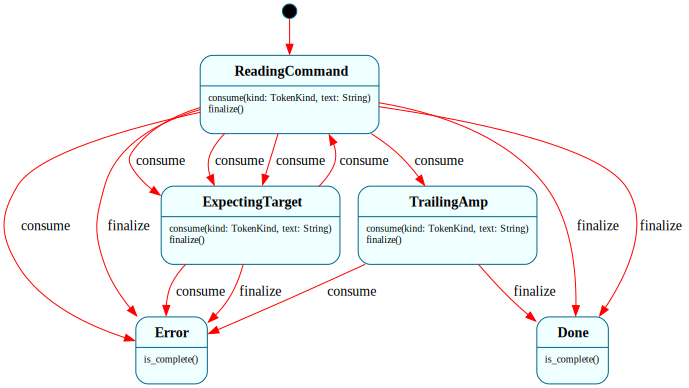

# `Pipeline`

> Command-line grammar for the Frame OS shell: folds the `Parser`'s token stream into an executable pipeline — commands joined by `|`, each with optional `< > >>` redirection, plus an optional trailing `&` for background launch.

| Property | Value |
|---|---|
| Track | Hosted **and** ring-3 userspace — the *same* `.frs` compiles for both (the `ish` reuse landed at M3a), like `Parser`. |
| Milestone introduced | M1 (hosted); reused in ring-3 `ish` at M3a |
| Source file | [`../../frame/pipeline.frs`](../../frame/pipeline.frs) |
| State diagram | [`pipeline.svg`](pipeline.svg) |
| Instances at runtime | One per Shell `$Parsing` activation — `Pipeline::__create()` per line, fed the `Parser`'s typed tokens |
| Status | Documented (M1) |

## State diagram



Regenerate via `cargo xtask regen-diagrams` after any `.frs` change. The SVG is committed to the repo and `cargo xtask check-diagrams` enforces drift.

## Role in the shell

`Parser` answers *"what are the tokens?"* (and tags operators — see
[`parser.md`](parser.md)). `Pipeline` answers *"what is the command structure?"*:

```
pipeline := command ('|' command)* '&'?
command  := word+ ( ('<' | '>' | '>>') word )*
```

It is fed one token at a time. The `Parser`'s `Token` enum carries its word text
inline (`Word(String)`); the driver splits each `Token` into a Copy `TokenKind`
tag plus the word text (empty for operators) and calls `consume(kind, text)`,
then `finalize()`. (The split exists because framec's event machinery moves a
non-Copy enum param out of a shared reference, which won't compile — a Copy tag
plus a String the codegen clones is the supported shape.)

The output is a `Vec<Command>` (the pipeline stages, left to right) plus an
`is_background()` flag. Each `Command` is:

```rust
pub struct Command {
    pub words: Vec<String>,
    pub redir_in: Option<String>,   // < file
    pub redir_out: Option<String>,  // > / >> file
    pub append: bool,               // true → >>, false → >
}
```

This is the FSM-owns-logic / native-owns-mechanism split that runs through Frame
OS: `Pipeline` owns the *coordination/structure*; the *execution mechanism* is
native and target-specific (hosted: `std::process` with `Stdio::piped()` and
file redirection; ring-3: syscall `fork`/`exec`/`dup2`/`pipe`). Both targets
share this one grammar — the hosted `Shell` drives it at M1, the bare-metal
`ish` migrates onto it at M3/M4.

## States

### `$ReadingCommand`

Initial state. Accumulates words into the command under construction.

- `consume(Word, text)` → push `text` onto the current command's words; stay.
- `consume(RedirIn/RedirOut/RedirAppend, _)` → record the pending redirection
  (`>>` sets `append`), → `$ExpectingTarget`.
- `consume(Pipe, _)` → commit the current command and start a new one; **error**
  (`syntax error near '|'`) if the command so far has no words (leading `|`).
- `consume(Amp, _)` → set `background`, → `$TrailingAmp`.
- `finalize()` → commit the current command, → `$Done`. If a trailing `|` left
  an empty command (no words, but earlier commands exist), → `$Error`.

### `$ExpectingTarget`

The previous token was a redirection operator; the next token must be the
target filename.

- `consume(Word, text)` → set `redir_in`/`redir_out` (per the pending direction)
  to `text`, → `$ReadingCommand`.
- `consume(<any operator>, _)` → **error** (`expected filename after redirection
  operator`), → `$Error`. Two operators in a row (`> >`) is a syntax error.
- `finalize()` → **error** (`missing redirection target`), → `$Error`.

### `$TrailingAmp`

`&` was seen; it must be the last token.

- `consume(<any token>, _)` → **error** (`unexpected token after '&'`), →
  `$Error`.
- `finalize()` → commit the current command (a lone `&` with no command leaves
  the pipeline empty — a no-op the shell ignores), → `$Done`.

### `$Done`

Terminal (success). `commands()` and `is_background()` hold the parsed pipeline;
`error()` is empty; `is_complete()` is `true`.

### `$Error`

Terminal (failure). `error()` holds the syntax-error message; `is_complete()` is
`true`. Consumers check `error()` before using `commands()`.

## Interface

| Method | Parameters | Returns | Purpose |
|---|---|---|---|
| `consume` | `kind: TokenKind, text: String` | `()` | Feed one token (its Copy kind tag + word text, `""` for operators) |
| `finalize` | `()` | `()` | Signal end of input; commits the final command and drives to a terminal state |
| `commands` | `()` | `Vec<Command>` | The parsed pipeline stages (valid once `is_complete()`) |
| `is_background` | `()` | `bool` | Whether a trailing `&` requested background launch |
| `error` | `()` | `String` | Syntax-error message, empty if none |
| `is_complete` | `()` | `bool` | Whether a terminal state (`$Done`/`$Error`) has been reached |

Consumer pattern (the Shell's glue):

```rust
let mut pl = Pipeline::__create();
for tok in parser.typed_tokens() {
    let (kind, text) = match tok {
        Token::Word(w) => (TokenKind::Word, w),
        Token::Pipe => (TokenKind::Pipe, String::new()),
        Token::RedirIn => (TokenKind::RedirIn, String::new()),
        Token::RedirOut => (TokenKind::RedirOut, String::new()),
        Token::RedirAppend => (TokenKind::RedirAppend, String::new()),
        Token::Amp => (TokenKind::Amp, String::new()),
    };
    pl.consume(kind, text);
}
pl.finalize();
if !pl.error().is_empty() {
    // print pl.error(), stay at the prompt
}
let commands = pl.commands();
let background = pl.is_background();
```

## Domain

| Field | Type | Initial value | Purpose | Lifetime |
|---|---|---|---|---|
| `commands` | `Vec<Command>` | `Vec::new()` | Committed pipeline stages | System lifetime — grows on `|` and `finalize()` |
| `current` | `Command` | `Command::default()` | The stage under construction | Reset on each commit |
| `background` | `bool` | `false` | Trailing `&` seen | Set once in `$TrailingAmp` |
| `pending_input` | `bool` | `false` | In `$ExpectingTarget`, does the target apply to `<` (input) or `>`/`>>` (output)? | Set when the operator is consumed |
| `error_msg` | `String` | `String::new()` | Syntax-error message | Set on transition to `$Error` |

## Why a state machine

A command line is a small grammar, and *"what may a token mean here"* is exactly
state-dependent: a `<` **starts** a redirection in `$ReadingCommand` but is a
**syntax error** in `$ExpectingTarget` (two operators in a row), and *any* token
after `&` is illegal. Per-state handlers make those legal-move boundaries
structural rather than a tangle of native flags. As plain Rust this would be a
hand-rolled parser with mode flags (`expecting_target`, `seen_amp`, …) and the
"is this token legal right now" checks scattered across the loop — exactly the
shape `ish`'s `parse_redirs` + pipeline split currently have, and exactly what
M3/M4 replaces with this one shared FSM.

## Composition

`Pipeline` consumes the `Parser`'s `typed_tokens()` and is consumed by the
`Shell` (`$Parsing`), which executes the resulting `Vec<Command>`. It holds no
native actions beyond `commit_command` (pure domain manipulation), so — like
`Parser` — there is nothing target-specific to re-implement for ring 3; the same
`.frs` is expected to compile for `x86_64-unknown-none` when `ish` migrates onto
it (M3/M4).

## Testing

- **Level 3 (behavioral):** [`../../shell/tests/pipeline_behavior.rs`](../../shell/tests/pipeline_behavior.rs)
  — one or more tests per committed state-event pair: single command, input/
  output/append redirection, two- and three-stage pipelines, trailing `&`, lone
  `&`, and every syntax-error path (leading/trailing `|`, missing redirection
  target, two operators in a row, token after `&`).
- **Level 2 (state-graph snapshot):** `pipeline_state_graph_snapshot` in
  [`../../shell/tests/state_graphs.rs`](../../shell/tests/state_graphs.rs).
- **Diagram drift:** `cargo xtask check-diagrams` (covers `pipeline.svg`).

## Related documents

- [`parser.md`](parser.md) — the tokenizer that feeds this FSM
- [`shell.md`](shell.md) — the shell control flow that drives both
- [`../plans/hb_parity.md`](../plans/hb_parity.md) — the H↔B parity program (M1 introduces `Pipeline`)
