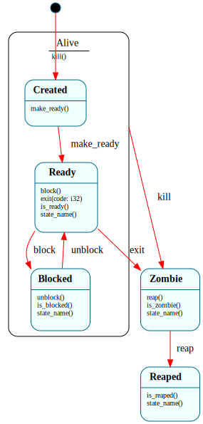

# `Process`

> Per-process lifecycle: `$Created → $Ready ⇄ $Blocked → $Zombie → $Reaped`, with `kill()` funneled to a single `$Alive` parent via `=> $^`. The B3 successor to `Task` — same coarse shape, plus the two states a real OS needs to collect exit status (`$Zombie`, `$Reaped`).

| Property | Value |
|---|---|
| Track | Bare-metal |
| Milestone introduced | B3 (Step 3) |
| Source file | [`../../frame/process.frs`](../../frame/process.frs) |
| State diagram | [`process.svg`](process.svg) |
| Instances at runtime | One per process (the kernel's `ProcessTable` holds a `Vec<Process>`) |
| Status | Implemented and load-bearing — the single ring-3 program's lifecycle is driven through it. |

## State diagram

## Why this is a clean Frame-in-kernel fit, and why no `$Running`

A process lifecycle is the textbook state machine, and `kill()` is the textbook case for state-dependent dispatch: it means "terminate" from every live state but is a no-op once the process has already exited. Frame expresses that as a parent handler the live states forward to.

**There is deliberately no `$Running` state.** The architecture doc lists one, but "currently on the CPU" flips on every timer tick from the preemptive scheduler's ISR, and the ISR cannot fire Frame events (Frame dispatch is non-reentrant). "Which runnable process is executing right now" is native scheduler state, not a Frame transition — so `$Ready` means "runnable," and the native scheduler decides who actually runs. This is the same call already made for `Task`, `Scheduler`, and `SerialDriver`: model the invariant that exists, not the textbook diagram. (Decision recorded in the roadmap's B3 Step 3 notes; `docs/architecture.md` is annotated accordingly.)

What `Process` adds over `Task` is real: `$Zombie` (exited, exit status recorded, awaiting a `reap()`) and `$Reaped` (status collected, slot reclaimable). Those are genuine *persistent* states — a zombie sits there until its parent waits on it — not per-tick mechanics.

## States

### `$Created` (initial, child of `$Alive`)
A freshly created process, not yet admitted to the run set. `make_ready()` → `$Ready`. `kill()` is unhandled here and forwards `=> $^` to `$Alive`.

### `$Ready` (child of `$Alive`)
Runnable (selected or waiting its turn — "on the CPU" is native state). `block()` → `$Blocked`; `exit(code)` records the status and → `$Zombie`; `kill()` forwards `=> $^` to `$Alive`. Overrides `is_ready()`/`state_name()`.

### `$Blocked` (child of `$Alive`)
Waiting on a resource. `unblock()` → `$Ready`; `kill()` forwards `=> $^` to `$Alive`. Overrides `is_blocked()`/`state_name()`.

### `$Alive` (HSM parent)
The single termination handler the live children forward to. **`kill()`**: record the killed sentinel (`exit_code = -1`, distinct from a voluntary `exit(code)` — B3 doesn't model signal numbers yet) and `-> $Zombie`. This is the load-bearing forward: `kill()` is written once and inherited by `$Created`/`$Ready`/`$Blocked`, exactly the `SyscallDispatcher.$Active.reject` shape — and unlike Kernel/PageFaultHandler's `=> $^`, it is actually traversed (and tested from each live state).

### `$Zombie`
Exited, status recorded, not yet reaped. **`reap(): i32`** sets the return value to the exit code (`@@:(self.exit_code)`) and `-> $Reaped` — the value is fixed *before* the transition because a transition is terminal. Overrides `is_zombie()`/`state_name()`. `$Zombie` is **not** a child of `$Alive`: killing an already-exited process is a no-op, so `kill()` is simply unhandled (ignored) here.

### `$Reaped`
Terminal sink. All lifecycle events are unhandled (ignored). Overrides `is_reaped()`/`state_name()`.

## Interface

| Method | Parameters | Returns | Purpose |
|---|---|---|---|
| `make_ready` | (none) | (none) | Admit `$Created` → `$Ready`. |
| `block` | (none) | (none) | `$Ready` → `$Blocked`. |
| `unblock` | (none) | (none) | `$Blocked` → `$Ready`. |
| `exit` | `code: i32` | (none) | Voluntary exit (records `code`) → `$Zombie`. |
| `kill` | (none) | (none) | Forced termination (records `-1`) → `$Zombie`, from any live state via `$Alive`. |
| `reap` | (none) | `i32` | `$Zombie` → `$Reaped`; returns the exit code. |
| `pid` | (none) | `u32` | The process id (constructor param). |
| `exit_code` | (none) | `i32` | The recorded exit code (0 while live). |
| `state_name` | (none) | `String` | Diagnostic state label. |
| `is_ready` / `is_blocked` / `is_zombie` / `is_reaped` | (none) | `bool` | State queries (default `false`, per-state override). |

Constructor: `@@Process(pid: u32)`.

## Domain

| Field | Type | Initial | Purpose | Lifetime |
|---|---|---|---|---|
| `pid` | `u32` | constructor arg | Process id. | System lifetime |
| `exit_code` | `i32` | `0` | Exit status (set by `exit`/`kill`). | System lifetime |

## Composition

**Held by:** `ProcessTable` ([`process_table.md`](process_table.md)) — the manager owns a `Vec<Process>` and forwards lifecycle operations by pid.

**Driven by (kernel):** `crate::usermode::run` spawns the single ring-3 program as a `Process` (→ `$Ready`), lets it run natively, and the `exit` syscall (`perform_syscall`) drives it `→ $Zombie`; the kernel then reaps it `→ $Reaped`. Driving `Process`/`ProcessTable` from inside the `SyscallDispatcher`'s handler is safe — they are independent Frame instances, so it is not a non-reentrant re-entry.

**Calls into (native):** none. `Process` is pure lifecycle bookkeeping (no `crate::` action dependencies), so the host test crate needs no test-double for it.

## Testing

**State graph snapshot (Level 2):** `kernel-tests/tests/state_graphs.rs::process_state_graph_snapshot`.

**Behavioral (Level 3):** `kernel-tests/tests/process_behavior.rs` — 11 tests: fresh-is-Created; make_ready; block/unblock round-trip; voluntary exit records code + zombifies; **kill from each of `$Created`/`$Ready`/`$Blocked` zombifies via the `$Alive` parent**; reap returns status + → `$Reaped`; zombie ignores lifecycle events; reaped is a sink; pid independent of state.

**QEMU (Level 7):** `ring3_syscall_b3` asserts the live markers `[proc] spawned pid 1 (Ready)`, `[proc] pid 1 exited -> Zombie`, and `[proc] reaped pid 1; ... table count 0`.

## Open questions
- **No wait queue yet.** `$Blocked` is modeled but, at Step 3, the kernel's single ring-3 program never blocks. `block()`/`unblock()` are exercised by host tests and wired through `ProcessTable`, but not yet traversed in the running kernel — the "declared now, load-bearing later" pattern, here pending real blocking syscalls.
- **Signal numbers.** `kill()` records a flat `-1` sentinel; real signal semantics (`SIGKILL`/`SIGSEGV`/`SIGCHLD`) arrive at Step 5.

## Related documents
- [Roadmap](../roadmap.md) — B3 Step 3 (B3-1 snapshot, B3-2 lifecycle + state-dependent `kill()`)
- [`ProcessTable`](process_table.md) — the manager that holds and orchestrates `Process` instances
- [`Task`](task.md) — the B1 predecessor (`Process` adds `$Zombie`/`$Reaped`)
- [`SyscallDispatcher`](syscall_dispatcher.md) — the other load-bearing `=> $^` funnel

## Change log
- **2026-05-20** — initial doc; B3 Step 3. `$Created → $Ready ⇄ $Blocked → $Zombie → $Reaped` with `kill()` funneled to `$Alive` via `=> $^`; no `$Running` (consistent with `Task`). Wired into the kernel's ring-3 demo and host-tested.
