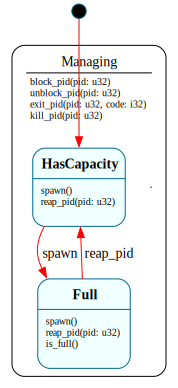

# `ProcessTable`

> Manager for the kernel's fixed-size process array: holds a `Vec<Process>`, forwards lifecycle operations by pid, and models the one invariant worth a state — capacity. `$HasCapacity ⇄ $Full` under a `$Managing` parent that owns the by-pid operations. The "one manager + N instances" pattern, B3's instance of it.

| Property | Value |
|---|---|
| Track | Bare-metal |
| Milestone introduced | B3 (Step 3) |
| Source file | [`../../frame/process_table.frs`](../../frame/process_table.frs) |
| State diagram | [`process_table.svg`](process_table.svg) |
| Instances at runtime | One global instance |
| Status | Implemented and load-bearing — the kernel spawns/reaps the ring-3 program through it. |

## State diagram

## Why this shape (manager + instances, not per-slot states)

This is the same pattern as the hosted shell's `JobControl` + `Job`: a manager holds a collection of per-instance state machines and orchestrates them. Where `JobControl` was the H3 instance, `ProcessTable` is the B3 (kernel) instance — `ProcessTable` holds `Vec<Process>` and routes lifecycle calls to the right `Process` by pid.

The one invariant worth modeling as a *state* is **capacity**: a fixed-size process table can fill, and `spawn()` must then fail (a real OS returns `EAGAIN` / fork failure). That is genuine state-dependent dispatch — `spawn()` does different things in `$HasCapacity` vs `$Full` — so it earns two states, the same way `Scheduler` earned `$Idle`/`$Active`.

We deliberately do **not** model the architecture doc's per-slot `$Free → $Reserved → $Active → $ZombieAwaitingReap`: those largely duplicate the `Process` lifecycle, and `$Reserved` exists for partial `fork()` failures, which arrive at Step 5. Manager-of-instances is the honest shape now. (Decision recorded in the roadmap's B3 Step 3 notes.)

## States

### `$HasCapacity` (initial, child of `$Managing`)
Room for at least one more process.
- **`spawn(): u32`** — create `@@Process(next_pid)`, `make_ready()` it (→ `$Ready`), push it, return its pid; if the table is now at capacity, `-> $Full`.
- **`reap_pid(pid): i32`** — reap and free a slot (no mode change: we already had capacity).
- forwards everything else `=> $^` to `$Managing`.

### `$Full` (child of `$Managing`)
The table is at capacity.
- **`spawn(): u32`** — reject; return `0`.
- **`reap_pid(pid): i32`** — reap and free a slot; if the entry was actually removed, `-> $HasCapacity`.
- overrides `is_full()` → `true`; forwards everything else `=> $^`.

### `$Managing` (HSM parent)
The capacity-independent by-pid operations, shared by both modes and written once: `block_pid`, `unblock_pid`, `exit_pid`, `kill_pid`. Each finds the named `Process` and forwards the call to it. This is the load-bearing `=> $^`: both children forward their unhandled events here.

## Interface

| Method | Parameters | Returns | Purpose |
|---|---|---|---|
| `spawn` | (none) | `u32` | Create + admit a process; returns its pid, or `0` if full. |
| `block_pid` / `unblock_pid` | `pid: u32` | (none) | Block/unblock the named process. |
| `exit_pid` | `pid: u32, code: i32` | (none) | Voluntary exit of the named process. |
| `kill_pid` | `pid: u32` | (none) | Force-terminate the named process. |
| `reap_pid` | `pid: u32` | `i32` | Reap a zombie, free its slot; returns exit code or `-1`. |
| `count` | (none) | `u32` | Entries currently in the table (reaped are removed). |
| `is_full` | (none) | `bool` | Capacity exhausted (state-driven). |
| `pid_state` | `pid: u32` | `String` | The named process's `state_name`, or `"None"`. |

Constructor: `@@ProcessTable(capacity: u32)`.

## Domain

| Field | Type | Initial | Purpose | Lifetime |
|---|---|---|---|---|
| `procs` | `Vec<Process>` | empty | The process array. | System lifetime |
| `next_pid` | `u32` | `1` | Monotonic pid allocator. | System lifetime |
| `capacity` | `u32` | constructor arg | Maximum live entries before `$Full`. | System lifetime |

## Composition

**Holds:** `Vec<Process>` ([`process.md`](process.md)). A reaped process is *removed* from the Vec (the slot is freed), so `$Reaped` is observable on a standalone `Process` but transient in the table — "reaped" means "gone from the table."

**Driven by (kernel):** `crate::usermode::run` constructs one `@@ProcessTable(64)`, `spawn()`s the ring-3 program, and after the user exits calls `reap_pid()` to free the slot. The `exit` syscall calls `exit_pid()` to move that process to `$Zombie`.

**Calls into (native):** none — pure `Vec` orchestration plus `Process` method calls. No test-double needed.

## Testing

**State graph snapshot (Level 2):** `kernel-tests/tests/state_graphs.rs::process_table_state_graph_snapshot`.

**Behavioral (Level 3):** `kernel-tests/tests/process_table_behavior.rs` — 8 tests: fresh-has-capacity; spawn admits to `$Ready` with ascending pids; unknown pid → `"None"`; **table fills → `$Full` and rejects further spawns**; by-pid lifecycle forwarded (`$Managing`); `kill_pid` targets only the named pid; **reap returns status, frees the slot, and recovers capacity (`$Full → $HasCapacity`)**; reap of a non-zombie returns `-1` and changes nothing.

**QEMU (Level 7):** `ring3_syscall_b3` — `[proc] spawned pid 1 (Ready)` and `[proc] reaped pid 1; ... table count 0` prove spawn + reap-frees-slot in the running kernel.

## Open questions
- **Single process at Step 3.** Only the one ring-3 program exists, so `$Full` and multi-pid forwarding are exercised by host tests, not yet in the running kernel. Real multi-process load (and `$Full` under pressure) arrives with `fork`/`exec` at Step 5.
- **`$Reserved` / partial fork.** The architecture's reserved-slot state for fork-that-fails-partway is deferred to Step 5, where `fork` can actually fail mid-way.

## Related documents
- [Roadmap](../roadmap.md) — B3 Step 3
- [`Process`](process.md) — the per-instance lifecycle this manager holds
- [`JobControl`](job_control.md) — the hosted-track instance of the same manager+instances pattern

## Change log
- **2026-05-20** — initial doc; B3 Step 3. `$HasCapacity ⇄ $Full` under `$Managing`; manager-of-`Process`-instances; per-slot allocation states deferred. Wired into the kernel's ring-3 demo and host-tested.
