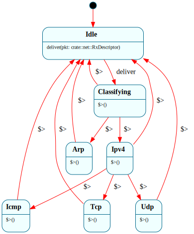

# `RxPipeline`

> Classify one received Ethernet frame and dispatch it to the right protocol handler: `$Idle → $Classifying → ($Arp | $Ipv4 → $Icmp | $Udp) → $Idle`. The project's marquee **data pipeline** — a parsed packet descriptor flows down the classify→dispatch graph as an **enter parameter**, while the frame bytes stay in a native buffer. The first system to thread a parsed *struct* through the states (needs framec's typed enter-arg codegen).

| Property | Value |
|---|---|
| Track | Bare-metal |
| Milestone introduced | B5 (Step 3) |
| Source file | [`../../frame/rx_pipeline.frs`](../../frame/rx_pipeline.frs) |
| State diagram | [`rx_pipeline.svg`](rx_pipeline.svg) |
| Instances at runtime | One (the kernel's inbound dispatch) |
| Status | Implemented and load-bearing — every received frame is classified through it (`net::pump`). |

## State diagram

## Why a state machine (and why a *pipeline*)

Receiving a packet is a classify-then-dispatch cascade: read the Ethernet type → if IPv4, read the IP protocol → route to ICMP/UDP/TCP. That's a small decision *pipeline*, and modelling it as one makes the routing graph the diagram. The interesting property — the one this system exists to demonstrate — is that the parsed **descriptor flows down the pipeline as an enter parameter** (`-> (pkt) $Ipv4` → `$>(pkt: RxDescriptor)`), so each stage receives exactly the datum it routes on, rather than reading shared state. The classification predicates are plain `if` on the descriptor's fields (Frame guards are native conditionals around transitions).

The frame **bytes** stay in a native buffer (`crate::net::RX_FRAME`); only the small `RxDescriptor` (ethertype + IP protocol) rides the transitions. This is the cookbook **"thread the parsed descriptor, keep the payload native"** recipe, on real packets — and the counterpart to `SyscallDispatcher` (scalars) and `ElfLoader` (a phase descriptor): here a *classifier fan-out* threads a struct.

## States

- **`$Idle`** (initial) — `deliver(pkt)` → `$Classifying`, carrying the descriptor.
- **`$Classifying`** — enter handler routes on `pkt.ethertype`: `0x0806` → `$Arp`, `0x0800` → `$Ipv4`, else back to `$Idle`.
- **`$Arp`** — enter handler calls `crate::net::on_arp(pkt)` (re-reads the native frame for the ARP specifics), then → `$Idle`.
- **`$Ipv4`** — routes on `pkt.ip_proto`: `1` → `$Icmp`, `17` → `$Udp`, else → `$Idle`.
- **`$Icmp`** / **`$Udp`** — enter handlers call `crate::net::on_icmp(pkt)` / `on_udp(pkt)`, then → `$Idle`.

Every leaf returns to `$Idle`, so the single instance classifies frame after frame.

## Interface

| Method | Returns | Purpose |
|---|---|---|
| `deliver` | (none) | A received frame's descriptor arrived; classify + dispatch it. |

`RxDescriptor { ethertype: u16, ip_proto: u8 }` (`Clone, Copy, Default, Debug`) is the threaded summary. The per-protocol handlers (`on_arp`/`on_icmp`/`on_udp`) re-read the native `RX_FRAME` buffer for their specifics.

## Composition

**Driven by:** `crate::net::pump()` — reads one frame from the NIC (`virtio_net::poll_rx`) into `RX_FRAME`, parses the `RxDescriptor`, and calls `deliver(desc)`. The receive loops (gateway ARP resolution, the ICMP ping) call `pump()` and check the native flags the leaves set (`ARP_GATEWAY_SEEN`, `ICMP_REPLY_SEEN`) — so ARP replies reach `ArpResolver.reply()` and echo replies satisfy the ping, both *through* the pipeline.

## Testing

**State graph snapshot (Level 2):** `kernel-tests/tests/state_graphs.rs::rx_pipeline_state_graph_snapshot`.

**Behavioral (Level 3):** `kernel-tests/tests/rx_pipeline_behavior.rs` — 6 tests: ARP → `on_arp`; IPv4/ICMP → `on_icmp`; IPv4/UDP → `on_udp`; unknown ethertype and unknown IP protocol dispatch to nothing; and the pipeline returns to `$Idle` and re-classifies the next frame. (The `net` leaves are doubled to record which fired.)

**QEMU (Level 7):** `arp_resolves_gateway_b5` and `kernel_pings_gateway_b5` now drive their received frames through `RxPipeline` — the gateway ARP reply and the ICMP echo reply are classified + dispatched by the Frame machine end to end.

## Related documents
- [Roadmap](../roadmap.md) — B5 Step 3
- [Pipeline-conversion plan](../plans/pipeline_conversions.md) — the data-pipeline-via-enter-params recipes
- [`ArpResolver`](arp_resolver.md) — the ARP leaf feeds it; [`SyscallDispatcher`](syscall_dispatcher.md) / [`ElfLoader`](elf_loader.md) — the other pipeline recipes

## Change log
- **2026-05-21** — initial doc; B5 Step 3. Classify→dispatch threading an `RxDescriptor` via enter params; ARP + ICMP receive paths routed through it. UDP leaf lands fully at Step 3b.
