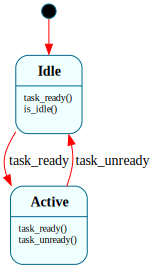

# `Scheduler`

> The kernel's run/halt **mode**: `$Idle` (nothing runnable → the kernel halts) vs `$Active` (≥1 runnable thread → keep switching). Deliberately minimal — picking and context-switching are native ISR work, not modeled here. Load-bearing at B1: the boot context reads `is_idle()` to decide when to stop.

| Property | Value |
|---|---|
| Track | Bare-metal |
| Milestone introduced | B1 |
| Source file | [`../../frame/scheduler.frs`](../../frame/scheduler.frs) |
| State diagram | [`scheduler.svg`](scheduler.svg) |
| Instances at runtime | Exactly one |
| Status | Implemented and load-bearing — drives the kernel's idle-halt decision. |

## State diagram

## States

### `$Idle` (initial)
No runnable threads. The kernel's idle loop, reading `is_idle()`, halts the CPU here.
**Transitions out:** `task_ready()` → `$Active` (and `runnable += 1`).
**Override:** `is_idle()` → `true`.

### `$Active`
At least one runnable thread; the (native) scheduler keeps round-robining.
**Transitions out:** `task_unready()` → `$Idle` when `runnable` hits 0 (otherwise stays `$Active`); `task_ready()` stays `$Active` (`runnable += 1`).

## Interface

| Method | Parameters | Returns | Purpose |
|---|---|---|---|
| `task_ready` | (none) | (none) | A thread became runnable. `runnable += 1`; `$Idle` → `$Active`. |
| `task_unready` | (none) | (none) | A thread blocked/exited. `runnable -= 1`; → `$Idle` at zero. |
| `is_idle` | (none) | `bool` | `true` in `$Idle`. Read by the kernel idle loop to decide to halt. |
| `runnable_count` | (none) | `u32` | The current runnable count (domain read). |

## Domain

| Field | Type | Initial | Purpose | Lifetime |
|---|---|---|---|---|
| `runnable` | `u32` | `0` | Count of runnable threads; the basis for `$Idle` vs `$Active`. | System lifetime |

## Why a state machine

This is deliberately the **smallest honest** machine, the same call made for [`SerialDriver`](serial_driver.md). The architecture doc sketches a fuller `$Idle → $PickingNext → $Running → $ContextSwitching` graph, but at B1 those phases are *native ISR mechanics* with no distinct Frame behavior: the timer ISR saves the register frame, reads a native ready-queue, and swaps stacks (see `kernel/src/sched.rs` and `interrupts.rs`). Modeling them as Frame states would be ceremony. The one genuinely-different-behavior decision the scheduler owns is the **mode**: when nothing is runnable, halt; otherwise keep switching. That is real, and the kernel reads `is_idle()` to act on it — so the system earns its keep without overclaiming. It gains real internal states at **B3**, when blocking/waiting/zombie interactions give it decisions to make.

## Composition: load-bearing, with a critical-section caveat

The native scheduler (`kernel/src/sched.rs`) holds the one `Scheduler` instance and drives it from **normal context only**:
- **spawn a worker** → `task_ready()` (`$Idle`→`$Active`),
- **a worker exits** → `task_unready()` (→`$Idle` at zero),
- **boot idle loop** → `while !is_idle() { hlt }`, then halts.

**Why the ISR never touches it.** Frame dispatch is single-threaded, run-to-completion, non-reentrant. If the timer ISR called a `Scheduler` method while a normal-context thread was mid-dispatch in the same instance, it would corrupt the `_context_stack`. So the ISR uses only the native ready-queue; all `Scheduler` dispatch happens in normal context.

**Why even normal-context calls need a critical section.** The `Scheduler` is shared across *preemptible* threads (boot reads `is_idle()`; workers call `task_unready()`). A timer preemption mid-dispatch would re-enter it from another thread — the same hazard. So every dispatch runs inside `interrupts::without_interrupts(...)`, an interrupts-off critical section (single-core mutual exclusion). This is the concrete, B1-scale consequence of Frame's non-reentrant model under preemption — the same property that, for the *device-interrupt* case, motivates the deferred-event queue at B4.

## Testing

**State graph snapshot (Level 2):** `kernel-tests/tests/state_graphs.rs::scheduler_state_graph_snapshot`.

**Behavioral (Level 3):** `kernel-tests/tests/scheduler_behavior.rs` — 6 tests: fresh-idle, first `task_ready`→active, accumulate, decrement-to-idle, `task_unready`-in-idle ignored, idle/active cycle.

**QEMU (Level 7):** `preemption_b1` (in `xtask` `SMOKE_TESTS`) boots the kernel; two non-yielding threads are preempted, each exits, and the kernel reaches `scheduler is $Idle` — exercising `task_ready`/`task_unready`/`is_idle` in the running kernel under preemption.

## Related documents

- [Task](task.md) — per-thread lifecycle (host-validated at B1)
- [SerialDriver](serial_driver.md) — the same "smallest honest machine" call
- [Roadmap](../roadmap.md) — B1; richer scheduler states at B3
- [port_contract.md](../port_contract.md) — the non-reentrancy property behind the critical-section requirement

## Change log

- **2026-05-20** — initial doc; B1. `$Idle`/`$Active` load-bearing for the idle-halt decision; critical-section requirement documented.
