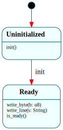

# `SerialDriver`

> COM1 serial console lifecycle: a two-state machine that enforces "program the UART before you transmit." `$Uninitialized → (init) → $Ready`; writes are handled only in `$Ready`. Introduced at B0 Step 3 to own the console output that the `Kernel` HSM previously did via raw `serial::*` calls.

| Property | Value |
|---|---|
| Track | Bare-metal |
| Milestone introduced | B0 Step 3 |
| Source file | [`../../frame/serial_driver.frs`](../../frame/serial_driver.frs) |
| State diagram | [`serial_driver.svg`](serial_driver.svg) |
| Instances at runtime | One per kernel image (held in `Kernel`'s `console` domain field) |
| Status | Implemented. Boots in QEMU; init handshake + gated writes covered by host behavioral tests and the QEMU smoke chain. |

## State diagram

Regenerate via `cargo xtask regen-diagrams` after any `.frs` change; `cargo xtask check-diagrams` enforces drift.

## States

### `$Uninitialized`

Initial state. The UART has not been programmed (baud rate, line format, and FIFO are at power-on / firmware defaults, which on real hardware may not match what the kernel expects). The console is **not** writable yet: `write_byte` and `write_line` are intentionally not handled here, so per Frame's explicit-only-forwarding they are silently dropped. This is the gate the machine exists for — it makes "wrote before init" impossible to express as a successful operation.

**Transitions out:**
- `init()` → `$Ready` — runs `serial::init_uart()` (the 16550 programming sequence), then becomes writable.

**Events ignored:**
- `write_byte(b)` — dropped. Writing before the UART is configured would emit at an undefined baud rate. The drop is deliberate, not a missing feature.
- `write_line(s)` — dropped, same reason.

### `$Ready`

The UART is programmed; output works. Reached only via `init()`.

**Transitions out:** none — `$Ready` is where the driver lives for the rest of the kernel's life. (No `$Transmitting`/`$Draining` cycle: at B0 the target is QEMU, where transmission is synchronous. See "Why a state machine".)

**Events handled (no transition):**
- `write_byte(b)` — emits one byte via `serial::write_byte` (which THRE-polls then writes COM1).
- `write_line(s)` — emits the string then a newline, via `serial::write_str` + `serial::write_byte(b'\n')`.

**Events ignored:**
- `init()` — re-initializing an already-ready console is a no-op we don't need to write, so the handler is omitted (silently ignored). The UART stays programmed; the driver stays `$Ready`.

## Interface

| Method | Parameters | Returns | Purpose |
|---|---|---|---|
| `init` | (none) | (none) | Program the UART and become writable. Valid in `$Uninitialized` (does the work + transitions); ignored in `$Ready`. |
| `write_byte` | `b: u8` | (none) | Emit one byte. Handled in `$Ready`; dropped in `$Uninitialized`. |
| `write_line` | `s: String` | (none) | Emit a string followed by a newline. Handled in `$Ready`; dropped in `$Uninitialized`. |
| `is_ready` | (none) | `bool` | `true` iff in `$Ready`. Default is `false`; only `$Ready` overrides. Lets a caller check whether `init()` has run. |

## Domain

No domain block. The driver's only state is which state is active (`$Uninitialized` vs `$Ready`); the UART itself is the "storage", accessed through the native `serial` module. There's nothing per-instance to persist.

## Why a state machine

**What would this look like as plain Rust?** A `struct SerialDriver { ready: bool }` with `init()` setting the flag and `write_*` methods that early-return (or debug-assert) when `!ready`. The "don't write before init" rule would be a runtime `if self.ready` check duplicated in every write method, easy to forget when a third write method is added later.

**What does Frame buy?** The init-before-write invariant becomes *structural* rather than a convention: the write events simply don't exist as handled operations in `$Uninitialized`, so there's no `if ready` to forget and no code path that writes to an unprogrammed UART. The state graph ([`serial_driver.svg`](serial_driver.svg)) documents the lifecycle at a glance — one edge, `init`, gates everything.

**What would be lost by not using Frame here?** Honestly, not a lot — this is a small machine, and a disciplined `bool` flag would work. The doc is upfront about that: SerialDriver is deliberately *minimal*. Its value as a Frame system is twofold and modest: (1) it removes a class of "forgot the ready check" bug by construction, and (2) it's the smallest honest demonstration of `Kernel` → child-system composition and the "shared `.frs`, different native actions per target" pattern (see Composition / Testing) before that pattern carries real weight at B2 (`Shell`/`Parser` reused in the kernel).

What this system pointedly does **not** do is invent an `$Idle → $Transmitting → $Draining` graph. At B0 the target is QEMU, where COM1 writes are synchronous — there is no asynchronous transmit phase, no TX interrupt, no FIFO-drain wait beyond the THRE poll inside `serial::write_byte`. Modeling transmit/drain states with no behavior behind them would be ceremony. Those states become real on hardware with interrupt-driven TX (a later track) and get added then. Choosing the smaller machine *is* the Frame discipline: model the invariant that exists, not the one a textbook UART diagram suggests.

## Composition

**Calls into:**
- `serial::init_uart()` — `$Uninitialized.init()`; the 16550 programming sequence.
- `serial::write_byte(b)` / `serial::write_str(s)` — `$Ready`'s write handlers; byte-level COM1 output (THRE-polled).

The `serial` module is resolved at the include site, so it differs per target — this is the key composition point:
- In the **kernel** (`kernel/src/frame_systems.rs`): `serial` is `crate::serial` (real COM1 port I/O, `kernel/src/serial.rs`).
- In **host tests** (`kernel-tests/src/lib.rs`): `serial` is a capturing module that appends to a thread-local buffer, with `init_uart()` a no-op (no UART on the host).

The *same generated `SerialDriver`* runs in both; only the native `serial` actions differ. This is the bare-metal-vs-host action split the roadmap relies on at B2.

**Called from:**
- `Kernel` holds a `SerialDriver` in its `console` domain field (`console: SerialDriver = @@SerialDriver()`).
  - `Kernel.$InitConsole.$>` calls `self.console.init()` — the boot phase that brings the real console up.
  - `Kernel.$LaunchInit.$>` and `Kernel.$Running.$>` call `self.console.write_line(...)` — output after the console is ready.
  - Early-boot phases (`$InitMemory`..`$InitConsole`'s own banner) and the panic/halt paths deliberately use raw `serial::*` instead (bootstrap / emergency console — see [`kernel.md`](kernel.md)).

## Testing

**State graph snapshot (Level 2):** present.
- `kernel-tests/tests/state_graphs.rs::serial_driver_state_graph_snapshot` — insta snapshot of `framec -l graphviz` output.
  Snapshot: `kernel-tests/tests/snapshots/state_graphs__serial_driver_state_graph.snap`.

**Behavioral tests (Level 3):** present, in `kernel-tests/tests/serial_driver_behavior.rs`.
- `fresh_driver_is_uninitialized_not_ready` — `is_ready()` is `false` after construction.
- `write_before_init_is_dropped` — `write_byte`/`write_line` in `$Uninitialized` produce no output and don't change state. This is the gate assertion.
- `init_transitions_to_ready` — `init()` moves to `$Ready` (`is_ready()` becomes `true`).
- `write_line_after_init_emits_text_and_newline` — `$Ready` `write_line` emits `"hello\n"`.
- `write_byte_after_init_emits_single_byte` — `$Ready` `write_byte` emits one byte.
- `multiple_writes_after_init_accumulate_in_order` — interleaved writes accumulate correctly.
- `reinit_while_ready_is_ignored_and_stays_ready` — `init()` in `$Ready` is a silent no-op.

**Integration tests (Level 4):**
- Exercised in composition with `Kernel`: the kernel behavioral test `boot_chain_prints_all_phases_in_order` (in `kernel-tests/tests/kernel_behavior.rs`) asserts `[boot] launching init` and `[run] kernel running` appear — those lines are emitted *through* the SerialDriver after `$InitConsole` runs `init()`, so the test transitively covers the Kernel → SerialDriver wiring.

**QEMU smoke tests (Level 7):**
- `boot_hsm_runs_init_chain_b0` (in `xtask/src/main.rs`'s `SMOKE_TESTS`) boots the real kernel; the `[boot] launching init` and `[run] kernel running` lines it asserts are produced by the SerialDriver on actual QEMU COM1 (via `serial::write_byte`'s THRE-polled path + the real `init_uart` sequence). Confirms the driver works end-to-end on bare metal, not just in host capture.

**Hardware tests (Level 8):**
- Not applicable at B0 (QEMU only). The `init_uart` sequence is written to be correct for a real 16550, so when a hardware track lands this driver is the natural place for a UART loopback test.

## Native action implementations

The action bodies are thin: each calls one or two `serial::*` functions. The substance is in the native `serial` module:
- **Kernel** (`kernel/src/serial.rs`): `init_uart()` programs the 16550 for 115200 8N1, FIFOs on, interrupts off (polled mode — B0 has no IDT wired for serial). `write_byte` busy-waits on the Line Status Register THRE bit, then writes the data register. All via `in`/`out` port instructions wrapped in a safe API (COM1 register access is sound).
- **Host tests** (`kernel-tests/src/lib.rs`): `init_uart()` is a no-op; `write_byte`/`write_str` append to a thread-local capture buffer.

No `unsafe` appears in the Frame source or the generated code — it's confined to the native `serial` module's `asm!` port I/O.

## Open questions

- **Should `write_line` take `&str` instead of `String`?** It currently takes `String`, so callers write `self.console.write_line("...".to_string())`. `&str` interface params are supported (framec issue #18 fixed), which would drop the `.to_string()`. Deferred — `String` matches the convention used elsewhere (`Kernel.kernel_panic`, `JobControl`), and the allocation is irrelevant at boot. Revisit if a hot path ever calls `write_line` in a loop.
- **When TX becomes interrupt-driven (hardware track), where do the new states go?** Adding `$Transmitting`/`$Draining` would turn `write_*` in `$Ready` into "enqueue + kick TX" with completion handled by a TX-empty interrupt. That's a real future state machine. The question is whether it's the same system extended or a separate `Uart16550Driver` — likely the former, with `$Ready` splitting into `$Idle`/`$Transmitting`. Not decided; not needed until interrupts exist.

## Related documents

- [Architecture](../architecture.md) — overall project structure; the B-track section
- [Roadmap](../roadmap.md) — B0 milestone exit criteria (B0-2, B0-5)
- [Kernel](kernel.md) — the HSM that owns a `SerialDriver` and routes post-console output through it; documents the bootstrap-vs-driver-vs-emergency console split

## Change log

- **2026-05-20** — initial doc; B0 Step 3. Minimal two-state init-gate driver; integrated into the Kernel HSM's `$InitConsole`/`$LaunchInit`/`$Running` states.
