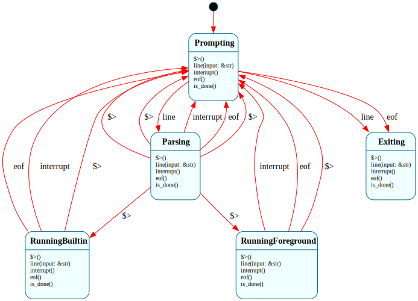

# `Shell`

> The hosted-mode Frame OS shell: prompts the user, reads commands, and exits cleanly when asked. At H0, this is the smallest possible Frame system that demonstrates the project's hosted-mode binary: two states, one input event, one query method.

| Property | Value |
|---|---|
| Track | Hosted (will be reused in Bare-metal at B2) |
| Milestone introduced | H0 |
| Source file | [`../../frame/shell.frs`](../../frame/shell.frs) |
| State diagram | [`shell.svg`](shell.svg) |
| Instances at runtime | Exactly one per process |
| Status | In progress (H0) |

## State diagram

Regenerate via `cargo xtask regen-diagrams` after any `.frs` change. The SVG is committed to the repo and `cargo xtask check-diagrams` enforces drift.

## States

### `$Prompting`

The shell is waiting for user input. The first prompt is printed by the state's `$>` enter handler at construction time. Subsequent prompts are printed by the `line()` handler after each input that doesn't cause a transition.

**Transitions out:**
- `line(input)` → `$Exiting` — when `input.trim()` is `"exit"` or `"quit"`
- `interrupt()` → `$Exiting` — Ctrl-C or Ctrl-D from the host loop

**Events handled (no transition):**
- `line(input)` — stays in `$Prompting` for all non-transitioning input (empty, whitespace, unknown command); re-prints the prompt as a side effect
- `is_done()` → returns `false` — used by the host loop to decide whether to continue reading lines

**Forwarding:** none. `$Prompting` has no parent state at H0.

### `$Exiting`

Terminal state. The shell's `$>` enter handler prints "goodbye". The host loop, after the call that caused the transition, calls `is_done()` and sees `true`, then breaks.

**Transitions out:** none. Once in `$Exiting`, the system stays there.

**Events handled (no transition):**
- `line(input)` — ignored. The shell is shutting down, so further input has no effect. Documented explicitly because future milestones (H3 job control) may add events that should still produce output here.
- `interrupt()` — ignored. Redundant Ctrl-C / Ctrl-D during shutdown is a no-op.
- `is_done()` → returns `true`

## Interface

| Method | Parameters | Returns | Purpose |
|---|---|---|---|
| `line` | `input: &str` | `()` | Process one line of input from the user |
| `interrupt` | `()` | `()` | Process a Ctrl-C / Ctrl-D / SIGINT-equivalent signal from the host loop |
| `is_done` | `()` | `bool` | Query whether the shell is in `$Exiting` and the host loop should stop |

`line(input)` always trims whitespace before deciding what to do. Both `$Prompting` and `$Exiting` accept the event; only `$Prompting` does anything with it. The caller (host loop) doesn't need to check state before calling — Frame's dispatch handles the routing.

`interrupt()` is the explicit Frame event for "the user is asking to abort what's happening." H0 maps any abort signal to immediate exit. In H2 this will split: `$Prompting.interrupt()` will clear the line and stay (typical shell behavior), `$RunningExternal.interrupt()` will SIGKILL the child and return to the prompt. The state-dependent dispatch is the Frame argument; putting the event in the interface at H0 means H2 is purely additive (a new state, new handlers on existing states if their behavior changes).

`is_done()` is the host loop's only way to observe the state. We intentionally don't expose state names; the host loop only needs to know "should I keep going" and the answer is `!shell.is_done()`.

## Domain

No domain fields at H0. The shell is stateless beyond what its current state implies.

Future milestones will add: `cwd` (current directory, H1), `history` (line history, H1), `current_line` (when `$Parsing` is introduced at H1), etc.

## Why a state machine

Honest answer for H0: the Frame argument is weakest here.

The minimal H0 shell has two states and one input event. As plain Rust this would be a `Done` boolean flag and a function. Frame buys very little at this size.

So why use Frame? **Because the shell grows.** Looking at the H1, H2, H3 roadmap entries:

- H1 adds `$Parsing` and `$RunningBuiltin` states, plus 8 builtin commands, plus a separate `Parser` system that the shell composes with.
- H2 adds `$RunningExternal` with state-specific signal handling — Ctrl-C means different things in different states, which is the textbook case for state-driven dispatch.
- H3 adds `$Suspended` for Ctrl-Z, plus a `JobControl` manager system and per-job `Job` instances.

Each of those additions is a *localized change* in Frame: new state, new transitions, framepiler regenerates dispatch. In plain Rust each is a hunt-and-peck through every place the `Done` flag would have grown into a `ShellState` enum.

The H0 doc records the *start* of that progression. The Frame argument compounds with each subsequent milestone; H0 alone doesn't make the case.

What's lost by not using Frame at H0? Almost nothing in absolute terms, but conceptually: the established pattern. If we wrote H0 in plain Rust and "introduced Frame at H1", we'd have to refactor the H0 code, and the project's argument would be weaker because Frame wasn't there from the start.

## Composition

**Calls into:**
- `self.print_prompt()` — native action; uses `std::io::stdout` to print `"frame-os> "` and flush
- `self.print_goodbye()` — native action; prints `"goodbye"`
- `self.print_unknown(cmd)` — native action; prints `"unknown command: {cmd} (try 'exit')"`

**Called from:** the host loop in [`shell/src/main.rs`](../../shell/src/main.rs), which constructs the `Shell` once and calls `shell.line(input)` for each line read from stdin.

**Native modules used by actions:** `std::io::Write` (for flushing stdout). No other dependencies at H0.

## Testing

See [`../testing.md`](../testing.md) for the project-wide testing approach.

**State graph snapshot (Level 2):**
- Test file: [`../../shell/tests/state_graphs.rs`](../../shell/tests/state_graphs.rs)
- Snapshot file: `shell/tests/snapshots/state_graphs__shell_state_graph.snap` (auto-generated on first test run)
- Test name: `shell_state_graph_snapshot`
- Status: present; snapshot accepted after first run via `cargo insta review`

**Behavioral tests (Level 3):**
Test file: [`../../shell/tests/shell_behavior.rs`](../../shell/tests/shell_behavior.rs).

- `shell_starts_not_done` — fresh `Shell` is in `$Prompting`, `is_done()` is `false`
- `exit_command_transitions_to_exiting` — `line("exit")` → `is_done()` is `true`
- `quit_command_transitions_to_exiting` — `line("quit")` → `is_done()` is `true`
- `exit_with_trailing_newline_works` — `line("exit\n")` works (host loop sends trailing newline)
- `exit_with_surrounding_whitespace_works` — `line("  exit  ")` works
- `empty_line_does_not_exit` — `line("")` stays in `$Prompting`
- `whitespace_only_line_does_not_exit` — `line("   \t  ")` stays in `$Prompting`
- `unknown_command_does_not_exit` — `line("xyzzy")` stays in `$Prompting`
- `exiting_state_ignores_further_lines` — once in `$Exiting`, further `line()` calls don't change `is_done()`
- `interrupt_in_prompting_transitions_to_exiting` — `interrupt()` from `$Prompting` → `is_done()` is `true`
- `interrupt_in_exiting_is_idempotent` — `interrupt()` from `$Exiting` is a no-op (no panic, state unchanged)
- `interrupt_after_unknown_commands_still_exits` — after `line("foo"); line("bar"); interrupt()`, `is_done()` is `true`
- `many_unknown_commands_before_exit` — stress check that we can stay in `$Prompting` indefinitely

**Integration tests (Level 4):** N/A at H0 — `Shell` doesn't compose with any other Frame system yet. Will land at H1 with `Parser`.

**E2E tests (Level 6):**
Test file: [`../../shell/tests/e2e.rs`](../../shell/tests/e2e.rs).

- `prints_banner_on_startup` — binary prints the banner
- `prints_prompt` — binary prints the prompt
- `exit_command_exits_cleanly` — typing `exit` produces "goodbye" and exit code 0
- `quit_command_exits_cleanly` — typing `quit` produces "goodbye" and exit code 0
- `eof_exits_cleanly` — closing stdin produces "goodbye" and exit code 0
- `unknown_command_prints_message` — typing `xyzzy` produces "unknown command: xyzzy"
- `empty_lines_dont_crash` — repeated empty input doesn't produce unknown-command messages
- `multiple_commands_before_exit` — typing several unknown commands followed by `exit` works

**QEMU smoke tests (Level 7):** N/A — `Shell` at H0 runs only in the hosted track.

**Hardware tests (Level 8):** N/A — same reason.

## Native action implementations

The action bodies are inside the `actions:` block in [`../../frame/shell.frs`](../../frame/shell.frs). Each is a few lines of Rust:

- `print_prompt()` — `print!("frame-os> "); io::stdout().flush()`. The flush matters: without it, the prompt doesn't appear until after the user has typed a line on some terminals.
- `print_goodbye()` — `println!("goodbye")`. Newline is intentional so the next shell command on the user's terminal isn't glued to "goodbye".
- `print_unknown(cmd)` — `println!("unknown command: {cmd} (try 'exit')")`.

All three are unsafe-free and `std`-only. They will need to be re-implemented for the bare-metal `Shell` at B2 (writing to `SerialDriver` instead of `stdout`); the Frame source itself is unchanged.

## Open questions

- **Should `line()` return something to the host?** Today the host calls `line()` and then queries `is_done()` separately. A future cleanup might fold these — `line()` returns a `bool` indicating whether to continue. Not necessary for H0; revisit if H1 surfaces a need.
- **Are `exit` and `quit` both genuinely useful, or is one redundant?** Two commands for the same action might be unnecessary surface. Pro: matches user expectation from both bash (`exit`) and Python REPL (`quit`). Con: more state-event pairs to test. Defer the decision; if it becomes annoying, drop `quit`.
- **Should there be a `help` builtin at H0?** Currently the banner mentions `exit`/`quit`. A `help` builtin would be 5 lines and would not require any state machine changes. Defer to H1, which is where builtins legitimately live; the H0 banner is the only help facility at this milestone.

## Related documents

- [Architecture](../architecture.md) — overall project structure, where Shell fits in the hosted track
- [Roadmap](../roadmap.md#h0--minimum-viable-shell) — H0 scope and success criteria
- [Testing](../testing.md) — project-wide testing approach this doc's Testing section follows
- [Systems index](README.md) — where to find docs for other Frame systems (none yet, at H0)

## Change log

- **2026-05-19** — initial doc; H0 implementation with `line` and `is_done`.
- **2026-05-19** — added `interrupt()` event for Ctrl-C / Ctrl-D handling, completing H0 scope per `docs/roadmap.md`. State graph adds `Prompting -> Exiting [label=interrupt]` edge. Three new behavioral tests cover the new state-event pairs.
