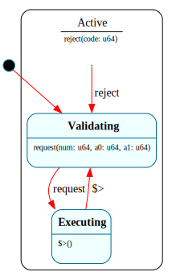

# `SyscallDispatcher`

> Validates and executes one system call, with **every error funneled to a single parent handler** via `=> $^`: `$Validating → $Executing` under an HSM parent `$Active`. B3's HSM-forwarding showcase — "how an error is reported" is written once, on the parent, and the children forward to it.

| Property | Value |
|---|---|
| Track | Bare-metal |
| Milestone introduced | B3 (Step 2) |
| Source file | [`../../frame/syscall_dispatcher.frs`](../../frame/syscall_dispatcher.frs) |
| State diagram | [`syscall_dispatcher.svg`](syscall_dispatcher.svg) |
| Instances at runtime | One global instance (the kernel's syscall entry routes through it) |
| Status | Implemented and load-bearing — the ring-3 demo's `syscall_dispatch` drives it on every syscall. |

## State diagram

## Why this is a clean Frame-in-kernel fit

A syscall is a **synchronous trap**: the `syscall` instruction enters the kernel with a defined entry point, the kernel runs the call to completion, and `sysret` returns to user mode. There is no preemption hazard at the dispatch layer (the call either runs or is rejected, then returns), so one global `SyscallDispatcher` can be driven synchronously — the same "synchronous exception ⇒ Frame fits directly" argument as [`PageFaultHandler`](page_fault_handler.md).

What makes it a *good* Frame demonstration is the error path. Validation can fail for several reasons (at B3: unknown call number; at B4: bad argument, permission denied, out of memory), and every one of them must produce the **same** outcome: set an error result and return to ready. Rather than duplicate that logic in each failure site, the failure is **forwarded to the `$Active` parent's `reject()` handler** with `=> $^`. The reporting policy lives in exactly one place.

## States

### `$Validating` (initial, child of `$Active`)
Each `request(num, a0, a1)` lands here. The handler stashes the call number + args, then classifies via the native `crate::usermode::is_known_syscall(num)`:
- known → `-> $Executing`;
- unknown → `self.reject(38)` (ENOSYS). `reject` is **not** handled in `$Validating`, so it forwards `=> $^` to `$Active.reject` (relies on lang-reference §9.5 self-event-send: a handler may fire an event on `self`, which pushes its own context and runs to completion).

**Forwarding:** `=> $^` (see parent).

### `$Executing` (child of `$Active`)
**Enter (`$>`):** run the call natively — `self.result = crate::usermode::perform_syscall(self.num, self.a0, self.a1)` — clear the error flag (`is_err = false`), and `-> $Validating` (ready for the next request).

**Forwarding:** `=> $^`.

### `$Active` (HSM parent)
The single error handler the children forward to.
**`reject(code)`:** record `result = code`, set `is_err = true`, and `-> $Validating`. At B3 only the unknown-call (`ENOSYS`) path reaches it; at B4 the richer ABI (bad-arg / permission-denied / OOM) funnels through the same handler — the structure already scales, only the set of `reject` call sites grows.

## Interface

| Method | Parameters | Returns | Purpose |
|---|---|---|---|
| `request` | `num: u64, a0: u64, a1: u64` | (none) | Validate + dispatch one syscall. |
| `reject` | `code: u64` | (none) | Force the error path with the given result code (also the forward target of `$Validating`'s unknown-call path). |
| `result` | (none) | `u64` | The most recent call's result (the return value, or the error code after a reject). |
| `is_error` | (none) | `bool` | `true` iff the most recent call was rejected. |

## Domain

| Field | Type | Initial | Purpose | Lifetime |
|---|---|---|---|---|
| `num` | `u64` | `0` | The call number being processed. | System lifetime |
| `a0` | `u64` | `0` | First syscall argument. | System lifetime |
| `a1` | `u64` | `0` | Second syscall argument. | System lifetime |
| `result` | `u64` | `0` | The current call's return value / error code. | System lifetime |
| `is_err` | `bool` | `false` | Whether the current call was rejected. | System lifetime |

## Composition

**Driven by:** `crate::usermode::syscall_dispatch` — the Rust half of the `syscall`/`sysret` fast path (`usermode.rs::syscall_entry` marshals the user registers into the SysV ABI and calls it). It routes through a global `DISPATCHER: Option<SyscallDispatcher>`: `d.request(num, a0, a1); d.result()`.

**Calls into (native):** `crate::usermode::is_known_syscall` (validation) and `crate::usermode::perform_syscall` (the actual work — `write_char` to serial, or `exit` via the kernel-return `longjmp`). The `crate::usermode` paths resolve per crate — real in the kernel, a controllable test-double in `kernel-tests` (`is_known_syscall: num < 2`; `perform_syscall`: echoes `a0`) — the "shared `.frs`, different native actions per target" pattern.

## Testing

**State graph snapshot (Level 2):** `kernel-tests/tests/state_graphs.rs::syscall_dispatcher_state_graph_snapshot` (committed snapshot `state_graphs__syscall_dispatcher_state_graph.snap`).

**Behavioral (Level 3):** `kernel-tests/tests/syscall_dispatcher_behavior.rs` — 5 tests against the `usermode` double: fresh-not-error; known call executes and returns its value; **unknown call is rejected via the parent** (`=> $^` → `result == 38`, `is_error`); recovery (a valid call after a reject succeeds); each request classified independently.

**QEMU (Level 7):** `ring3_syscall_b3` — a ring-3 blob makes real `syscall`s that route through the global `SyscallDispatcher` (`AB` printed via `write_char`, then `exit(42)`); the dispatcher's `$Validating → $Executing` path is exercised on real hardware-style traps. No `KERNEL EXCEPTION` / `KERNEL PANIC`.

## Open questions
- **Multiple error classes** (bad-arg / permission-denied / out-of-memory) are part of the committed design but not distinguished at B3 — only `ENOSYS` reaches `$Active.reject`. They land at B4 with the richer ABI; the `=> $^` funnel already accommodates them (more `reject` sites, same handler).
- **Allocation in trap context:** `request()` dispatch allocates (Rc event + context). Fine at B3 (the heap is mapped; the trap is synchronous), but a `no-alloc` codegen mode (tracked framec gate) would remove even that — relevant once syscalls are hot.

## Related documents
- [Roadmap](../roadmap.md) — B3 (B3-1 SyscallDispatcher snapshot, B3-3 `=> $^` forwarding; both done at Step 2)
- [`PageFaultHandler`](page_fault_handler.md) — the other synchronous-trap Frame system, and the other user of `=> $^` parent forwarding
- [Architecture](../architecture.md) — `SyscallDispatcher` in the B3 system set

## Change log
- **2026-05-20** — initial doc; B3 Step 2. `$Validating → $Executing` under `$Active`, with the unknown-call path forwarding `self.reject(ENOSYS)` to `$Active.reject` via `=> $^`. Driven by the ring-3 syscall fast path; richer error classes deferred to B4.
