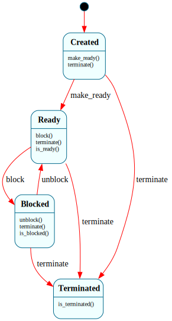

# `Task`

> Coarse, normal-context lifecycle of a kernel thread: `$Created → $Ready ⇄ $Blocked → $Terminated`. One instance per thread. Deliberately has **no `$Running` state** — "on the CPU" flips every timer tick and is native scheduler state, not a Frame transition.

| Property | Value |
|---|---|
| Track | Bare-metal |
| Milestone introduced | B1 |
| Source file | [`../../frame/task.frs`](../../frame/task.frs) |
| State diagram | [`task.svg`](task.svg) |
| Instances at runtime | One per kernel thread |
| Status | Host-validated (snapshot + behavioral). Not yet load-bearing in the kernel — see "Status note". |

## Status note

`Task` is fully designed and host-tested (its lifecycle transitions are validated in `kernel-tests`), but at B1 it is **not wired into the running kernel**. The reason is the honest native/Frame split: at B1 the per-tick scheduling decision happens inside the timer ISR, which cannot call a Frame system (Frame dispatch is non-reentrant — see [`scheduler.md`](scheduler.md)), and the native scheduler tracks each thread's runnable/dead state with a plain flag the ISR can read. A per-thread `Task` instance mirroring that flag would be decorative, so it isn't added. `Task` becomes load-bearing at **B3**, where it is superseded by `Process` (adding `$Zombie`/`$Reaped`) and the process lifecycle genuinely drives kernel decisions — `wait()`/reaping, exit-status delivery — that a flag can't capture. The B1 deliverable for `Task` is the validated lifecycle model; B3 puts it to work.

## State diagram

## States

### `$Created`
Initial. The thread exists but hasn't been admitted to the ready set.
**Transitions out:** `make_ready()` → `$Ready`; `terminate()` → `$Terminated`.

### `$Ready`
Runnable — selected on a CPU or waiting its turn in the (native) ready queue. There is no separate `$Running`; see the one-line summary.
**Transitions out:** `block()` → `$Blocked`; `terminate()` → `$Terminated`.
**Override:** `is_ready()` → `true`.

### `$Blocked`
Waiting on a resource (I/O, a lock — exercised at B3+).
**Transitions out:** `unblock()` → `$Ready`; `terminate()` → `$Terminated`.
**Override:** `is_blocked()` → `true`.

### `$Terminated`
Terminal sink. `make_ready`/`block`/`unblock` are unhandled here and silently dropped (explicit-only-forwarding) — nothing resurrects a terminated task.
**Override:** `is_terminated()` → `true`.

## Interface

| Method | Parameters | Returns | Purpose |
|---|---|---|---|
| `make_ready` | (none) | (none) | Admit `$Created` → `$Ready`. |
| `block` | (none) | (none) | `$Ready` → `$Blocked`. |
| `unblock` | (none) | (none) | `$Blocked` → `$Ready`. |
| `terminate` | (none) | (none) | Any non-terminal → `$Terminated`. |
| `id` | (none) | `u32` | The thread id (constructor `Task(id)`); constant across states. |
| `is_ready` / `is_blocked` / `is_terminated` | (none) | `bool` | State queries (default `false`, overridden in the matching state). |

## Domain

| Field | Type | Initial | Purpose | Lifetime |
|---|---|---|---|---|
| `id` | `u32` | `id` (ctor) | Thread identity | System lifetime |

## Why a state machine

Plain Rust would be an `enum ThreadState { Created, Ready, Blocked, Terminated }` plus checks. Frame buys the explicit, exhaustive lifecycle and makes illegal moves structural (you can't `unblock` a `$Created` task — that handler doesn't exist, so it's dropped, not mis-handled). Honestly, at B1 this is a *small* win and the system is borderline — which is exactly why it's host-validated now and only put to work at B3 as `Process`, where `$Zombie`/`$Reaped` and per-state `kill()`/`wait()` semantics make the state machine clearly worth it. Documenting the borderline honestly is the point.

## Composition

**Called from:** nothing in the kernel yet (host tests only at B1). At B3, `Process` (the evolved form) is driven by the syscall layer (`exit`, `wait`) and the scheduler.

## Testing

**State graph snapshot (Level 2):** `kernel-tests/tests/state_graphs.rs::task_state_graph_snapshot`.

**Behavioral (Level 3):** `kernel-tests/tests/task_behavior.rs` — 8 tests: fresh-state, `make_ready`, `block`/`unblock` round-trip, `terminate` from each non-terminal state, terminal-is-a-sink, id stability.

**QEMU (Level 7):** not applicable at B1 (not wired into the kernel).

## Related documents

- [Scheduler](scheduler.md) — the run/halt mode machine; the native scheduler that actually drives threads
- [Roadmap](../roadmap.md) — B1; `Process` at B3
- [Architecture](../architecture.md) — `Task` (B1) / `Process` (B4) note

## Change log

- **2026-05-20** — initial doc; B1. Lifecycle model host-validated; load-bearing as `Process` at B3.
