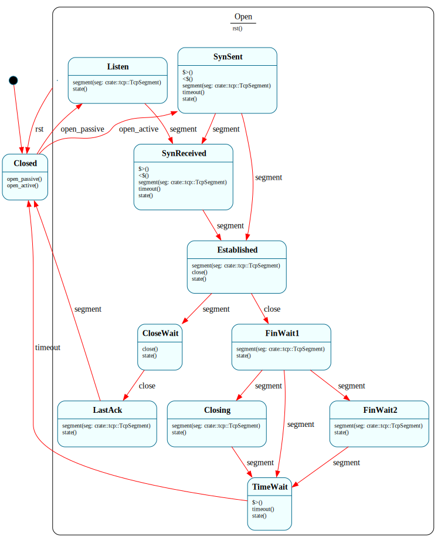

# `TcpConnection`

> One TCP connection's lifecycle — the **full RFC-793 state machine**, 11 states under an `$Open` parent that funnels RST/abort to a single `-> $Closed`. The deepest Frame system in the project, and the milestone the "stress-test Frame" thesis is pointed at: TCP *is* a state machine, top to bottom.

| Property | Value |
|---|---|
| Track | Bare-metal |
| Milestone introduced | B5 (Step 4a) |
| Source file | [`../../frame/tcp_connection.frs`](../../frame/tcp_connection.frs) |
| State diagram | [`tcp_connection.svg`](tcp_connection.svg) |
| Instances at runtime | One per connection (single connection at 4a; a table later) |
| Status | FSM complete + host-validated (RFC-793). Live **passive** (handshake + echo + close, B5-4) **and active** open against a real peer (4b–4e). Docs/CI wrap-up at 4f. |

## State diagram

## RFC-793 ↔ Frame

The states are RFC-793's verbatim: `$Closed` (initial/terminal), `$Listen`, `$SynSent`, `$SynReceived`, `$Established`, `$FinWait1`, `$FinWait2`, `$Closing`, `$TimeWait`, `$CloseWait`, `$LastAck`. The transitions are the RFC's, expressed directly:

| RFC-793 edge | Frame |
|---|---|
| passive/active OPEN | `$Closed`: `open_passive()` → `$Listen`; `open_active()` → send SYN, `$SynSent` |
| rcv SYN (in LISTEN) | `$Listen.segment` `if seg.syn` → send SYN-ACK, `$SynReceived` |
| rcv SYN,ACK (in SYN-SENT) | `$SynSent.segment` `if seg.syn && seg.ack` → send ACK, `$Established` |
| rcv SYN (simultaneous open) | `$SynSent.segment` `if seg.syn` → `$SynReceived` |
| rcv ACK of SYN | `$SynReceived.segment` `if seg.ack` → `$Established` |
| CLOSE (active) | `$Established.close()` → send FIN, `$FinWait1` |
| rcv FIN (passive close) | `$Established.segment` `if seg.fin` → ACK, `$CloseWait` |
| CLOSE (after CLOSE-WAIT) | `$CloseWait.close()` → FIN, `$LastAck` |
| rcv ACK of FIN | `$FinWait1`→`$FinWait2`; `$Closing`→`$TimeWait`; `$LastAck`→`$Closed` |
| rcv FIN (simultaneous close) | `$FinWait1.segment` `if seg.fin` → `$Closing` |
| 2·MSL timeout | `$TimeWait.timeout()` → `$Closed` |
| rcv RST (any state) | the **`$Open` parent**'s `rst()` → `$Closed`, reached by `=> $^` |

**Why a state machine:** the whole point — each segment means something *different* depending on the state (a FIN in `$Established` starts a passive close; in `$FinWait1` it's a simultaneous close; in `$FinWait2` it advances to `$TimeWait`). As plain Rust this is the textbook nested `match (state, flags)`; as Frame the graph *is* the diagram and the framepiler checks every state declares what it handles. The hard edges — simultaneous open/close, RST-from-anywhere — are localized transitions, not special cases threaded through a megafunction.

## Native / Frame split

- **Frame (`TcpConnection`):** which state; what each `segment`/`timeout`/`close`/`rst` does in it; the `=> $^` RST funnel. Guards (`if seg.syn`, `if seg.payload_len > 0`) are native conditionals around transitions. Timers are armed in enter handlers (`$SynSent`/`$SynReceived` arm retransmit; `$TimeWait` arms 2·MSL) and cancelled in exit handlers.
- **Native (`crate::tcp`):** segment parse/encode + checksum (with the IPv4 pseudo-header); the connection's sequence state (`SND_NXT`/`RCV_NXT`) + peer MAC/IP/port; the retransmit / TIME_WAIT deadlines; and the actions the FSM calls (`send_syn`/`send_syn_ack`/`send_ack`/`send_fin`/`deliver_data`/`arm_*`/`cancel_*`/`on_reset`).

`TcpSegment` (the parsed flags + seq/ack + payload offset/len) is threaded as the **event** param of `segment(seg)`; the payload bytes stay in the native RX buffer.

## Interface

| Method | Purpose |
|---|---|
| `open_passive` / `open_active` | LISTEN, or send SYN + SYN-SENT. |
| `segment(seg)` | An inbound (non-RST) segment; processed per state. |
| `close` | The local app closes (active close, or CLOSE-WAIT → LAST-ACK). |
| `timeout` | A connection timer fired (retransmit / 2·MSL), state-dependent. |
| `rst` | An RST (or local abort) — funnels to `$Closed` via the `$Open` parent. |
| `state(): String` | The current state name (tests + progress logging). |

## Composition

**Driven by:** `crate::tcp` holds the instance; `tcp::listen(port)` passive-opens it; the `RxPipeline` `$Tcp` leaf (`net::on_tcp` → `tcp::on_segment`) parses each inbound TCP segment and fires `rst()` (on RST) or `segment(seg)`. The native timer wheel (wired at 4d) fires `timeout()`.

## Testing

**State graph snapshot (Level 2):** `kernel-tests/tests/state_graphs.rs::tcp_connection_state_graph_snapshot` (reviewed against RFC-793 — B5-1).

**Behavioral (Level 3):** `kernel-tests/tests/tcp_connection_behavior.rs` — **16 tests** covering both opens, the passive + active handshakes, data delivery vs. a silent pure-ACK, both closes (`$CloseWait`→`$LastAck`→`$Closed` and `$FinWait1`→`$FinWait2`→`$TimeWait`→`$Closed`), the simultaneous-open and simultaneous-close edges, the RST funnel from two states, and SYN / SYN-ACK retransmits (B5-2). The `tcp` native actions are doubled to record what fired.

**QEMU (Level 7):** `tcp_handshake_b5` — the kernel passive-opens on :7 and serves; the harness connects through slirp `hostfwd` (3-way handshake) and the FSM reaches `$Established` against the **host's real TCP stack** (a correct RFC-793 oracle). `tcp_echo_b5` — the harness then sends a request; `$Established` echoes it back (the data segment piggybacks the ACK), and **the harness reads its request back**, validating the outbound data path's seq + pseudo-header checksum (a bad one would be dropped by the host). After the echo the kernel **actively closes**, driving `$FinWait1` → `$TimeWait` → (the 2·MSL timer, fired by the native wheel `tcp::drain_timers` from the serve loop) → `$Closed` — so `tcp_echo_b5` covers the full **handshake + request/response + clean close** (B5-4), asserting `[tcp] established` / `[tcp] echoed 18 bytes` / `[tcp] closed`. (The harness waits for the kernel's `[tcp] listening` log before connecting, so it makes exactly one connection during the serve window.)

## Related documents
- [Roadmap](../roadmap.md) — B5 Step 4 · [B5 TCP plan](../plans/b5_tcp.md)
- [`RxPipeline`](rx_pipeline.md) — the `$Tcp` leaf feeds it · [`ArpResolver`](arp_resolver.md) — the same timer-via-enter-handler pattern

## Change log
- **2026-05-21** — initial doc; B5 Step 4a. Full RFC-793 FSM (11 states + `$Open` RST funnel), host-validated (15 behavioral + snapshot); wired live in `$Listen`.
- **2026-05-21** — B5 Step 4b. Live passive handshake: the kernel serves on :7 and reaches `$Established` against the host's TCP stack via slirp `hostfwd` + a harness TCP probe (`tcp_handshake_b5`).
- **2026-05-21** — B5 Step 4c. Data echo: `$Established` echoes the client's bytes back (the demo's echo "app"); the harness verifies the reply (`tcp_echo_b5`), validating the outbound data path. Added connection recycling so the server drops dead/idle connections and accepts the live one.
- **2026-05-21** — B5 Step 4d (**B5-4**). Clean close: after the echo the kernel actively closes (`$FinWait1` → `$TimeWait` → 2·MSL timer via the native wheel → `$Closed`); `tcp_echo_b5` now asserts the full handshake + echo + close.
- **2026-05-21** — B5 Step 4e. Active open: the kernel connects *out* to 10.0.2.100:9 (slirp `guestfwd` → a host listener, reached via the resolved gateway MAC since slirp uses one MAC), `$SynSent` → `$Established` (`tcp_active_open_b5`). Added a SYN-ACK retransmit behavioral test. Docs/CI wrap-up at 4f.
