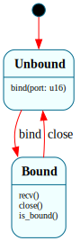

# `UdpSocket`

> One UDP socket's bind lifecycle: `$Unbound → $Bound`. The bind state **is** the invariant — `recv()` is only handled in `$Bound`, so a datagram for an unbound socket is dropped structurally rather than checked with a flag. (Same "the invariant is the state" call as `OpenFile`'s access mode and `Mount.is_mounted`.)

| Property | Value |
|---|---|
| Track | Bare-metal |
| Milestone introduced | B5 (Step 3b) |
| Source file | [`../../frame/udp_socket.frs`](../../frame/udp_socket.frs) |
| State diagram | [`udp_socket.svg`](udp_socket.svg) |
| Instances at runtime | One per UDP socket |
| Status | Implemented and load-bearing — `net` binds one on :68 for the DHCP exchange. |

## State diagram

## Why a state machine

A UDP socket has a bind step that gates everything after it: you can't receive datagrams for a port you haven't bound. Modeling "bound" as the state makes that structural — `recv()` exists only in `$Bound`, so the `RxPipeline`'s `$Udp` leaf delivering to an unbound socket is a dropped event, not a guarded branch. It's a small per-instance lifecycle (the counterpart, on the receive side, to the `RxPipeline` *pipeline*): the pipeline classifies + routes; the socket owns "am I bound, on which port, how many datagrams have I taken."

## States

### `$Unbound` (initial)
`bind(port)` records the port and → `$Bound`. `recv()` is **not** handled (a datagram for an unbound socket is dropped).

### `$Bound`
`recv()` increments the received count (the native layer has already buffered/handled the datagram bytes). `close()` → `$Unbound`. Overrides `is_bound()` → `true`.

## Interface

| Method | Returns | Purpose |
|---|---|---|
| `bind` | (none) | Bind the socket to `port` (`$Unbound` → `$Bound`). |
| `recv` | (none) | Count a delivered datagram (gated to `$Bound`). |
| `close` | (none) | Unbind (`$Bound` → `$Unbound`). |
| `is_bound` / `port` / `received` | `bool` / `u16` / `u32` | State queries. |

Pure lifecycle — no native actions. Domain: `port`, `received`.

## Composition

**Driven by:** `crate::net` — holds one `UdpSocket`; `dhcp_exchange()` binds it on `:68`, then the `RxPipeline`'s `$Udp` leaf (`net::on_udp`) matches an inbound datagram's destination port against the bound socket and fires `recv()` (latching the DHCP-offered IP natively). The datagram bytes + the port match are native; the socket owns the bind lifecycle + the count.

## Testing

**State graph snapshot (Level 2):** `kernel-tests/tests/state_graphs.rs::udp_socket_state_graph_snapshot`.

**Behavioral (Level 3):** `kernel-tests/tests/udp_socket_behavior.rs` — 5 tests: fresh-is-unbound; bind sets port + binds; `recv` on a bound socket counts; **`recv` on an unbound socket is dropped**; `close` unbinds and re-gates `recv`.

**QEMU (Level 7):** `dhcp_offer_b5` — the kernel binds a `UdpSocket` on :68, sends a DHCP DISCOVER, and the slirp DHCP server's OFFER is classified by `RxPipeline` and delivered to the socket (`received` = 1); the offered IP (10.0.2.15) is logged.

## Related documents
- [Roadmap](../roadmap.md) — B5 Step 3b
- [`RxPipeline`](rx_pipeline.md) — the `$Udp` leaf that delivers to this socket
- [`OpenFile`](open_file.md) / [`Mount`](mount.md) — the same "the invariant is the state" lifecycle shape

## Change log
- **2026-05-21** — initial doc; B5 Step 3b. `$Unbound → $Bound`, one per UDP socket; bind state as the invariant, `recv()` gated to `$Bound`. Drives the DHCP DISCOVER→OFFER exchange.
