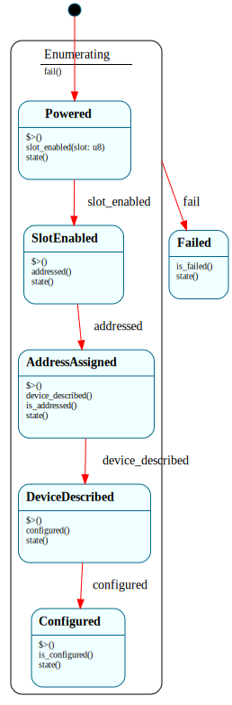

# `UsbEnumeration`

> A USB device's full enumeration lifecycle: `$Powered → $SlotEnabled → $AddressAssigned → $DeviceDescribed → $Configured`, with `fail()` funneled to `$Failed` from any active stage through an `$Enumerating` parent (`=> $^`). Each stage's enter handler issues the next xHCI command or control transfer (non-blocking); the native driver loop dequeues the completion event and dispatches the matching milestone event back to the FSM.

| Property | Value |
|---|---|
| Track | Bare-metal |
| Milestone introduced | B6 (Step 3) |
| Source file | [`../../frame/usb_enumeration.frs`](../../frame/usb_enumeration.frs) |
| State diagram | [`usb_enumeration.svg`](usb_enumeration.svg) |
| Instances at runtime | One (single-flight: the enumerating device) |
| Status | Implemented to `$Configured` — enumerates the QEMU usb-kbd end to end (Enable Slot → Address Device → GET_DESCRIPTOR → SET_CONFIGURATION), `cargo xtask qemu-test` `usb_enumerates_b6`. The post-config transfer (a HID report) is `UsbTransfer` (B6 Step 4). |

## State diagram

## Why a state machine

USB enumeration is a fixed sequence of steps, each gated on the *asynchronous
completion* of the previous one: enable a device slot, give the device an
address, read its descriptors, select a configuration. The xHCI controller
signals each completion by posting an event on the event ring. Modelling the
sequence as a state machine makes "which step are we on" the state, and lets the
**enter handler of each state issue the next command** — non-blocking, because a
Frame handler must run to completion (you cannot wait for the event inside it;
that's the B5 `PENDING_*` lesson). The native driver loop owns the waiting: it
dequeues completion events and dispatches the milestone event (`slot_enabled`,
`addressed`, …) that advances the FSM.

`fail()` from any active stage funnels to `$Failed` through the `$Enumerating`
parent (`=> $^`) — one teardown disposition, the `TcpConnection.$Open` /
`HubPort.$Attached` pattern.

The **slot id** (assigned by the controller in the Enable Slot completion) is
threaded through the FSM domain (`slot: u8`) and read by the later stages' enter
handlers when they issue commands against the device.

## States

- **`$Powered`** (initial, child of `$Enumerating`) — the enabled port. Its enter
  handler (which runs at construction) calls `crate::xhci::cmd_enable_slot()`.
  `slot_enabled(slot)` stores the slot and → `$SlotEnabled`.
- **`$SlotEnabled`** (child of `$Enumerating`) — enter handler calls
  `crate::xhci::address_device(self.slot)` (build the input/slot/EP0 contexts,
  register the output device context in the DCBAA, issue Address Device).
  `addressed()` → `$AddressAssigned`.
- **`$AddressAssigned`** (child of `$Enumerating`) — enter handler calls
  `crate::xhci::get_device_descriptor(self.slot)` (issue a GET_DESCRIPTOR control
  transfer on EP0: Setup → Data IN → Status); `is_addressed()` is true.
  `device_described()` → `$DeviceDescribed`.
- **`$DeviceDescribed`** (child of `$Enumerating`) — enter handler reads the
  fetched descriptor (`read_device_descriptor()`, logs idVendor/idProduct) and
  issues SET_CONFIGURATION (`set_configuration(self.slot)`). `configured()` →
  `$Configured`.
- **`$Configured`** (child of `$Enumerating`) — enter handler logs the configured
  device; `is_configured()` is true. The device is now usable (transfers — Step 4).
- **`$Failed`** — a command/transfer failed; `is_failed()` is true.
- **`$Enumerating`** (parent) — `fail() { -> $Failed }`, inherited by the active
  children via `=> $^`.

## Interface

| Method | Returns | Purpose |
|---|---|---|
| `slot_enabled` | (none) | Enable Slot completed; carries the assigned `slot`. |
| `addressed` | (none) | Address Device completed. |
| `device_described` | (none) | The GET_DESCRIPTOR transfer completed. |
| `configured` | (none) | The SET_CONFIGURATION transfer completed. |
| `fail` | (none) | A command/transfer failed (funneled to `$Failed`). |
| `state` | `String` | Current state name. |
| `is_addressed` | `bool` | True in `$AddressAssigned`. |
| `is_configured` | `bool` | True in `$Configured`. |
| `is_failed` | `bool` | True in `$Failed`. |

## Composition

**Driven by:** `crate::xhci::run_enumeration()` — creates the `UsbEnumeration`
FSM (whose `$Powered` enter handler issues Enable Slot), then polls the event
ring; on each Command Completion Event it dispatches the milestone event for the
current state (`slot_enabled` in `$Powered`, `addressed` in `$SlotEnabled`),
bailing on a non-Success completion (`fail()`) or the deadline. Native
(`xhci.rs`) owns the command/event rings, doorbells, and the slot/EP0 contexts;
this owns the stage lifecycle.

## Roadmap-name mapping

The roadmap sketches `$Powered → $Reset → $AddressAssigned → $Configured`. The
port *reset* is owned by `HubPort` (its `$Resetting → $Enabled`), so enumeration
begins at `$Powered` (port enabled) and adds two states the generic sketch omits:
`$SlotEnabled` (the xHCI Enable Slot step) and `$DeviceDescribed` (the
GET_DESCRIPTOR control transfer, before SET_CONFIGURATION).

## Testing

**State graph snapshot (Level 2):** `kernel-tests/tests/state_graphs.rs::usb_enumeration_state_graph_snapshot`.

**Behavioral (Level 3):** `kernel-tests/tests/usb_enumeration_behavior.rs` — 9
tests: construction issues Enable Slot in `$Powered`; `slot_enabled` →
`$SlotEnabled` + Address Device on the threaded slot; `addressed` →
`$AddressAssigned` + GET_DESCRIPTOR; `device_described` → `$DeviceDescribed` +
descriptor read + SET_CONFIGURATION; `configured` → `$Configured`; and `fail()`
reaches `$Failed` from each active stage (the parent funnel). The `xhci` actions
are doubled to record the calls + slot.

**QEMU (Level 7):** `usb_enumerates_b6` — the kernel enumerates the real
qemu-xhci usb-kbd end to end: serial shows `[usb] slot 1 enabled` → `[usb] device
addressed (slot 1)` → `[usb] device descriptor: idVendor 0627 idProduct 0001` →
`[usb] device configured (slot 1)` (Enable Slot + Address Device on the command
ring, then GET_DESCRIPTOR + SET_CONFIGURATION control transfers on EP0, against
the live controller — exercising the command/event rings, doorbells, the
slot/EP0 contexts, and the EP0 transfer ring).

## Related documents
- [Roadmap](../roadmap.md) — B6 Step 3
- [`HubPort`](hub_port.md) — readies the port (`$Enabled`) that enumeration begins from; [`TcpConnection`](tcp_connection.md) — the same "enter handler kicks the next async step, completion event advances the FSM" shape

## Change log
- **2026-05-22** — initial doc; B6 Step 3 (3a/3b). Enumeration through addressing: Enable Slot + Address Device driven by command-completion events, slot threaded via the domain, fail funnel via the `$Enumerating` parent.
- **2026-05-22** — B6 Step 3c. Added `$DeviceDescribed` + `$Configured`: GET_DESCRIPTOR + SET_CONFIGURATION EP0 control transfers (Setup/Data/Status TRBs on the EP0 transfer ring, dispatched by Transfer Events). Full enumeration to `$Configured`, validated on the real qemu-xhci usb-kbd.
