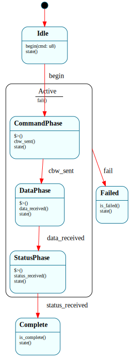

# `UsbMsd`

> One USB Mass-Storage **Bulk-Only Transport** (BOT) transaction's phase lifecycle: `$Idle → $CommandPhase → $DataPhase → $StatusPhase → ($Complete | $Failed)`. Each phase's enter handler issues the next *bulk* transfer (non-blocking — a TRB on the bulk ring + a doorbell); the native driver dispatches the phase event when the controller posts the Transfer Event. The driver runs one instance per SCSI command (INQUIRY → READ CAPACITY(10) → READ(10)).

| Property | Value |
|---|---|
| Track | Bare-metal |
| Milestone introduced | R3b (Post-B7 refinement) |
| Source file | [`../../frame/usb_msd.frs`](../../frame/usb_msd.frs) |
| State diagram | [`usb_msd.svg`](usb_msd.svg) |
| Instances at runtime | One per SCSI command (sequential) |
| Status | Implemented — reads INQUIRY, READ CAPACITY(10), and READ(10) of block 0 from the QEMU `usb-storage` device over bulk endpoints. `cargo xtask qemu-test` `usb_msd_r3b`. |

## State diagram

## Why a state machine

USB Mass Storage's Bulk-Only Transport is a literal three-phase protocol: a
**Command** phase (a 31-byte Command Block Wrapper carrying the SCSI CDB, sent on
the bulk OUT endpoint), a **Data** phase (here always device-to-host on bulk IN —
the INQUIRY data, the capacity result, or a 512-byte block), and a **Status**
phase (a 13-byte Command Status Wrapper read on bulk IN). Each phase is a separate
bulk transfer whose completion arrives asynchronously as an xHCI Transfer Event.

"Issue a transfer, advance when its completion event arrives" is the same shape as
`UsbTransfer` and `TcpConnection`: the **enter handler kicks the async transfer**
(non-blocking — a Frame handler must run to completion, the B5 `PENDING_*` lesson)
and the **completion event advances the FSM** from the native driver loop. Here
the lifecycle has three sequential transfers rather than one, so it has three
phase states. `fail()` from any active phase funnels to `$Failed` via the
`$Active` parent (`=> $^`), the same RST-from-any-state idiom as `TcpConnection`.

This is a genuinely **new device class + transfer type** for the project: bulk
endpoints (not the HID interrupt-IN of B6), and a layered protocol (SCSI inside
BOT inside USB bulk).

## States

- **`$Idle`** (initial) — `begin(cmd)` stores the SCSI opcode and → `$CommandPhase`.
- **`$CommandPhase`** — enter handler calls `crate::xhci::msd_send_cbw(cmd)` (build
  the CBW + SCSI CDB, Normal TRB on the bulk OUT ring, ring the doorbell).
  `cbw_sent()` → `$DataPhase`.
- **`$DataPhase`** — enter handler calls `crate::xhci::msd_recv_data(cmd)` (Normal
  TRB on the bulk IN ring for the command's data length). `data_received()` →
  `$StatusPhase`.
- **`$StatusPhase`** — enter handler calls `crate::xhci::msd_recv_csw()` (read the
  13-byte CSW on bulk IN). `status_received()` → `$Complete`.
- **`$Complete`** — `is_complete()` is true.
- **`$Failed`** — a transfer errored, or the CSW signature/status was bad;
  `is_failed()` is true.
- **`$Active`** (parent of the three phases) — `fail()` → `$Failed`.

## Interface

| Method | Returns | Purpose |
|---|---|---|
| `begin` | (none) | Start a BOT transaction for SCSI command `cmd`. |
| `cbw_sent` | (none) | The CBW transfer completed. |
| `data_received` | (none) | The data-phase transfer completed. |
| `status_received` | (none) | The CSW transfer completed (and the CSW was valid). |
| `fail` | (none) | A transfer errored / the CSW was bad. |
| `state` | `String` | Current state name. |
| `is_complete` | `bool` | True in `$Complete`. |
| `is_failed` | `bool` | True in `$Failed`. |

## Composition

**Driven by:** `crate::xhci::run_msd()` — after enumeration + classification
(`classify_devices` reads each device's configuration descriptor and finds the
mass-storage device by interface class 0x08), it issues a Configure Endpoint
command adding the device's bulk IN + OUT endpoints (parsed from the config
descriptor), then for each of INQUIRY / READ CAPACITY(10) / READ(10) creates a
`UsbMsd`, calls `begin(cmd)`, and polls the event ring, dispatching `cbw_sent` /
`data_received` / `status_received` (or `fail`) on each bulk Transfer Event.
Native (`xhci.rs`) owns the CBW/CSW byte layout, the SCSI CDB, the bulk rings +
TRBs, the doorbells, and the DMA buffers; this owns the BOT phase lifecycle.

## Testing

**State graph snapshot (Level 2):** `kernel-tests/tests/state_graphs.rs::usb_msd_state_graph_snapshot`.

**Behavioral (Level 3):** `kernel-tests/tests/usb_msd_behavior.rs` — 4 tests:
starts `$Idle`; `begin` → `$CommandPhase` + the CBW is sent for the requested
opcode; the full `cbw_sent → data_received → status_received` sequence reaches
`$Complete` (each phase issues its bulk transfer); `fail` mid-phase → `$Failed`
(no status read). The `xhci` actions are doubled to count the calls.

**QEMU (Level 7):** `usb_msd_r3b` — the kernel configures the storage device's
bulk endpoints and runs the three SCSI commands; serial shows `[usb] bulk
endpoints configured (IN + OUT)` → `[msd] INQUIRY vendor 'QEMU' product 'QEMU
HARDDISK'` → `[msd] capacity: 128 blocks of 512 bytes` → `[msd] block 0 first 8
bytes: FRAMEOS!` (the magic stamped into the backing image — proof of a real media
read).

## Related documents
- [Roadmap](../roadmap.md) — R3b
- [`UsbTransfer`](usb_transfer.md) — the HID interrupt-IN transfer (same async shape, one phase); [`UsbEnumeration`](usb_enumeration.md) — brings the device to `$Configured` first; [`TcpConnection`](tcp_connection.md) — the `=> $^` fail-funnel idiom

## Change log
- **2026-05-22** — initial doc; R3b. USB Mass-Storage Bulk-Only Transport as a Frame system, driving SCSI INQUIRY / READ CAPACITY(10) / READ(10) over bulk endpoints against the QEMU `usb-storage` device. A new device class + transfer type; routed by interface-class classification.
