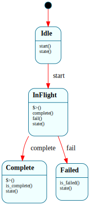

# `UsbTransfer`

> One USB transfer's lifecycle: `$Idle → $InFlight → ($Complete | $Failed)`. The enter handler of `$InFlight` *queues* the transfer (non-blocking — a TRB on the endpoint's transfer ring + a doorbell ring); the native driver dispatches `complete()`/`fail()` when the controller posts the Transfer Event; `$Complete`'s enter handler consumes the result (here, an 8-byte HID keyboard report).

| Property | Value |
|---|---|
| Track | Bare-metal |
| Milestone introduced | B6 (Step 4) |
| Source file | [`../../frame/usb_transfer.frs`](../../frame/usb_transfer.frs) |
| State diagram | [`usb_transfer.svg`](usb_transfer.svg) |
| Instances at runtime | One per transfer (single-flight in the demo) |
| Status | Implemented — completes a real interrupt-IN transfer from the QEMU usb-kbd (a keypress HID report), closing **B6-3**. `cargo xtask qemu-test` `usb_transfer_b6`. |

## State diagram

## Why a state machine

A USB transfer is asynchronous: software queues a Transfer Request Block on the
endpoint's ring and rings a doorbell, and the controller completes it later by
posting a Transfer Event (immediately for a control/bulk transfer, or — for an
interrupt IN endpoint like the keyboard's — whenever the device next has data).
That "queue, then a completion event arrives" shape is exactly a small state
machine: `$Idle → $InFlight → $Complete | $Failed`. As with `TcpConnection` and
`UsbEnumeration`, the **enter handler kicks the async operation** (non-blocking —
a Frame handler must run to completion, the B5 `PENDING_*` lesson) and the
**completion event advances the FSM** from the native driver loop.

This is the generic transfer lifecycle the roadmap names ("control/bulk/interrupt
transfer lifecycles") — the same FSM regardless of transfer type; only the queued
TRBs differ. Here it's wired to an interrupt-IN read of the keyboard.

## States

- **`$Idle`** (initial) — `start()` → `$InFlight`.
- **`$InFlight`** — enter handler calls `crate::xhci::queue_interrupt_in()`
  (Normal TRB on the EP1 transfer ring + ring the EP1 doorbell, then log
  "waiting for key report"). `complete()` → `$Complete`; `fail()` → `$Failed`.
- **`$Complete`** — enter handler calls `crate::xhci::on_report()` (read + log the
  8-byte HID report: modifiers + keycode); `is_complete()` is true.
- **`$Failed`** — the transfer errored; `is_failed()` is true.

## Interface

| Method | Returns | Purpose |
|---|---|---|
| `start` | (none) | Begin the transfer (queue it). |
| `complete` | (none) | The controller posted a successful Transfer Event. |
| `fail` | (none) | The transfer errored. |
| `state` | `String` | Current state name. |
| `is_complete` | `bool` | True in `$Complete`. |
| `is_failed` | `bool` | True in `$Failed`. |

## Composition

**Driven by:** `crate::xhci::run_transfer()` — after enumeration reaches
`$Configured`, it first issues a Configure Endpoint command (native prep:
add the keyboard's interrupt endpoint EP1-IN + its transfer ring), then creates a
`UsbTransfer`, calls `start()` (which queues the interrupt-IN read), and polls the
event ring for the Transfer Event → `complete()`/`fail()`. The transfer completes
when a key report arrives; in the automated test the QEMU monitor injects a
keypress (`sendkey`). Native (`xhci.rs`) owns the endpoint setup, the EP1 ring +
Normal TRB, the doorbell, and the report buffer; this owns the transfer lifecycle.

## Testing

**State graph snapshot (Level 2):** `kernel-tests/tests/state_graphs.rs::usb_transfer_state_graph_snapshot`.

**Behavioral (Level 3):** `kernel-tests/tests/usb_transfer_behavior.rs` — 4 tests:
starts `$Idle`; `start` → `$InFlight` + the transfer is queued; `complete` →
`$Complete` + the report is read; `fail` → `$Failed` (no report). The `xhci`
actions are doubled to count the calls.

**QEMU (Level 7):** `usb_transfer_b6` — the kernel configures the keyboard's
interrupt endpoint and queues an interrupt-IN read; the harness injects a
keypress via the QEMU monitor (`sendkey a`); the keyboard produces a HID report
and the transfer completes — serial shows `[usb] interrupt endpoint configured
(EP1 IN)` → `[usb] waiting for key report` → `[usb] HID report: modifiers 0
keycode 0x04` (HID usage for 'a') → `[usb] key transfer complete`. This closes
**B6-3** (enumerate to `$Configured` *and* complete a transfer).

## Related documents
- [Roadmap](../roadmap.md) — B6 Step 4
- [`UsbEnumeration`](usb_enumeration.md) — brings the device to `$Configured` first; [`TcpConnection`](tcp_connection.md) — the same "enter kicks the async op, completion event advances the FSM" shape

## Change log
- **2026-05-22** — initial doc; B6 Step 4. Transfer lifecycle as a Frame system, wired to a real interrupt-IN read of the QEMU usb-kbd (Configure Endpoint + EP1 ring native; keypress injected via the QEMU monitor). Closes B6-3.
